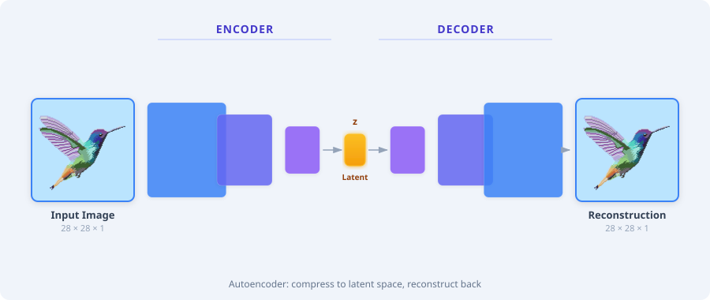
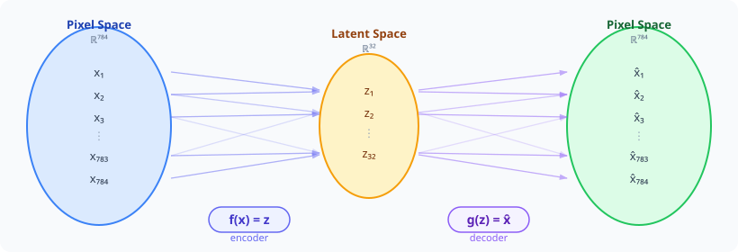

[](https://colab.research.google.com/github/miguelalexanderdiaz/quarto_blog/blob/main/blog/posts/tutorials/deep_learning/autoencoder/autoencoder.ipynb)

This is the second entry in our series building a
[Diffusion Transformer (DiT) from scratch](../diffusion_transformer/diffusion_transformer.qmd).
Autoencoders are one of the oldest and most elegant ideas in deep learning — a
network that learns to compress data into a compact representation and
reconstruct it back. In this tutorial we build four increasingly powerful
autoencoders for images: a fully connected bottleneck, a convolutional
autoencoder, a Variational Autoencoder (VAE), and a ResNet VAE — showing how
each improvement unlocks new capabilities from simple reconstruction to smooth
latent-space generation.

::: {#fig-ae-arch-simple}


Simplified overview of the Autoencoder architecture. An encoder compresses the
input image into a compact latent vector **z**, and a decoder reconstructs the
image from that representation alone.
:::

## Why Compress Images?

What does a computer actually see when it looks at an image? Not shapes or
objects — just a grid of numbers. Use the magnifying glass below to inspect the
individual pixels of this hummingbird and notice how neighboring pixels almost
always share similar colors. That redundancy is the key insight behind
compression.

::: {#fig-pixel-redundancy}


An image is just a grid of colored pixels. Hover to inspect — neighboring pixels
share similar colors, which means most of the raw data is redundant.
:::

A 28×28 grayscale image has 784 pixels — but not all of those pixels carry
unique information. As you saw above, neighboring pixels are highly correlated:
large patches share near-identical values, and transitions follow predictable
edge patterns. Most of the 784 numbers are **redundant**.

Traditional codecs like JPEG exploit this redundancy with hand-crafted rules:
discrete cosine transforms, quantization tables, and Huffman coding. These work
well, but they are designed by humans and optimized for perceptual quality, not
for *understanding* the content.

**Autoencoders** take a different approach: let a neural network **learn** the
compression. An encoder maps the input to a low-dimensional **latent vector**
$\mathbf{z}$, and a decoder reconstructs the input from $\mathbf{z}$ alone. The
network is trained end-to-end to minimize the reconstruction error, so the
latent representation must capture whatever matters most about the data — the
network discovers the compression rules on its own.

::: {#fig-ae-mapping}


The autoencoder as a pair of functions. The encoder $f$ maps 784 pixels into a
compact 49-dimensional latent space; the decoder $g$ maps back. Many input
dimensions collapse into fewer latent dimensions — information must be
compressed.
:::

This learned latent space turns out to be useful far beyond compression:

- **Denoising** — reconstruct clean images from noisy inputs
- **Anomaly detection** — outliers reconstruct poorly, revealing defects
- **Feature learning** — the latent vectors are compact features for downstream classifiers
- **Generation** — sample from the latent space to create new data (we'll get to this with VAEs)

### Our Running Dataset: FashionMNIST

Throughout this tutorial we use **FashionMNIST** [@bank2023autoencoders]: 70,000
grayscale images of clothing items at 28×28 resolution, split into 10 classes
(T-shirt, trouser, pullover, dress, coat, sandal, shirt, sneaker, bag, ankle
boot). It's small enough to train on a laptop in seconds, visual enough to
inspect reconstructions by eye, and varied enough to challenge a bottleneck.

```{python}
#| code-fold: true
#| code-summary: "Setup: imports and configuration"

from pathlib import Path
import torch
import torch.nn as nn
import torch.nn.functional as F
import torch.optim as optim
from torch.utils.data import DataLoader
from torchvision import datasets, transforms
import plotly.graph_objects as go
from plotly.subplots import make_subplots
import numpy as np
from rich.console import Console
from rich.table import Table

console = Console()
torch.manual_seed(42)
np.random.seed(42)

DEVICE = torch.device(
    "cuda" if torch.cuda.is_available()
    else "mps" if torch.backends.mps.is_available()
    else "cpu"
)
BATCH_SIZE = 256
EPOCHS = 100
LOAD_CHECKPOINTS = True
CHECKPOINT_DIR = Path("data/checkpoints")
CHECKPOINT_DIR.mkdir(parents=True, exist_ok=True)


def save_checkpoint(name, model, optimizer, history):
    torch.save(
        {"model": model.state_dict(), "optimizer": optimizer.state_dict(), "history": history},
        CHECKPOINT_DIR / f"{name}.pt",
    )


def load_checkpoint(name, model, optimizer):
    path = CHECKPOINT_DIR / f"{name}.pt"
    if LOAD_CHECKPOINTS and path.exists():
        ckpt = torch.load(path, map_location=DEVICE, weights_only=False)
        model.load_state_dict(ckpt["model"])
        optimizer.load_state_dict(ckpt["optimizer"])
        return ckpt["history"]
    return None


CLASS_NAMES = [
    "T-shirt/top", "Trouser", "Pullover", "Dress", "Coat",
    "Sandal", "Shirt", "Sneaker", "Bag", "Ankle boot",
]
```

```{python}
#| code-fold: true
#| code-summary: "Load FashionMNIST and create dataloaders"

transform = transforms.Compose([transforms.ToTensor()])

train_dataset = datasets.FashionMNIST(
    root="./data", train=True, download=True, transform=transform
)
test_dataset = datasets.FashionMNIST(
    root="./data", train=False, download=True, transform=transform
)

train_loader = DataLoader(train_dataset, batch_size=BATCH_SIZE, shuffle=True)
test_loader = DataLoader(test_dataset, batch_size=BATCH_SIZE, shuffle=False)

t = Table(title="FashionMNIST Dataset")
t.add_column("Split", style="cyan")
t.add_column("Samples", style="green")
t.add_column("Image Size", style="magenta")
t.add_column("Classes", style="dim")
t.add_row("Train", str(len(train_dataset)), "28 × 28 × 1", "10")
t.add_row("Test", str(len(test_dataset)), "28 × 28 × 1", "10")
console.print(t)
```

```{python}
#| code-fold: true
#| code-summary: "Display a sample grid of FashionMNIST images"

# Grab one batch and pick 20 samples (2 per class)
sample_images, sample_labels = next(iter(test_loader))

# Select 2 examples per class for a nice grid
indices = []
for c in range(10):
    class_idx = (sample_labels == c).nonzero(as_tuple=True)[0][:2]
    indices.extend(class_idx.tolist())
indices = indices[:20]

fig = make_subplots(
    rows=2, cols=10,
    subplot_titles=[CLASS_NAMES[sample_labels[i].item()] for i in indices],
    vertical_spacing=0.08,
    horizontal_spacing=0.02,
)

for pos, idx in enumerate(indices):
    row = pos // 10 + 1
    col = pos % 10 + 1
    img = sample_images[idx].squeeze().numpy()
    fig.add_trace(
        go.Heatmap(
            z=img[::-1],
            colorscale="Gray_r",
            showscale=False,
            hovertemplate="pixel (%{x}, %{y}): %{z:.2f}<extra></extra>",
        ),
        row=row, col=col,
    )
    fig.update_xaxes(showticklabels=False, row=row, col=col)
    fig.update_yaxes(showticklabels=False, row=row, col=col)

fig.update_layout(
    title_text="FashionMNIST — Sample Grid (2 per class)",
    height=320,
    width=900,
    margin=dict(t=60, b=10, l=10, r=10),
)
fig.show()
```


## The Simplest Autoencoder — A Fully Connected Bottleneck

The autoencoder has two halves. An **encoder** $f_\theta$ maps the input
$\mathbf{x} \in \mathbb{R}^{784}$ to a latent vector
$\mathbf{z} \in \mathbb{R}^{d}$, and a **decoder** $g_\phi$ maps it back:

$$
\mathbf{z} = f_\theta(\mathbf{x}), \qquad \hat{\mathbf{x}} = g_\phi(\mathbf{z})
$$

We train both jointly to minimize the **reconstruction error**:

$$
\mathcal{L}(\theta, \phi) = \frac{1}{N}\sum_{i=1}^{N} \|\mathbf{x}_i - \hat{\mathbf{x}}_i\|^2
$$

The key design choice is the **bottleneck dimension** $d$. Our images live in
$\mathbb{R}^{784}$ (28×28 pixels), and we will compress them down to just
$d = 32$ — a **24.5× compression ratio**. Since the decoder must reconstruct the
full image from these 32 numbers alone, the encoder is forced to learn a compact
summary of what matters.

:::: {.callout-tip}
## The bottleneck is the teacher
The network isn't told *what* to encode — it discovers which features matter by
being forced through a narrow bottleneck. A wider bottleneck makes reconstruction
easier but the representation less compressed; a narrower one forces harder
decisions about what to keep.
::::

::: {#fig-bottleneck}


Animated overview of the autoencoder bottleneck. Data flows from the
high-dimensional input through a narrow latent space and back out to a
reconstruction. Each layer is labeled with its output dimension.
:::

```{python}
#| code-fold: true
#| code-summary: "LinearAutoencoder model definition"

LATENT_DIM = 49

class LinearAutoencoder(nn.Module):
    """Fully connected autoencoder: 784 → 256 → 64 → 32 → 64 → 256 → 784."""

    def __init__(self, latent_dim: int = LATENT_DIM):
        super().__init__()
        self.encoder = nn.Sequential(
            nn.Flatten(),
            nn.Linear(784, 256), nn.ReLU(),
            nn.Linear(256, 64),  nn.ReLU(),
            nn.Linear(64, latent_dim),
        )
        self.decoder = nn.Sequential(
            nn.Linear(latent_dim, 64),  nn.ReLU(),
            nn.Linear(64, 256),         nn.ReLU(),
            nn.Linear(256, 784),        nn.Sigmoid(),
        )

    def forward(self, x):
        z = self.encoder(x)
        x_hat = self.decoder(z)
        return x_hat.view(-1, 1, 28, 28), z

fc_ae = LinearAutoencoder().to(DEVICE)
optimizer = optim.Adam(fc_ae.parameters(), lr=1e-3)
criterion = nn.MSELoss()

t = Table(title="Linear Autoencoder Architecture")
t.add_column("Component", style="cyan")
t.add_column("Layer", style="magenta")
t.add_column("Output Shape", style="green")
for name, layer, shape in [
    ("Encoder", "Input",              "784"),
    ("",        "Linear + ReLU",      "256"),
    ("",        "Linear + ReLU",      "64"),
    ("",        "Linear (bottleneck)","32"),
    ("Decoder", "Linear + ReLU",      "64"),
    ("",        "Linear + ReLU",      "256"),
    ("",        "Linear + Sigmoid",   "784 → 1×28×28"),
]:
    t.add_row(name, layer, shape)
console.print(t)

total_params = sum(p.numel() for p in fc_ae.parameters())
console.print(f"\n[bold]Total parameters:[/bold] {total_params:,}  |  "
              f"[bold]Compression:[/bold] 784 → {LATENT_DIM} ({784/LATENT_DIM:.1f}×)")
```

```{python}
#| code-fold: true
#| code-summary: "Train the linear autoencoder"

EPOCHS_FC = EPOCHS
fc_history = load_checkpoint("fc_ae", fc_ae, optimizer)

if fc_history is None:
    fc_history = []
    for epoch in range(EPOCHS_FC):
        fc_ae.train()
        epoch_loss = 0.0
        for images, _ in train_loader:
            images = images.to(DEVICE)
            x_hat, _ = fc_ae(images)
            loss = criterion(x_hat, images)
            optimizer.zero_grad()
            loss.backward()
            optimizer.step()
            epoch_loss += loss.item() * images.size(0)
        avg_loss = epoch_loss / len(train_dataset)
        fc_history.append(avg_loss)
    save_checkpoint("fc_ae", fc_ae, optimizer, fc_history)

# Plot loss curve
fig = go.Figure()
fig.add_trace(go.Scatter(
    x=list(range(1, EPOCHS_FC + 1)), y=fc_history,
    mode="lines+markers",
    line=dict(color="#3b82f6", width=2),
    marker=dict(size=6),
    name="Train MSE",
))
fig.update_layout(
    title="Linear Autoencoder — Training Loss",
    xaxis_title="Epoch",
    yaxis_title="MSE Loss",
    height=350, width=700,
    margin=dict(t=50, b=50, l=60, r=20),
    template="plotly_white",
)
fig.show()

console.print(f"[bold green]Final train loss:[/bold green] {fc_history[-1]:.6f}")
```

```{python}
#| code-fold: true
#| code-summary: "Reconstructions: original vs. linear autoencoder output"

fc_ae.eval()
with torch.no_grad():
    test_batch, test_labels = next(iter(test_loader))
    test_batch = test_batch.to(DEVICE)
    fc_recon, fc_latents = fc_ae(test_batch)

# Pick 10 varied samples (one per class)
show_idx = []
for c in range(10):
    match = (test_labels == c).nonzero(as_tuple=True)[0]
    if len(match) > 0:
        show_idx.append(match[0].item())

n = len(show_idx)
fig = make_subplots(
    rows=2, cols=n,
    row_titles=["Original", "Reconstruction"],
    vertical_spacing=0.06,
    horizontal_spacing=0.02,
    subplot_titles=[CLASS_NAMES[test_labels[i].item()] for i in show_idx],
)

for pos, idx in enumerate(show_idx):
    col = pos + 1
    orig = test_batch[idx].squeeze().cpu().numpy()
    recon = fc_recon[idx].squeeze().cpu().numpy()
    for row, img in enumerate([orig, recon], 1):
        fig.add_trace(
            go.Heatmap(
                z=img[::-1], colorscale="Gray_r", showscale=False,
                hovertemplate="(%{x}, %{y}): %{z:.2f}<extra></extra>",
            ),
            row=row, col=col,
        )
        fig.update_xaxes(showticklabels=False, row=row, col=col)
        fig.update_yaxes(showticklabels=False, row=row, col=col)

fig.update_layout(
    title_text=f"Linear Autoencoder — Reconstructions ({LATENT_DIM}-d bottleneck)",
    height=350, width=900,
    margin=dict(t=60, b=10, l=60, r=10),
)
fig.show()

test_mse = criterion(fc_recon, test_batch).item()
console.print(f"[bold]Test MSE:[/bold] {test_mse:.6f}")
```

An interesting connection: a **linear** autoencoder trained with MSE loss learns
exactly the same subspace as PCA [@hinton2006reducing]. Our nonlinear version
(with ReLU activations) can capture richer structure, but the principle is the
same — find the most important directions in the data. So what does this
49-dimensional latent space actually look like? We can project it down to 2D
with t-SNE and color each point by its class.

```{python}
#| code-fold: true
#| code-summary: "t-SNE projection of the FC autoencoder latent space"

from sklearn.manifold import TSNE

# Encode the full test set
fc_ae.eval()
all_latents, all_labels = [], []
with torch.no_grad():
    for images, labels in test_loader:
        _, z = fc_ae(images.to(DEVICE))
        all_latents.append(z.cpu().numpy())
        all_labels.append(labels.numpy())

all_latents = np.concatenate(all_latents)
all_labels = np.concatenate(all_labels)

# Subsample for cleaner visualization (300 per class = 3000 total)
rng = np.random.default_rng(42)
TSNE_SAMPLE = 300
sub_idx = np.concatenate([
    rng.choice(np.where(all_labels == c)[0], size=TSNE_SAMPLE, replace=False)
    for c in range(10)
])
all_latents = all_latents[sub_idx]
all_labels = all_labels[sub_idx]

# t-SNE to 2D
tsne = TSNE(n_components=2, perplexity=30, max_iter=1000, random_state=42)
latents_2d = tsne.fit_transform(all_latents)

# 10-class color palette
colors = [
    "#3b82f6", "#ef4444", "#10b981", "#f59e0b", "#8b5cf6",
    "#ec4899", "#06b6d4", "#84cc16", "#f97316", "#6366f1",
]

fig = go.Figure()
for c in range(10):
    mask = all_labels == c
    fig.add_trace(go.Scattergl(
        x=latents_2d[mask, 0], y=latents_2d[mask, 1],
        mode="markers",
        marker=dict(size=3, color=colors[c], opacity=0.6),
        name=CLASS_NAMES[c],
    ))

fig.update_layout(
    title=f"FC Autoencoder — Latent Space (t-SNE of {LATENT_DIM}-d → 2-d)",
    xaxis_title="t-SNE 1", yaxis_title="t-SNE 2",
    height=500, width=700,
    margin=dict(t=50, b=50, l=50, r=20),
    template="plotly_white",
    legend=dict(itemsizing="constant"),
)
fig.show()
```


## Convolutional Autoencoder — Respecting Spatial Structure

Our FC autoencoder has a fundamental problem: the very first thing it does is
`nn.Flatten()`, which turns a 28×28 grid into a 784-long vector. Two pixels that
were neighbors in the image are now just two numbers in a list — the network has
no idea they were adjacent. It must re-learn spatial relationships entirely from
data, wasting capacity on something we already know.

**Convolutional layers** solve this by operating on local spatial patches.
A 3×3 kernel slides across the image, so the network *always* knows which pixels
are neighbors. Strided convolutions ($\text{stride} = 2$) downsample spatially
while increasing the number of channels, compressing the spatial dimensions at
each layer:

$$
\text{1×28×28} \xrightarrow{\text{conv}} \text{16×14×14} \xrightarrow{\text{conv}} \text{32×7×7} \xrightarrow{\text{flatten}} \text{1568} \xrightarrow{\text{linear}} \text{32}
$$

The decoder reverses this with **transposed convolutions** (`ConvTranspose2d`),
which upsample the spatial dimensions back to the original size.

::: {#fig-conv-vs-fc}


Fully connected autoencoders flatten the spatial structure of images, while
convolutional autoencoders preserve spatial relationships through feature maps.
:::

:::: {.callout-note}
## From feature maps to visual tokens
Each spatial position in a convolutional feature map summarizes a local patch of
the input — not unlike how Vision Transformers (ViTs) split images into patch
tokens. The key idea is the same: represent images as a collection of local
features rather than a flat bag of pixels.
::::

```{python}
#| code-fold: true
#| code-summary: "ConvAutoencoder model definition"

class ConvAutoencoder(nn.Module):
    """Convolutional autoencoder: 1×28×28 → 49-d latent → 1×28×28."""

    def __init__(self, latent_dim: int = LATENT_DIM):
        super().__init__()
        self.encoder_conv = nn.Sequential(
            nn.Conv2d(1, 16, 3, stride=2, padding=1),  # → 16×14×14
            nn.BatchNorm2d(16), nn.ReLU(),
            nn.Conv2d(16, 32, 3, stride=2, padding=1), # → 32×7×7
            nn.BatchNorm2d(32), nn.ReLU(),
        )
        self.encoder_fc = nn.Linear(32 * 7 * 7, latent_dim)

        self.decoder_fc = nn.Linear(latent_dim, 32 * 7 * 7)
        self.decoder_conv = nn.Sequential(
            nn.ConvTranspose2d(32, 16, 3, stride=2, padding=1, output_padding=1),  # → 16×14×14
            nn.BatchNorm2d(16), nn.ReLU(),
            nn.ConvTranspose2d(16, 1, 3, stride=2, padding=1, output_padding=1),   # → 1×28×28
            nn.Sigmoid(),
        )

    def forward(self, x):
        h = self.encoder_conv(x)
        z = self.encoder_fc(h.view(h.size(0), -1))
        h_dec = self.decoder_fc(z).view(-1, 32, 7, 7)
        x_hat = self.decoder_conv(h_dec)
        return x_hat, z

conv_ae = ConvAutoencoder().to(DEVICE)
conv_optimizer = optim.Adam(conv_ae.parameters(), lr=1e-3)

t = Table(title="Convolutional Autoencoder Architecture")
t.add_column("Component", style="cyan")
t.add_column("Layer", style="magenta")
t.add_column("Output Shape", style="green")
for name, layer, shape in [
    ("Encoder", "Input",                        "1×28×28"),
    ("",        "Conv2d(1→16, 3×3, s=2) + BN + ReLU",  "16×14×14"),
    ("",        "Conv2d(16→32, 3×3, s=2) + BN + ReLU", "32×7×7"),
    ("",        "Flatten + Linear",             "32"),
    ("Decoder", "Linear + Reshape",             "32×7×7"),
    ("",        "ConvT2d(32→16, 3×3, s=2) + BN + ReLU","16×14×14"),
    ("",        "ConvT2d(16→1, 3×3, s=2) + Sigmoid",   "1×28×28"),
]:
    t.add_row(name, layer, shape)
console.print(t)

total_params = sum(p.numel() for p in conv_ae.parameters())
fc_params = sum(p.numel() for p in fc_ae.parameters())
console.print(f"\n[bold]Total parameters:[/bold] {total_params:,}  "
              f"(FC had {fc_params:,})")
```

```{python}
#| code-fold: true
#| code-summary: "Train the convolutional autoencoder"

EPOCHS_CONV = EPOCHS
conv_history = load_checkpoint("conv_ae", conv_ae, conv_optimizer)

if conv_history is None:
    conv_history = []
    for epoch in range(EPOCHS_CONV):
        conv_ae.train()
        epoch_loss = 0.0
        for images, _ in train_loader:
            images = images.to(DEVICE)
            x_hat, _ = conv_ae(images)
            loss = criterion(x_hat, images)
            conv_optimizer.zero_grad()
            loss.backward()
            conv_optimizer.step()
            epoch_loss += loss.item() * images.size(0)
        avg_loss = epoch_loss / len(train_dataset)
        conv_history.append(avg_loss)
    save_checkpoint("conv_ae", conv_ae, conv_optimizer, conv_history)

# Plot both loss curves
fig = go.Figure()
fig.add_trace(go.Scatter(
    x=list(range(1, EPOCHS_FC + 1)), y=fc_history,
    mode="lines+markers", line=dict(color="#94a3b8", width=2, dash="dot"),
    marker=dict(size=5), name="FC Autoencoder",
))
fig.add_trace(go.Scatter(
    x=list(range(1, EPOCHS_CONV + 1)), y=conv_history,
    mode="lines+markers", line=dict(color="#10b981", width=2),
    marker=dict(size=6), name="Conv Autoencoder",
))
fig.update_layout(
    title="Training Loss — FC vs. Convolutional Autoencoder",
    xaxis_title="Epoch", yaxis_title="MSE Loss",
    height=350, width=700,
    margin=dict(t=50, b=50, l=60, r=20),
    template="plotly_white",
)
fig.show()

console.print(f"[bold green]Conv final loss:[/bold green] {conv_history[-1]:.6f}  "
              f"(FC was {fc_history[-1]:.6f})")
```

```{python}
#| code-fold: true
#| code-summary: "Reconstructions: FC vs. Convolutional autoencoder"

conv_ae.eval()
with torch.no_grad():
    conv_recon, conv_latents = conv_ae(test_batch)

n = len(show_idx)
fig = make_subplots(
    rows=3, cols=n,
    row_titles=["Original", "FC Recon.", "Conv Recon."],
    vertical_spacing=0.06,
    horizontal_spacing=0.02,
    subplot_titles=[CLASS_NAMES[test_labels[i].item()] for i in show_idx],
)

for pos, idx in enumerate(show_idx):
    col = pos + 1
    orig = test_batch[idx].squeeze().cpu().numpy()
    fc_r = fc_recon[idx].squeeze().cpu().numpy()
    conv_r = conv_recon[idx].squeeze().cpu().numpy()
    for row, img in enumerate([orig, fc_r, conv_r], 1):
        fig.add_trace(
            go.Heatmap(
                z=img[::-1], colorscale="Gray_r", showscale=False,
                hovertemplate="(%{x}, %{y}): %{z:.2f}<extra></extra>",
            ),
            row=row, col=col,
        )
        fig.update_xaxes(showticklabels=False, row=row, col=col)
        fig.update_yaxes(showticklabels=False, row=row, col=col)

fig.update_layout(
    title_text=f"Reconstructions — FC vs. Convolutional (both {LATENT_DIM}-d bottleneck)",
    height=480, width=900,
    margin=dict(t=60, b=10, l=60, r=10),
)
fig.show()

conv_test_mse = criterion(conv_recon, test_batch).item()
console.print(f"[bold]Test MSE — FC:[/bold] {test_mse:.6f}  |  "
              f"[bold]Conv:[/bold] {conv_test_mse:.6f}")
```

The convolutional autoencoder should produce noticeably sharper reconstructions
— edges are crisper and fine details like shirt patterns and shoe shapes are
better preserved. By respecting the spatial structure of images, the network
spends its capacity learning *what* to encode rather than *where* things are.

How does the convolutional latent space compare to the FC one? Let's project
both into 2D with t-SNE side by side.

```{python}
#| code-fold: true
#| code-summary: "t-SNE projection of FC vs. Conv latent spaces"

# Encode full test set with the conv autoencoder
conv_ae.eval()
conv_all_latents, conv_all_labels = [], []
with torch.no_grad():
    for images, labels in test_loader:
        _, z = conv_ae(images.to(DEVICE))
        conv_all_latents.append(z.cpu().numpy())
        conv_all_labels.append(labels.numpy())

conv_all_latents = np.concatenate(conv_all_latents)
conv_all_labels = np.concatenate(conv_all_labels)

# Subsample to match FC plot (300 per class)
conv_sub_idx = np.concatenate([
    rng.choice(np.where(conv_all_labels == c)[0], size=TSNE_SAMPLE, replace=False)
    for c in range(10)
])
conv_all_latents = conv_all_latents[conv_sub_idx]
conv_all_labels = conv_all_labels[conv_sub_idx]

# t-SNE for conv latents
conv_tsne = TSNE(n_components=2, perplexity=30, max_iter=1000, random_state=42)
conv_latents_2d = conv_tsne.fit_transform(conv_all_latents)

# Side-by-side plots
fig = make_subplots(
    rows=1, cols=2,
    subplot_titles=["FC Autoencoder", "Conv Autoencoder"],
    horizontal_spacing=0.08,
)

for c in range(10):
    fc_mask = all_labels == c
    conv_mask = conv_all_labels == c
    fig.add_trace(go.Scattergl(
        x=latents_2d[fc_mask, 0], y=latents_2d[fc_mask, 1],
        mode="markers", marker=dict(size=3, color=colors[c], opacity=0.6),
        name=CLASS_NAMES[c], legendgroup=CLASS_NAMES[c], showlegend=True,
    ), row=1, col=1)
    fig.add_trace(go.Scattergl(
        x=conv_latents_2d[conv_mask, 0], y=conv_latents_2d[conv_mask, 1],
        mode="markers", marker=dict(size=3, color=colors[c], opacity=0.6),
        name=CLASS_NAMES[c], legendgroup=CLASS_NAMES[c], showlegend=False,
    ), row=1, col=2)

fig.update_layout(
    title=f"Latent Space Comparison (t-SNE of {LATENT_DIM}-d → 2-d)",
    height=450, width=900,
    margin=dict(t=60, b=50, l=50, r=20),
    template="plotly_white",
    legend=dict(itemsizing="constant"),
)
fig.update_xaxes(title_text="t-SNE 1", row=1, col=1)
fig.update_xaxes(title_text="t-SNE 1", row=1, col=2)
fig.update_yaxes(title_text="t-SNE 2", row=1, col=1)
fig.show()
```

:::: {.callout-note}
## Why do the t-SNE plots look different?
Both projections use the same random seed, but the resulting layouts look
different — this is expected. t-SNE depends on the pairwise distances in the
input data, not just the initialization. Since the two autoencoders learned
different latent representations, the distance structure changes, and so does the
2D projection. The seed only ensures each plot is individually reproducible
across runs.
::::

This reveals a fundamental limitation of deterministic autoencoders: they are
trained to **reconstruct**, not to **generate**. Nothing in the loss function
encourages the latent space to be smooth, continuous, or connected — the
encoder is free to scatter classes into isolated islands with dead zones in
between. A straight-line path between two classes may pass through empty regions
the decoder has never seen, producing artifacts. To turn an autoencoder into a
generative model, we need to *regularize* the latent space so that every region
decodes to something meaningful. That's exactly what a **Variational
Autoencoder** does.


## Variational Autoencoder (VAE) — A Principled Latent Space

We saw that deterministic autoencoders are poor generators: they
compress well, but their latent space is full of holes. The **Variational
Autoencoder** (VAE) [@kingma2013auto] fixes this by building the autoencoder on
top of a probabilistic foundation. The idea might sound intimidating, but we can
arrive at it one step at a time — no measure theory required.

### Starting from a wish

Imagine you had a magic machine that could produce new, realistic images of
fashion items. Formally, there exists some true probability distribution
$p(\mathbf{x})$ over all possible 28×28 images. If we could somehow learn that
distribution, we could simply *sample* from it to create new images. The problem
is that $p(\mathbf{x})$ lives in $\mathbb{R}^{784}$ — far too complex to model
directly.

### Introducing a latent variable

Here is the key insight: what if every image $\mathbf{x}$ was generated by a
two-step process? First, nature picks a simple, low-dimensional code
$\mathbf{z}$ — think of it as a compact recipe — and then "renders" it into
pixels. If we want to know the probability of seeing a particular image, we
need to account for *all* possible recipes that could have produced it. For
any single recipe $\mathbf{z}$, the chance of seeing image $\mathbf{x}$ is the
probability of picking that recipe, $p(\mathbf{z})$, times the probability that
the recipe produces this image, $p(\mathbf{x} \mid \mathbf{z})$. Since we don't
know which recipe was used, we sum (integrate) over all of them:

$$
p(\mathbf{x}) = \int p(\mathbf{x} \mid \mathbf{z})\, p(\mathbf{z})\, d\mathbf{z}
$$

This is known as [**marginalization**](https://www.khanacademy.org/math/ap-statistics/analyzing-categorical-ap/distributions-two-way-tables/v/marginal-distribution-and-conditional-distribution)
— we "marginalize out" the latent variable $\mathbf{z}$ to get the total
probability of the image.

Two terms in this equation deserve a moment of attention, because they'll keep
showing up throughout the derivation:

- The [**prior**](https://www.3blue1brown.com/lessons/bayes-theorem) $p(\mathbf{z})$ is our belief about what latent codes look like
  *before* we see any image. It answers the question: "if I pick a code at
  random, what distribution should it come from?" We choose the simplest
  possible answer — a standard Gaussian
  $p(\mathbf{z}) = \mathcal{N}(\mathbf{0}, \mathbf{I})$. This is a deliberate
  design choice: it gives us a well-behaved, symmetric space where every
  direction is equally valid, and sampling is trivially easy.

- The [**posterior**](https://www.3blue1brown.com/lessons/bayes-theorem) $p(\mathbf{z} \mid \mathbf{x})$ is the reverse question:
  "given *this specific* image, which codes could have generated it?" It's our
  belief about $\mathbf{z}$ *after* observing the data. By Bayes' theorem,
  $p(\mathbf{z} \mid \mathbf{x}) = p(\mathbf{x} \mid \mathbf{z})\, p(\mathbf{z}) / p(\mathbf{x})$.
  In other words, the posterior updates the prior using the evidence from the
  image — it tells us where in latent space this particular image "lives."

The remaining piece, the [**likelihood**](https://brilliant.org/wiki/maximum-likelihood-estimation-mle/) $p(\mathbf{x} \mid \mathbf{z})$, is our
decoder: given a code $\mathbf{z}$, it produces an image. This is exactly the
structure of our autoencoder, but now framed in probabilistic language.

### The intractable problem

To train this model we'd like to maximize $\log p(\mathbf{x})$ for every image
in our training set. But look at the integral above — it requires summing over
*every possible* $\mathbf{z}$. That's intractable.

We could try to narrow the search with the posterior $p(\mathbf{z} \mid
\mathbf{x})$ — but look at its definition above: computing it requires
$p(\mathbf{x})$, the very thing we're trying to estimate. We're going in
circles.

### The variational trick

The VAE breaks this circle with an approximation. Instead of computing the true
posterior $p(\mathbf{z} \mid \mathbf{x})$, we train a neural network —
the **encoder** — to output an approximate posterior:

$$
q_\phi(\mathbf{z} \mid \mathbf{x}) = \mathcal{N}\!\big(\boldsymbol{\mu}_\phi(\mathbf{x}),\; \boldsymbol{\sigma}^2_\phi(\mathbf{x})\big)
$$

For each input image, the encoder predicts a **mean** $\boldsymbol{\mu}$ and a
**variance** $\boldsymbol{\sigma}^2$ — both learned by the neural network (in
practice we predict $\log \boldsymbol{\sigma}^2$ for numerical stability).
Instead of encoding to a single point like our earlier autoencoders did, the VAE
encodes to a *cloud* of possible codes.

### Deriving the ELBO (Evidence Lower BOund){#sec-elbo}

:::: {.callout-note}
## TL;DR — The VAE loss in one equation
If the math feels heavy, here's the punchline — you can always come back for
the derivation later. The VAE loss splits into two terms:

$$
\mathcal{L} = \underbrace{\text{Reconstruction error}}_{\text{MSE between input and output}} + \underbrace{\text{KL divergence}}_{\text{keeps codes close to } \mathcal{N}(0, I)}
$$

The first term is the same MSE we've been using. The second term penalizes the
encoder whenever its output distribution drifts away from a standard Gaussian —
this is what fills the latent space holes. If this is enough for you,
[skip ahead to the reparameterization trick](#sec-reparam).
::::

<details>
<summary>**Full ELBO derivation** (click to expand)</summary>

The derivation below follows the original VAE paper by Kingma and Welling
[@kingma2013auto]. Our goal is to find decoder and encoder parameters
that make the training images as likely as possible under our model. In other
words, we want to **maximize** $p(\mathbf{x})$ — or equivalently
$\log p(\mathbf{x})$ (the log is just a monotonic transformation that makes the
math easier and avoids multiplying tiny probabilities together). This is the
standard [**maximum likelihood**](https://brilliant.org/wiki/maximum-likelihood-estimation-mle/) objective: find the model that assigns the
highest probability to the data we actually observed.

The problem is that $\log p(\mathbf{x})$ involves the intractable integral we
saw earlier. We can't compute it directly, but we *can* build a lower bound that
we know how to optimize. The trick starts by introducing our approximate
posterior $q_\phi$ into the equation.

Since $\log p(\mathbf{x})$ is a constant with respect to $\mathbf{z}$ (the
image probability doesn't change depending on which code we look at), we can
wrap it in an [expectation](https://seeing-theory.brown.edu/) over *any* distribution of $\mathbf{z}$ and it stays
the same. We choose our encoder $q_\phi(\mathbf{z} \mid \mathbf{x})$:

$$
\log p(\mathbf{x}) = \mathbb{E}_{q_\phi(\mathbf{z} \mid \mathbf{x})}\left[\log p(\mathbf{x})\right]
$$

This might seem like a pointless step — and by itself it is. But it lets us
bring $q_\phi$ inside the equation, which is exactly what we need. Inside the
expectation we have $\log p(\mathbf{x})$. Let's use Bayes' theorem to rewrite
$p(\mathbf{x})$ in terms of quantities that involve $\mathbf{z}$:

$$
p(\mathbf{x}) = \frac{p(\mathbf{x}, \mathbf{z})}{p(\mathbf{z} \mid \mathbf{x})}
$$

This is just the definition of [conditional probability](https://seeing-theory.brown.edu/) rearranged — the joint
divided by the conditional gives the marginal. Substituting this into our
expectation:

$$
\log p(\mathbf{x}) = \mathbb{E}_{q_\phi}\!\left[\log \frac{p(\mathbf{x}, \mathbf{z})}{p(\mathbf{z} \mid \mathbf{x})}\right]
$$

Now here comes the key move. We want to bring our approximate posterior
$q_\phi(\mathbf{z} \mid \mathbf{x})$ into the picture. We do this with the
oldest trick in math — multiply and divide by the same thing (which equals 1, so
nothing changes):

$$
\log p(\mathbf{x}) = \mathbb{E}_{q_\phi}\!\left[\log \frac{p(\mathbf{x}, \mathbf{z})}{p(\mathbf{z} \mid \mathbf{x})} \cdot \frac{q_\phi(\mathbf{z} \mid \mathbf{x})}{q_\phi(\mathbf{z} \mid \mathbf{x})}\right]
$$

Rearranging the fractions and using the property $\log(ab) = \log a + \log b$,
we can split this into two expectations:

$$
\log p(\mathbf{x}) = \mathbb{E}_{q_\phi}\!\left[\log \frac{p(\mathbf{x}, \mathbf{z})}{q_\phi(\mathbf{z} \mid \mathbf{x})}\right] + \mathbb{E}_{q_\phi}\!\left[\log \frac{q_\phi(\mathbf{z} \mid \mathbf{x})}{p(\mathbf{z} \mid \mathbf{x})}\right]
$$

Look at that second term carefully: it's an expectation of a log-ratio between
two distributions, $q_\phi$ and $p(\mathbf{z} \mid \mathbf{x})$, taken over
$q_\phi$. This is exactly the definition of the [**KL divergence**](https://www.countbayesie.com/blog/2017/5/9/kullback-leibler-divergence-explained)
$\text{KL}(q_\phi \| p)$ — a standard measure of how different two distributions
are. A crucial property of KL divergence is that it's always $\geq 0$ (it equals
zero only when the two distributions are identical). So we can write:

$$
\log p(\mathbf{x}) = \underbrace{\mathbb{E}_{q_\phi}\!\left[\log \frac{p(\mathbf{x}, \mathbf{z})}{q_\phi(\mathbf{z} \mid \mathbf{x})}\right]}_{\text{ELBO}} + \underbrace{\text{KL}\!\left(q_\phi(\mathbf{z} \mid \mathbf{x}) \,\|\, p(\mathbf{z} \mid \mathbf{x})\right)}_{\geq\; 0}
$$

Since we're adding a non-negative term to the first piece, that first piece must
be a **lower bound** on $\log p(\mathbf{x})$. This is the **Evidence Lower
BOund (ELBO)**:

$$
\text{ELBO} = \mathbb{E}_{q_\phi}\!\left[\log \frac{p(\mathbf{x}, \mathbf{z})}{q_\phi(\mathbf{z} \mid \mathbf{x})}\right] \leq \log p(\mathbf{x})
$$

Maximizing the ELBO simultaneously pushes $\log p(\mathbf{x})$ up (better model)
and drives $q_\phi$ closer to the true posterior (tighter bound). But the ELBO
in its current form — with the joint $p(\mathbf{x}, \mathbf{z})$ — isn't very
intuitive yet. Let's unpack it into something we can actually interpret.

The joint can be factored using the chain rule of probability:
$p(\mathbf{x}, \mathbf{z}) = p(\mathbf{x} \mid \mathbf{z}) \cdot p(\mathbf{z})$.
Substituting into the ELBO:

$$
\text{ELBO} = \mathbb{E}_{q_\phi}\!\left[\log \frac{p(\mathbf{x} \mid \mathbf{z}) \cdot p(\mathbf{z})}{q_\phi(\mathbf{z} \mid \mathbf{x})}\right]
$$

Using $\log \frac{a \cdot b}{c} = \log a + \log \frac{b}{c}$ we can split the fraction:

$$
\text{ELBO} = \mathbb{E}_{q_\phi}\!\left[\log p(\mathbf{x} \mid \mathbf{z})\right] + \mathbb{E}_{q_\phi}\!\left[\log \frac{p(\mathbf{z})}{q_\phi(\mathbf{z} \mid \mathbf{x})}\right]
$$

That second term is a log-ratio of $p(\mathbf{z})$ over $q_\phi$, taken under
$q_\phi$. Notice it looks almost like a KL divergence, but the fraction is
flipped — KL is defined with $q$ on top: $\mathbb{E}_q[\log \frac{q}{p}]$.
Flipping the fraction just adds a minus sign, so:

$$
\text{ELBO} = \underbrace{\mathbb{E}_{q_\phi}\!\left[\log p(\mathbf{x} \mid \mathbf{z})\right]}_{\text{Reconstruction quality}} - \underbrace{\text{KL}\!\left(q_\phi(\mathbf{z} \mid \mathbf{x}) \,\|\, p(\mathbf{z})\right)}_{\text{Latent space regularization}}
$$

This is the VAE loss — each term has a clear role:

- **Reconstruction term** $\mathbb{E}_{q_\phi}[\log p(\mathbf{x} \mid \mathbf{z})]$: "the decoder should produce images that look like the input."
- **KL term** $\text{KL}(q_\phi \| p(\mathbf{z}))$: "the encoder's distribution should stay close to the prior $\mathcal{N}(\mathbf{0}, \mathbf{I})$" — this is what fills the holes.

But how do these abstract terms translate into code we can actually run? We'll
bridge that gap in the next section.

</details>

### The reparameterization trick {#sec-reparam}

We've derived a beautiful loss function — the ELBO — and we know the encoder
should output $\boldsymbol{\mu}$ and $\boldsymbol{\sigma}$. But there's one
critical problem standing between us and a working implementation.

**The problem: sampling breaks backpropagation.**
To compute the reconstruction term of the ELBO, we need to:

1. Run the encoder to get $\boldsymbol{\mu}$ and $\boldsymbol{\sigma}$
2. **Sample** $\mathbf{z} \sim \mathcal{N}(\boldsymbol{\mu}, \boldsymbol{\sigma}^2 \mathbf{I})$
3. Pass $\mathbf{z}$ through the decoder to get $\hat{\mathbf{x}}$
4. Compute the reconstruction loss

The trouble is in step 2. Backpropagation works by tracing the chain of
operations from the loss backwards to every parameter, computing
$\partial \mathcal{L} / \partial \theta$ at each step. But "draw a random sample
from a distribution" is not an operation with a well-defined gradient. If we ask
"how should $\boldsymbol{\mu}$ change to reduce the loss?", the answer depends
on which random sample we happened to draw — the loss landscape is different
every time we sample. PyTorch's autograd engine simply cannot differentiate
through a random number generator.

Think of it this way: imagine you're adjusting a dart-throwing machine. You can
tune the aim (the mean $\boldsymbol{\mu}$) and the spread (the variance
$\boldsymbol{\sigma}^2$). After each throw, you want to know: "should I aim
slightly left or slightly right?" But the throw itself has randomness — you
can't take a derivative of a dice roll.

**The fix: externalize the randomness.**
[@kingma2013auto] proposed an elegantly simple solution. Instead of sampling
$\mathbf{z}$ directly from $\mathcal{N}(\boldsymbol{\mu},
\boldsymbol{\sigma}^2)$, we decompose the sampling into two parts:

1. Sample noise from a **fixed** distribution: $\boldsymbol{\varepsilon} \sim \mathcal{N}(\mathbf{0}, \mathbf{I})$
2. **Transform** it deterministically: $\mathbf{z} = \boldsymbol{\mu} + \boldsymbol{\sigma} \odot \boldsymbol{\varepsilon}$

This produces exactly the same distribution — if $\boldsymbol{\varepsilon}$ is
standard normal, then $\boldsymbol{\mu} + \boldsymbol{\sigma} \odot
\boldsymbol{\varepsilon}$ is normal with mean $\boldsymbol{\mu}$ and standard
deviation $\boldsymbol{\sigma}$. But now the random part
($\boldsymbol{\varepsilon}$) is an **input** to the computation graph, not an
operation inside it. The path from the encoder parameters through
$\boldsymbol{\mu}$ and $\boldsymbol{\sigma}$ to $\mathbf{z}$ is entirely made
of differentiable operations — addition and element-wise multiplication — so
gradients flow cleanly.

::: {#fig-reparam}


The reparameterization trick makes VAE training possible. Instead of sampling
directly from $\mathcal{N}(\boldsymbol{\mu}, \boldsymbol{\sigma}^2)$ (which
blocks gradients), we sample $\boldsymbol{\varepsilon}$ from a standard normal
and compute $\mathbf{z} = \boldsymbol{\mu} + \boldsymbol{\sigma} \cdot
\boldsymbol{\varepsilon}$. The green dashed lines show where gradients can flow;
the red path through $\boldsymbol{\varepsilon}$ carries no gradient.
:::

Back to our dart machine: instead of trying to differentiate a random throw, we
pre-generate a random wind vector $\boldsymbol{\varepsilon}$ and then
deterministically compute where the dart lands as $\text{aim} + \text{spread}
\times \text{wind}$. Given any specific wind, the landing is a smooth function
of aim and spread — perfectly differentiable.

::: {.callout-tip}
## Why log_var instead of σ directly?

In practice the encoder outputs $\log \sigma^2$ (log-variance) rather than
$\sigma$ itself. There are two reasons:

1. **Numerical stability** — $\log \sigma^2$ can be any real number, while
   $\sigma$ must be positive. No need for activation functions to enforce
   positivity.
2. **Easy conversion** — we recover $\sigma$ when needed via
   $\sigma = \exp(\tfrac{1}{2} \log \sigma^2)$, which is just `(0.5 * log_var).exp()` in PyTorch.
:::

### From ELBO to code — the actual VAE loss

Let's recall where we left off. The ELBO — our training objective — splits into
two terms:

$$
\text{ELBO} = \underbrace{\mathbb{E}_{q_\phi}\!\left[\log p(\mathbf{x} \mid \mathbf{z})\right]}_{\text{Reconstruction quality}} - \underbrace{\text{KL}\!\left(q_\phi(\mathbf{z} \mid \mathbf{x}) \,\|\, p(\mathbf{z})\right)}_{\text{Latent space regularization}}
$$

Training a VAE means **maximizing** the ELBO, which is equivalent to
**minimizing** $-\text{ELBO}$. So our loss function is:

$$
\mathcal{L} = -\mathbb{E}_{q_\phi}\!\left[\log p(\mathbf{x} \mid \mathbf{z})\right] + \text{KL}\!\left(q_\phi(\mathbf{z} \mid \mathbf{x}) \,\|\, p(\mathbf{z})\right)
$$

This is the final form. All that remains is to choose concrete formulas for each
term. Let's derive them one at a time.

#### Reconstruction term → MSE

The first term $\mathbb{E}_{q_\phi}[\log p(\mathbf{x} \mid \mathbf{z})]$ asks:
"how likely is the real image $\mathbf{x}$ under the decoder's output?" To
compute this, we need to define what $p(\mathbf{x} \mid \mathbf{z})$ actually
looks like. We assume the decoder outputs the **mean** of a Gaussian
distribution centered on its prediction $\hat{\mathbf{x}}$:

$$
p(\mathbf{x} \mid \mathbf{z}) = \mathcal{N}(\hat{\mathbf{x}},\; \sigma^2 \mathbf{I})
$$

where $\hat{\mathbf{x}} = g_\theta(\mathbf{z})$ is the decoder's output and
$\sigma^2$ is a fixed variance (a hyperparameter we choose). Now we can write
out the [log-likelihood of a Gaussian](https://statproofbook.github.io/P/norm-pdf)
explicitly. For a single pixel $x_i$ with predicted value $\hat{x}_i$:

$$
\log p(x_i \mid \mathbf{z}) = \log \frac{1}{\sqrt{2\pi\sigma^2}} \exp\!\left(-\frac{(x_i - \hat{x}_i)^2}{2\sigma^2}\right)
$$

Applying $\log(ab) = \log a + \log b$ and $\log e^y = y$:

$$
\log p(x_i \mid \mathbf{z}) = -\frac{1}{2}\log(2\pi\sigma^2) - \frac{(x_i - \hat{x}_i)^2}{2\sigma^2}
$$

Summing over all 784 pixels:

$$
\log p(\mathbf{x} \mid \mathbf{z}) = -\frac{784}{2}\log(2\pi\sigma^2) - \frac{1}{2\sigma^2}\sum_{i=1}^{784}(x_i - \hat{x}_i)^2
$$

The first part is a constant (it doesn't depend on the network parameters), so
when we **maximize** this expression the optimizer only cares about the second
part. And maximizing $-\frac{1}{2\sigma^2}\|\mathbf{x} - \hat{\mathbf{x}}\|^2$
is the same as **minimizing** $\|\mathbf{x} - \hat{\mathbf{x}}\|^2$ — which is
just **MSE**. For a deeper discussion, see
[Bernstein's VAE derivation](https://mbernste.github.io/posts/vae/).

So the Gaussian assumption gives us the probabilistic justification for the MSE
loss we've been using all along — it wasn't an arbitrary choice.

#### KL regularization term → closed-form formula

The KL term $\text{KL}(q_\phi(\mathbf{z} \mid \mathbf{x}) \| p(\mathbf{z}))$
measures how far the encoder's output distribution is from the standard Gaussian
prior. Because both distributions are Gaussian, this KL divergence has a
[closed-form solution](https://statproofbook.github.io/P/norm-kl.html) — no
sampling or approximation needed:

$$
\text{KL}\!\left(q_\phi \,\|\, p\right) = -\frac{1}{2} \sum_{j=1}^{d} \left(1 + \log \sigma_j^2 - \mu_j^2 - \sigma_j^2\right)
$$

Each of the $d$ latent dimensions contributes independently. The term penalizes
means $\mu_j$ that drift from zero and variances $\sigma_j^2$ that deviate from
one — exactly what it means to "stay close to $\mathcal{N}(0, 1)$."

Putting both pieces together, the loss we actually minimize during training is:

$$
\mathcal{L}(\theta, \phi) = \underbrace{\frac{1}{N}\|\mathbf{x} - \hat{\mathbf{x}}\|^2}_{\text{MSE reconstruction}} + \underbrace{\left(-\frac{1}{2} \sum_{j=1}^{d} (1 + \log \sigma_j^2 - \mu_j^2 - \sigma_j^2)\right)}_{\text{KL regularization}}
$$

:::: {.callout-tip}
## Two forces, one loss
Think of the two terms as opposing forces. The reconstruction term wants
each image to have its own unique, precise code. The KL term wants all codes
to look like the same Gaussian blob. Training a VAE is a negotiation between
these two goals — and the result is a latent space that's both informative
*and* smooth.
::::

With the math in place, we're ready to implement our VAE.

### Implementation

Every piece of the VAE maps directly to a line of code. The encoder outputs
$\boldsymbol{\mu}$ and $\log \sigma^2$ (two linear heads), the
reparameterization trick samples $\mathbf{z}$, and the decoder reconstructs.
The loss is the $-\text{ELBO}$: MSE reconstruction + KL divergence.

```{python}
class VAE(nn.Module):
    """Convolutional VAE: 1×28×28 → q(z|x) = N(μ, σ²) → 1×28×28."""

    def __init__(self, latent_dim: int = LATENT_DIM):
        super().__init__()

        # --- Encoder: image → feature map → (μ, log_var) ---
        self.encoder_conv = nn.Sequential(
            nn.Conv2d(1, 16, 3, stride=2, padding=1),   # → 16×14×14
            nn.BatchNorm2d(16), nn.ReLU(),
            nn.Conv2d(16, 32, 3, stride=2, padding=1),  # → 32×7×7
            nn.BatchNorm2d(32), nn.ReLU(),
        )
        self.fc_mu      = nn.Linear(32 * 7 * 7, latent_dim)  # μ head
        self.fc_log_var = nn.Linear(32 * 7 * 7, latent_dim)  # log σ² head

        # --- Decoder: z → feature map → image ---
        self.decoder_fc = nn.Linear(latent_dim, 32 * 7 * 7)
        self.decoder_conv = nn.Sequential(
            nn.ConvTranspose2d(32, 16, 3, stride=2, padding=1, output_padding=1),
            nn.BatchNorm2d(16), nn.ReLU(),
            nn.ConvTranspose2d(16, 1, 3, stride=2, padding=1, output_padding=1),
            nn.Sigmoid(),
        )

    def reparameterize(self, mu, log_var):
        """z = μ + σ · ε,  ε ~ N(0, I)"""
        std = (0.5 * log_var).exp()           # σ = exp(½ log σ²)
        eps = torch.randn_like(std)            # ε ~ N(0, I)
        return mu + std * eps                  # deterministic + stochastic

    def forward(self, x):
        # Encode
        h = self.encoder_conv(x)
        h_flat = h.view(h.size(0), -1)
        mu, log_var = self.fc_mu(h_flat), self.fc_log_var(h_flat)

        # Reparameterize
        z = self.reparameterize(mu, log_var)

        # Decode
        h_dec = self.decoder_fc(z).view(-1, 32, 7, 7)
        x_hat = self.decoder_conv(h_dec)
        return x_hat, mu, log_var, z
```

The loss function translates the $-\text{ELBO}$ directly. Both terms are
averaged over their respective dimensions — per-pixel MSE for reconstruction,
per-dimension KL for regularization — and then combined with a weight $\beta$
that controls the trade-off. This is the **β-VAE** [@kingma2013auto]
formulation:

```{python}
KL_WEIGHT_VAE = 0.0005  # β — balances reconstruction vs. regularity

def vae_loss(x, x_hat, mu, log_var, beta=KL_WEIGHT_VAE):
    """
    -ELBO = reconstruction (MSE) + β · KL divergence.

    Reconstruction:  mean over pixels of (x - x̂)²
    KL(q ‖ p):      mean over dims of -½(1 + log σ² - μ² - σ²)
    """
    recon = F.mse_loss(x_hat, x)  # mean over all pixels
    kl = -0.5 * torch.mean(1 + log_var - mu.pow(2) - log_var.exp())
    return recon + beta * kl, recon, kl
```

:::: {.callout-tip}
## Why the β weight?

With $\beta = 1$ (the pure ELBO), the KL term dominates because each per-dimension
KL value is **much larger** than each per-pixel MSE — the encoder gets penalized
so heavily for deviating from $\mathcal{N}(\mathbf{0}, \mathbf{I})$ that it
barely encodes anything useful. Reconstructions turn blurry.

**Our choice: $\beta = 0.0005$** — small enough that reconstruction quality
stays sharp, while still providing enough KL pressure to smooth the latent space
for interpolation. We intentionally favor reconstruction over generation in this
tutorial — our goal here is to understand how autoencoders work, not to build
the best generator.

Here's how different $\beta$ values shift the balance:

| $\beta$ | Regime | Reconstruction | Generation |
|:--------|:-------|:---------------|:-----------|
| 1.0 | KL dominates | Very blurry — encoder barely encodes | Prior matches well, but nothing useful is encoded |
| 0.01 | Generation-focused | Slightly soft | Good — $\mathbf{z} \sim \mathcal{N}(\mathbf{0}, \mathbf{I})$ produces coherent samples |
| **0.0005 (ours)** | **Reconstruction-focused** | **Sharp — close to Conv AE** | **Poor — prior mismatch, dead zones between clusters** |

We intentionally sit at the reconstruction end of this spectrum. Our goal in this
tutorial is to understand how autoencoders work, not to build the best generator.
The trade-off is real: with a low $\beta$, each class ends up in its own latent
cluster far from $\mathcal{N}(\mathbf{0}, \mathbf{I})$, and sampling from the
prior lands in dead zones. We'll see this in the [Generation](#sec-generation)
section, and address it in a follow-up post on class-conditional VAEs where
generation is the primary objective and a higher $\beta$ is warranted.
::::

```{python}
#| code-fold: true
#| code-summary: "Instantiate the VAE and inspect architecture"

vae = VAE().to(DEVICE)
vae_optimizer = optim.Adam(vae.parameters(), lr=2e-3)

t = Table(title="VAE Architecture")
t.add_column("Component", style="cyan")
t.add_column("Layer", style="magenta")
t.add_column("Output Shape", style="green")
for name, layer, shape in [
    ("Encoder", "Input",                               "1×28×28"),
    ("",        "Conv2d(1→16, 3×3, s=2) + BN + ReLU",  "16×14×14"),
    ("",        "Conv2d(16→32, 3×3, s=2) + BN + ReLU", "32×7×7"),
    ("",        "Flatten",                              "1568"),
    ("",        "Linear → μ",                           f"{LATENT_DIM}"),
    ("",        "Linear → log σ²",                      f"{LATENT_DIM}"),
    ("Latent",  "Reparameterize: μ + σ·ε",              f"{LATENT_DIM}"),
    ("Decoder", "Linear + Reshape",                     "32×7×7"),
    ("",        "ConvT2d(32→16, 3×3, s=2) + BN + ReLU", "16×14×14"),
    ("",        "ConvT2d(16→1, 3×3, s=2) + Sigmoid",    "1×28×28"),
]:
    t.add_row(name, layer, shape)
console.print(t)

total_params = sum(p.numel() for p in vae.parameters())
console.print(f"\n[bold]Total parameters:[/bold] {total_params:,}  "
              f"(Conv AE had {sum(p.numel() for p in conv_ae.parameters()):,})")
```

```{python}
#| code-fold: true
#| code-summary: "Train the VAE"

EPOCHS_VAE = EPOCHS
vae_history = load_checkpoint("vae", vae, vae_optimizer)

if vae_history is None:
    vae_total_history, vae_recon_history, vae_kl_history = [], [], []
    for epoch in range(EPOCHS_VAE):
        vae.train()
        ep_total, ep_recon, ep_kl = 0.0, 0.0, 0.0
        for images, _ in train_loader:
            images = images.to(DEVICE)
            x_hat, mu, log_var, _ = vae(images)
            loss, recon, kl = vae_loss(images, x_hat, mu, log_var)
            vae_optimizer.zero_grad()
            loss.backward()
            vae_optimizer.step()
            ep_total += loss.item() * images.size(0)
            ep_recon += recon.item() * images.size(0)
            ep_kl    += kl.item() * images.size(0)
        n = len(train_dataset)
        vae_total_history.append(ep_total / n)
        vae_recon_history.append(ep_recon / n)
        vae_kl_history.append(ep_kl / n)
    save_checkpoint("vae", vae, vae_optimizer, {
        "total": vae_total_history, "recon": vae_recon_history, "kl": vae_kl_history,
    })
else:
    vae_total_history = vae_history["total"]
    vae_recon_history = vae_history["recon"]
    vae_kl_history = vae_history["kl"]

# --- Loss curves ---
from plotly.subplots import make_subplots

fig = make_subplots(rows=1, cols=3, subplot_titles=(
    "Reconstruction Loss (all models)", "VAE — Reconstruction", "VAE — KL Divergence"),
    horizontal_spacing=0.08)

# Left: reconstruction-only comparison (per-pixel MSE, all models use mean reduction)
for name, hist, color, dash in [
    ("FC AE", fc_history, "#94a3b8", "dot"),
    ("Conv AE", conv_history, "#10b981", "dot"),
    ("VAE (recon)", vae_recon_history, "#6366f1", "solid"),
]:
    fig.add_trace(go.Scatter(
        x=list(range(1, len(hist) + 1)), y=hist,
        mode="lines+markers", name=name,
        line=dict(color=color, width=2, dash=dash),
        marker=dict(size=4),
    ), row=1, col=1)

# Center: VAE reconstruction term alone
fig.add_trace(go.Scatter(
    x=list(range(1, EPOCHS_VAE + 1)), y=vae_recon_history,
    mode="lines+markers", name="Reconstruction (MSE)",
    line=dict(color="#3b82f6", width=2), marker=dict(size=4),
    showlegend=False,
), row=1, col=2)

# Right: VAE KL divergence alone
fig.add_trace(go.Scatter(
    x=list(range(1, EPOCHS_VAE + 1)), y=vae_kl_history,
    mode="lines+markers", name="KL Divergence",
    line=dict(color="#f59e0b", width=2), marker=dict(size=4),
    showlegend=False,
), row=1, col=3)

fig.update_xaxes(title_text="Epoch")
fig.update_yaxes(title_text="Per-pixel MSE", row=1, col=1)
fig.update_yaxes(title_text="MSE", row=1, col=2)
fig.update_yaxes(title_text="KL", row=1, col=3)
fig.update_layout(
    height=350, width=950,
    margin=dict(t=50, b=50, l=60, r=20),
    template="plotly_white",
)
fig.show()

console.print(f"[bold blue]VAE final loss:[/bold blue] {vae_total_history[-1]:.6f} "
              f"(recon: {vae_recon_history[-1]:.6f}, "
              f"KL: {vae_kl_history[-1]:.4f})")
```

## Scaling Up — A ResNet VAE

Our Conv VAE works, but its encoder and decoder are shallow — just two
convolutional layers each. As networks get deeper, training becomes harder:
gradients shrink as they pass through many layers (the *vanishing gradient*
problem), and stacking more convolutions yields diminishing returns. **Residual
connections** [@he2016deep] solve this elegantly: each block adds its input back
to its output, giving gradients a direct highway through the network.

Many architectures in computer vision rely on this idea. ResNet blocks with
skip connections are the backbone of image classifiers, segmentation networks,
and — most relevant to us — the autoencoder codecs used in modern generative
pipelines [@esser2021taming; @rombach2022high]. These production autoencoders
share a common design:

- **ResNet blocks** with GroupNorm and SiLU activations instead of plain
  convolutions
- **Spatial latents** instead of a flat vector — the bottleneck preserves a
  2D feature map (e.g., 7×7×4) rather than collapsing to a 1D vector
- **No encoder→decoder skip connections** — the encoder and decoder communicate
  *only* through the bottleneck, so any latent can be decoded independently
- A **mid-block** with self-attention between encoder and decoder

Let's build a simplified version of this architecture for FashionMNIST.

::: {#fig-resnet-vae-arch}


The ResNet VAE architecture. The encoder compresses 1×28×28 images through
ResNet blocks and strided convolutions to a spatial latent **z** of shape
1×7×7 (49 values — matching our earlier VAE's 49-d bottleneck). The decoder
mirrors this with upsampling, using 3 ResNet blocks per level (vs. 2 in the
encoder) for extra capacity. Crucially, there are no encoder→decoder skip
connections — the bottleneck is the only communication path.
:::

### The ResNet block

The core building block is simple: two convolutions with a residual shortcut.
If the input $\mathbf{x}$ has the same number of channels as the output, the
shortcut is just the identity. Otherwise, a 1×1 convolution adjusts the channel
count.

$$
\text{ResBlock}(\mathbf{x}) = \text{Conv}_2\!\big(\text{SiLU}(\text{GN}(\text{Conv}_1(\text{SiLU}(\text{GN}(\mathbf{x})))))\big) + \text{Shortcut}(\mathbf{x})
$$

::: {#fig-resblock-detail}


Inside a ResNet block. The input **x** is split into two paths: the *identity* (skip) path passes through unchanged, while the *transform* path applies two rounds of GroupNorm → SiLU → Conv. The outputs are added at ⊕, so the network only needs to learn the residual F(**x**).
:::

:::: {.callout-note}
## Why GroupNorm instead of BatchNorm?
BatchNorm computes statistics across the batch, which works poorly with small
batch sizes and breaks down entirely when generating a single image. GroupNorm
splits channels into fixed groups and normalizes within each group —
independent of batch size, making it the standard choice in generative models.
::::

### Training

```{python}
#| code-fold: true
#| code-summary: "ResNet block, encoder, decoder, and ResNetVAE model definition"

class ResNetBlock(nn.Module):
    """Residual block: GroupNorm → SiLU → Conv → GroupNorm → SiLU → Conv + skip."""

    def __init__(self, in_ch: int, out_ch: int):
        super().__init__()
        self.net = nn.Sequential(
            nn.GroupNorm(min(8, in_ch), in_ch),
            nn.SiLU(),
            nn.Conv2d(in_ch, out_ch, 3, padding=1),
            nn.GroupNorm(min(8, out_ch), out_ch),
            nn.SiLU(),
            nn.Conv2d(out_ch, out_ch, 3, padding=1),
        )
        self.skip = nn.Conv2d(in_ch, out_ch, 1) if in_ch != out_ch else nn.Identity()

    def forward(self, x):
        return self.net(x) + self.skip(x)


class SelfAttention(nn.Module):
    """Single-head self-attention over spatial positions."""

    def __init__(self, ch: int):
        super().__init__()
        self.norm = nn.GroupNorm(min(8, ch), ch)
        self.q = nn.Conv2d(ch, ch, 1)
        self.k = nn.Conv2d(ch, ch, 1)
        self.v = nn.Conv2d(ch, ch, 1)
        self.proj = nn.Conv2d(ch, ch, 1)
        self.scale = ch ** -0.5

    def forward(self, x):
        B, C, H, W = x.shape
        h = self.norm(x)
        q = self.q(h).view(B, C, -1)          # (B, C, HW)
        k = self.k(h).view(B, C, -1)
        v = self.v(h).view(B, C, -1)
        attn = (q.transpose(1, 2) @ k) * self.scale  # (B, HW, HW)
        attn = attn.softmax(dim=-1)
        out = (v @ attn.transpose(1, 2)).view(B, C, H, W)
        return x + self.proj(out)


class ResNetEncoder(nn.Module):
    """Encoder: 1×28×28 → spatial latent (z_ch × 7 × 7)."""

    def __init__(self, z_channels: int = 4):
        super().__init__()
        self.conv_in = nn.Conv2d(1, 32, 3, padding=1)  # → 32×28×28

        # Level 1: 32×28×28 → 64×14×14
        self.down1 = nn.Sequential(
            ResNetBlock(32, 64),
            ResNetBlock(64, 64),
            nn.Conv2d(64, 64, 3, stride=2, padding=1),  # downsample
        )
        # Level 2: 64×14×14 → 128×7×7
        self.down2 = nn.Sequential(
            ResNetBlock(64, 128),
            ResNetBlock(128, 128),
            nn.Conv2d(128, 128, 3, stride=2, padding=1),  # downsample
        )
        # Mid-block with attention (at 7×7 resolution)
        self.mid = nn.Sequential(
            ResNetBlock(128, 128),
            SelfAttention(128),
            ResNetBlock(128, 128),
        )
        # Project to latent: mean + logvar (double channels)
        self.norm_out = nn.GroupNorm(8, 128)
        self.conv_out = nn.Conv2d(128, 2 * z_channels, 3, padding=1)

    def forward(self, x):
        h = self.conv_in(x)
        h = self.down1(h)
        h = self.down2(h)
        h = self.mid(h)
        h = nn.functional.silu(self.norm_out(h))
        return self.conv_out(h)  # (B, 2*z_ch, 7, 7)


class ResNetDecoder(nn.Module):
    """Decoder: spatial latent (z_ch × 7 × 7) → 1×28×28."""

    def __init__(self, z_channels: int = 4):
        super().__init__()
        self.conv_in = nn.Conv2d(z_channels, 128, 3, padding=1)

        # Mid-block with attention
        self.mid = nn.Sequential(
            ResNetBlock(128, 128),
            SelfAttention(128),
            ResNetBlock(128, 128),
        )
        # Level 2: 128×7×7 → 64×14×14
        self.up2 = nn.Sequential(
            ResNetBlock(128, 128),
            ResNetBlock(128, 128),
            ResNetBlock(128, 64),
            nn.Upsample(scale_factor=2, mode="nearest"),
            nn.Conv2d(64, 64, 3, padding=1),
        )
        # Level 1: 64×14×14 → 32×28×28
        self.up1 = nn.Sequential(
            ResNetBlock(64, 64),
            ResNetBlock(64, 64),
            ResNetBlock(64, 32),
            nn.Upsample(scale_factor=2, mode="nearest"),
            nn.Conv2d(32, 32, 3, padding=1),
        )
        self.norm_out = nn.GroupNorm(8, 32)
        self.conv_out = nn.Conv2d(32, 1, 3, padding=1)

    def forward(self, z):
        h = self.conv_in(z)
        h = self.mid(h)
        h = self.up2(h)
        h = self.up1(h)
        h = nn.functional.silu(self.norm_out(h))
        return torch.sigmoid(self.conv_out(h))  # (B, 1, 28, 28)


class ResNetVAE(nn.Module):
    """ResNet-based VAE with spatial latent: 1×28×28 → 1×7×7 → 1×28×28."""

    def __init__(self, z_channels: int = 4):
        super().__init__()
        self.encoder = ResNetEncoder(z_channels)
        self.decoder = ResNetDecoder(z_channels)
        self.z_channels = z_channels

    def reparameterize(self, mu, log_var):
        std = torch.exp(0.5 * log_var)
        eps = torch.randn_like(std)
        return mu + std * eps

    def forward(self, x):
        h = self.encoder(x)                             # (B, 2*z_ch, 7, 7)
        mu, log_var = h.chunk(2, dim=1)                  # each (B, z_ch, 7, 7)
        z = self.reparameterize(mu, log_var)             # (B, z_ch, 7, 7)
        x_hat = self.decoder(z)                          # (B, 1, 28, 28)
        return x_hat, mu, log_var, z

resnet_vae = ResNetVAE(z_channels=1).to(DEVICE)
resnet_optimizer = optim.Adam(resnet_vae.parameters(), lr=1e-3)

t = Table(title="ResNet VAE Architecture")
t.add_column("Component", style="cyan")
t.add_column("Layer", style="magenta")
t.add_column("Output Shape", style="green")
for name, layer, shape in [
    ("Encoder", "conv_in",                       "32×28×28"),
    ("",        "2× ResBlock(32→64) + ↓stride",  "64×14×14"),
    ("",        "2× ResBlock(64→128) + ↓stride",  "128×7×7"),
    ("",        "ResBlock + SelfAttn + ResBlock",  "128×7×7"),
    ("",        "GN + SiLU + Conv → μ, log σ²",   "2×(1×7×7)"),
    ("Latent",  "Reparameterize",                  "1×7×7 = 49 values"),
    ("Decoder", "conv_in",                        "128×7×7"),
    ("",        "ResBlock + SelfAttn + ResBlock",  "128×7×7"),
    ("",        "3× ResBlock(128→64) + ↑nearest",  "64×14×14"),
    ("",        "3× ResBlock(64→32) + ↑nearest",   "32×28×28"),
    ("",        "GN + SiLU + Conv + Sigmoid",      "1×28×28"),
]:
    t.add_row(name, layer, shape)
console.print(t)

total_params = sum(p.numel() for p in resnet_vae.parameters())
vae_params = sum(p.numel() for p in vae.parameters())
console.print(f"\n[bold]ResNet VAE parameters:[/bold] {total_params:,}  "
              f"(Conv VAE had {vae_params:,})")
console.print(f"[bold]Latent shape:[/bold] 1×7×7 = 49 values  "
              f"(Conv VAE used a flat {LATENT_DIM}-d vector)")
```

A few things to notice:

- The **latent is spatial**: a 1×7×7 feature map (49 values) instead of a flat
  49-d vector. This preserves spatial structure in the compressed representation
  — the decoder knows roughly *where* things are, not just *what* they are.
- The **decoder has no access to encoder features** — it receives only the
  sampled latent. This means we can decode any latent vector, whether it came
  from encoding a real image or was sampled from the prior.
- The **decoder is deeper** than the encoder (3 ResBlocks per level vs. 2), giving
  it extra capacity to reconstruct fine details without skip connections.

```{python}
#| code-fold: true
#| code-summary: "Train the ResNet VAE"

EPOCHS_RESNET = EPOCHS
KL_WEIGHT_RESNET = 0.0005
resnet_history = load_checkpoint("resnet_vae", resnet_vae, resnet_optimizer)

if resnet_history is None:
    resnet_history = {"total": [], "recon": [], "kl": []}
    for epoch in range(EPOCHS_RESNET):
        resnet_vae.train()
        epoch_total, epoch_recon, epoch_kl = 0.0, 0.0, 0.0
        for images, _ in train_loader:
            images = images.to(DEVICE)
            x_hat, mu, log_var, _ = resnet_vae(images)
            recon = criterion(x_hat, images)
            kl = -0.5 * torch.mean(1 + log_var - mu.pow(2) - log_var.exp())
            loss = recon + KL_WEIGHT_RESNET * kl
            resnet_optimizer.zero_grad()
            loss.backward()
            resnet_optimizer.step()
            b = images.size(0)
            epoch_total += loss.item() * b
            epoch_recon += recon.item() * b
            epoch_kl += kl.item() * b
        n = len(train_dataset)
        resnet_history["total"].append(epoch_total / n)
        resnet_history["recon"].append(epoch_recon / n)
        resnet_history["kl"].append(epoch_kl / n)
    save_checkpoint("resnet_vae", resnet_vae, resnet_optimizer, resnet_history)

fig = go.Figure()
for name, hist, color, dash in [
    ("FC AE", fc_history, "#94a3b8", "dot"),
    ("Conv AE", conv_history, "#10b981", "dot"),
    ("Conv VAE", vae_recon_history, "#8b5cf6", "dash"),
    ("ResNet VAE", resnet_history["recon"], "#f59e0b", "solid"),
]:
    fig.add_trace(go.Scatter(
        x=list(range(1, len(hist) + 1)), y=hist,
        mode="lines+markers", line=dict(color=color, width=2, dash=dash),
        marker=dict(size=4), name=name,
    ))
fig.update_layout(
    title="Reconstruction Loss — All Models",
    xaxis_title="Epoch", yaxis_title="Per-pixel MSE",
    height=350, width=700,
    legend=dict(x=0.60, y=0.95),
    template="plotly_white",
)
fig.show()

console.print(f"[bold yellow]ResNet VAE recon loss:[/bold yellow] "
              f"{resnet_history['recon'][-1]:.6f}  "
              f"(Conv VAE: {vae_recon_history[-1]:.6f})")
```

## Comparing All Four Models

With all four architectures trained — FC AE, Conv AE, Conv VAE, and ResNet
VAE — we can now compare them head-to-head on reconstruction quality and latent
space structure.

### Reconstructions

The deeper architecture with residual connections should produce sharper
reconstructions than our simpler Conv VAE.

```{python}
#| code-fold: true
#| code-summary: "Side-by-side reconstruction comparison — all four models"

resnet_vae.eval()

# Collect reconstructions from all models
fc_ae.eval(); conv_ae.eval(); vae.eval()
with torch.no_grad():
    imgs = sample_images[:10].to(DEVICE)
    fc_recon, _ = fc_ae(imgs)
    fc_recon = fc_recon.cpu()
    conv_recon, _ = conv_ae(imgs)
    conv_recon = conv_recon.cpu()
    vae_recon, _, _, _ = vae(imgs)
    vae_recon = vae_recon.cpu()
    resnet_recon, _, _, _ = resnet_vae(imgs)
    resnet_recon = resnet_recon.cpu()

fig = make_subplots(
    rows=5, cols=10, vertical_spacing=0.02, horizontal_spacing=0.01,
    row_titles=["Original", "FC AE", "Conv AE", "Conv VAE", "ResNet VAE"],
)

all_rows = [
    sample_images[:10],
    fc_recon,
    conv_recon,
    vae_recon,
    resnet_recon,
]
for r, row_imgs in enumerate(all_rows):
    for c in range(10):
        img = row_imgs[c].squeeze().numpy()
        fig.add_trace(
            go.Heatmap(z=img[::-1], colorscale="Gray_r", showscale=False,
                       hovertemplate="(%{x},%{y}): %{z:.2f}<extra></extra>"),
            row=r + 1, col=c + 1,
        )
        fig.update_xaxes(showticklabels=False, row=r + 1, col=c + 1)
        fig.update_yaxes(showticklabels=False, row=r + 1, col=c + 1)

fig.update_layout(
    title_text="Reconstructions — All Four Models",
    height=500, width=900,
    margin=dict(t=40, b=10, l=80, r=10),
)
fig.show()
```

```{python}
#| code-fold: false
#| echo: false

# Grab one image per class (used by interpolation cells below)
class_images = {}
for images, labels in test_loader:
    for c in range(10):
        if c not in class_images:
            match = (labels == c).nonzero(as_tuple=True)[0]
            if len(match) > 0:
                class_images[c] = images[match[0]]
    if len(class_images) == 10:
        break
```

### Latent interpolation {#sec-latent-interpolation}

A hallmark of a well-structured latent space is **smooth interpolation**: if we
take two real images, encode them to latent vectors $\mathbf{z}_A$ and
$\mathbf{z}_B$, and walk along the line between them, the decoded images should
transition gradually — blending shape, style, and identity without sudden jumps
or artifacts.

$$
\mathbf{z}_t = (1 - t)\,\mathbf{z}_A + t\,\mathbf{z}_B, \qquad t \in [0, 1]
$$

::: {#fig-smooth-space}


The VAE's latent space is smooth and continuous. Nearby points decode to similar
images, and we can sample from any region to generate new, realistic outputs.
:::

Let's run the same cross-class interpolation on all three architectures — Conv
AE, VAE, and ResNet VAE — using the same class pairs, so the only variable is
the model.

::: {.callout-tip}
## Why interpolation is a better test than single-dimension traversal

Varying one dimension at a time only probes a thin slice of the latent space
along a coordinate axis. Cross-class interpolation walks a **diagonal path
through all dimensions at once**, which is far more likely to cross the empty
regions between clusters. It's a harder test — and exactly the kind of operation
that matters for generation, where we want the *entire* latent space to be
meaningful.
:::

```{python}
#| code-fold: true
#| code-summary: "Cross-class latent interpolation (Conv Autoencoder)"

conv_ae.eval()

interp_pairs = [
    (1, 7),  # Trouser → Sneaker
    (8, 5),  # Bag → Sandal
    (0, 9),  # T-shirt → Ankle boot
    (2, 8),  # Pullover → Bag
    (3, 7),  # Dress → Sneaker
]
n_steps = 10

fig = make_subplots(
    rows=len(interp_pairs), cols=n_steps,
    vertical_spacing=0.03, horizontal_spacing=0.01,
    row_titles=[f"{CLASS_NAMES[a]} → {CLASS_NAMES[b]}" for a, b in interp_pairs],
    column_titles=[f"{t:.0%}" for t in np.linspace(0, 1, n_steps)],
)

with torch.no_grad():
    for r, (cls_a, cls_b) in enumerate(interp_pairs):
        img_a = class_images[cls_a].unsqueeze(0).to(DEVICE)
        img_b = class_images[cls_b].unsqueeze(0).to(DEVICE)
        _, z_a = conv_ae(img_a)
        _, z_b = conv_ae(img_b)

        for c_idx, t in enumerate(np.linspace(0, 1, n_steps)):
            z_interp = (1 - t) * z_a + t * z_b
            h = conv_ae.decoder_fc(z_interp).view(-1, 32, 7, 7)
            img = conv_ae.decoder_conv(h).squeeze().cpu().numpy()
            fig.add_trace(
                go.Heatmap(z=img[::-1], colorscale="Gray_r", showscale=False,
                           hovertemplate="(%{x}, %{y}): %{z:.2f}<extra></extra>"),
                row=r + 1, col=c_idx + 1,
            )
            fig.update_xaxes(showticklabels=False, row=r + 1, col=c_idx + 1)
            fig.update_yaxes(showticklabels=False, row=r + 1, col=c_idx + 1)

fig.update_layout(
    title_text="Cross-Class Interpolation (Conv Autoencoder)",
    height=160 * len(interp_pairs), width=900,
    margin=dict(t=60, b=10, l=120, r=10),
)
fig.show()
```

```{python}
#| code-fold: true
#| code-summary: "Cross-class latent interpolation (VAE)"

vae.eval()

fig = make_subplots(
    rows=len(interp_pairs), cols=n_steps,
    vertical_spacing=0.03, horizontal_spacing=0.01,
    row_titles=[f"{CLASS_NAMES[a]} → {CLASS_NAMES[b]}" for a, b in interp_pairs],
    column_titles=[f"{t:.0%}" for t in np.linspace(0, 1, n_steps)],
)

with torch.no_grad():
    for r, (cls_a, cls_b) in enumerate(interp_pairs):
        img_a = class_images[cls_a].unsqueeze(0).to(DEVICE)
        img_b = class_images[cls_b].unsqueeze(0).to(DEVICE)
        _, _, _, z_a = vae(img_a)
        _, _, _, z_b = vae(img_b)

        for c_idx, t in enumerate(np.linspace(0, 1, n_steps)):
            z_interp = (1 - t) * z_a + t * z_b
            h = vae.decoder_fc(z_interp).view(-1, 32, 7, 7)
            img = vae.decoder_conv(h).squeeze().cpu().numpy()
            fig.add_trace(
                go.Heatmap(z=img[::-1], colorscale="Gray_r", showscale=False,
                           hovertemplate="(%{x}, %{y}): %{z:.2f}<extra></extra>"),
                row=r + 1, col=c_idx + 1,
            )
            fig.update_xaxes(showticklabels=False, row=r + 1, col=c_idx + 1)
            fig.update_yaxes(showticklabels=False, row=r + 1, col=c_idx + 1)

fig.update_layout(
    title_text="Cross-Class Interpolation (VAE)",
    height=160 * len(interp_pairs), width=900,
    margin=dict(t=60, b=10, l=120, r=10),
)
fig.show()
```

```{python}
#| code-fold: true
#| code-summary: "Cross-class latent interpolation (ResNet VAE)"

resnet_vae.eval()

n_pairs = len(interp_pairs)

fig = make_subplots(
    rows=n_pairs, cols=n_steps,
    vertical_spacing=0.03, horizontal_spacing=0.01,
    row_titles=[f"{CLASS_NAMES[a]} → {CLASS_NAMES[b]}" for a, b in interp_pairs],
    column_titles=[f"{t:.0%}" for t in np.linspace(0, 1, n_steps)],
)

with torch.no_grad():
    for row, (cls_a, cls_b) in enumerate(interp_pairs):
        img_a = class_images[cls_a].unsqueeze(0).to(DEVICE)
        img_b = class_images[cls_b].unsqueeze(0).to(DEVICE)

        # Encode both images to spatial latents
        h_a = resnet_vae.encoder(img_a)
        mu_a, _ = h_a.chunk(2, dim=1)
        h_b = resnet_vae.encoder(img_b)
        mu_b, _ = h_b.chunk(2, dim=1)

        # Interpolate in latent space
        for col, t in enumerate(np.linspace(0, 1, n_steps)):
            z_t = (1 - t) * mu_a + t * mu_b
            img_t = resnet_vae.decoder(z_t).squeeze().cpu().numpy()
            fig.add_trace(
                go.Heatmap(
                    z=img_t[::-1], colorscale="Gray_r", showscale=False,
                    hovertemplate="(%{x},%{y}): %{z:.2f}<extra></extra>",
                ),
                row=row + 1, col=col + 1,
            )
            fig.update_xaxes(showticklabels=False, row=row + 1, col=col + 1)
            fig.update_yaxes(showticklabels=False, row=row + 1, col=col + 1)

fig.update_layout(
    title_text="Cross-Class Interpolation (ResNet VAE)",
    height=150 * n_pairs,
    width=900,
    margin=dict(t=60, b=10, l=120, r=10),
)
fig.show()
```

Comparing the three grids reveals where each architecture improvement pays off.
The **Conv AE** interpolations show abrupt jumps and ghostly blends in the middle
columns — the straight-line path passes through dead zones the decoder has never
seen. The **VAE** improves slightly thanks to KL regularization pushing the latent
distribution toward $\mathcal{N}(\mathbf{0}, \mathbf{I})$, but with a shallow
architecture the effect is subtle. The **ResNet VAE** is the clear winner: deeper
capacity from residual blocks plus spatial latents produce smooth, coherent
morphing between classes — a coat gradually becoming a shirt, a dress dissolving
into a sneaker with plausible intermediates at every step.


## The Autoencoder as a Learned Codec

With the architectures we've explored — from simple FC through Conv, VAE, and
ResNet VAE — we've seen how different design choices trade off reconstruction
quality, latent space smoothness, and generative capability. Modern generative
pipelines take these ideas and scale them up.

:::: {.callout-note}
## How modern pipelines use this

In modern image generation pipelines, the autoencoder is trained **once** on a
large image dataset and then **frozen**. It becomes a learned compression codec:

1. **Encode**: compress a 512×512×3 image into, say, a 64×64×4 latent
   — a 48× spatial reduction
2. The generative model (diffusion, flow matching, etc.) operates entirely in
   this compact latent space — much cheaper than working with raw pixels
3. **Decode**: decompress the latent back to pixel space

The autoencoder never changes after pre-training. It's a fixed utility — like
JPEG, but learned and optimized for reconstruction fidelity.
::::

The architecture of our ResNet VAE — ResNet blocks with GroupNorm, a spatial
latent bottleneck, self-attention in the mid-block, and no encoder→decoder
skip connections — is a simplified version of the autoencoder codec introduced
by Esser et al. [@esser2021taming] and adopted by virtually all modern latent
generative models:

- **Latent Diffusion / Stable Diffusion** [@rombach2022high] — Uses the same
  ResNet-based KL-autoencoder (AutoencoderKL) from [@esser2021taming] to
  compress images to a spatial latent, where a diffusion model generates new
  latents. The frozen decoder maps latents back to pixels.

- **Stable Diffusion 3** [@esser2024scaling] — Scales the same autoencoder
  architecture to 16 latent channels and combines it with a rectified flow
  Transformer (MMDiT). The codec design is unchanged.

In all of these, the autoencoder architecture we've been building toward —
encoder, spatial bottleneck, decoder with ResNet blocks — is the unsung
workhorse that makes efficient generation possible. The codec communicates only
through the bottleneck, so any latent vector can be decoded independently.


## Generation {#sec-generation}

Our autoencoders can reconstruct and interpolate — but can they *generate* new
images from scratch? Before we try, let's look at why this is hard for the
models we've built.

::: {#fig-latent-holes}


A deterministic autoencoder's latent space has visible gaps between clusters.
Sampling from these empty regions produces unrealistic outputs, motivating the
need for a more structured latent space.
:::

The latent space is not uniformly filled — each class occupies its own region,
with dead zones in between. A random sample is likely to land in one of these
gaps, giving the decoder an input it has never seen during training. The VAE's
KL regularization pushes the latent distribution toward
$\mathcal{N}(\mathbf{0}, \mathbf{I})$, which helps — but with our intentionally
low $\beta$, the clusters remain well-separated. Let's see what happens.

### Sampling from the prior

Our ResNet VAE can decode *any* latent vector — so let's try generating new
images by sampling $\mathbf{z} \sim \mathcal{N}(\mathbf{0}, \mathbf{I})$ and
passing it straight through the decoder.

```{python}
#| code-fold: true
#| code-summary: "Generate new images by sampling z ~ N(0, I)"

resnet_vae.eval()
with torch.no_grad():
    z_sample = torch.randn(20, resnet_vae.z_channels, 7, 7, device=DEVICE)
    generated = resnet_vae.decoder(z_sample).cpu()

fig = make_subplots(rows=2, cols=10, vertical_spacing=0.04, horizontal_spacing=0.02)

for i in range(20):
    row = i // 10 + 1
    col = i % 10 + 1
    img = generated[i].squeeze().numpy()
    fig.add_trace(
        go.Heatmap(z=img[::-1], colorscale="Gray_r", showscale=False,
                   hovertemplate="(%{x},%{y}): %{z:.2f}<extra></extra>"),
        row=row, col=col,
    )
    fig.update_xaxes(showticklabels=False, row=row, col=col)
    fig.update_yaxes(showticklabels=False, row=row, col=col)

fig.update_layout(
    title_text="ResNet VAE — Samples from N(0, I)",
    height=250, width=900,
    margin=dict(t=40, b=10, l=10, r=10),
)
fig.show()
```

The results are underwhelming — blurry, incoherent shapes that don't look like
any particular class. This is expected. We intentionally used a very low KL
weight ($\beta = 0.0005$) to prioritize reconstruction quality, which means the
encoder's aggregate posterior $q(\mathbf{z})$ doesn't match the standard normal
prior $\mathcal{N}(\mathbf{0}, \mathbf{I})$. Each class ends up in its own
cluster within latent space, and a random draw from the prior is likely to land
in the empty space *between* clusters — a region the decoder was never trained
to handle.

### Class-aware sampling

If the problem is that classes occupy distinct regions, what if we sample from
where each class *actually* lives? We can encode the training set, compute the
empirical mean $\boldsymbol{\mu}_c$ and covariance $\boldsymbol{\Sigma}_c$ for
each class $c$, and then draw
$\mathbf{z} \sim \mathcal{N}(\boldsymbol{\mu}_c, \boldsymbol{\Sigma}_c)$.

::: {#fig-class-aware-sampling}


Instead of sampling from the global prior $\mathcal{N}(\mathbf{0}, \mathbf{I})$,
we estimate each class's empirical mean and covariance in latent space, then draw
new samples from within those regions.
:::

```{python}
#| code-fold: true
#| code-summary: "Compute per-class latent statistics and sample"

resnet_vae.eval()

# Encode the full training set — collect mu vectors and labels
all_mu, all_labels = [], []
with torch.no_grad():
    for images, labels in train_loader:
        images = images.to(DEVICE)
        h = resnet_vae.encoder(images)
        mu, _ = h.chunk(2, dim=1)
        all_mu.append(mu.flatten(1).cpu())  # (B, 49)
        all_labels.append(labels)

all_mu = torch.cat(all_mu, dim=0)        # (N, 49)
all_labels = torch.cat(all_labels, dim=0)  # (N,)

# Per-class mean and covariance
class_stats = {}
for c in range(10):
    mask = all_labels == c
    mu_c = all_mu[mask]
    mean_c = mu_c.mean(dim=0)
    # Covariance with small regularization for numerical stability
    centered = mu_c - mean_c
    cov_c = (centered.T @ centered) / (centered.shape[0] - 1) + 1e-5 * torch.eye(49)
    class_stats[c] = (mean_c, cov_c)

# Sample 8 images per class from N(mu_c, Sigma_c)
n_samples_per_class = 8
fig = make_subplots(
    rows=10, cols=n_samples_per_class,
    vertical_spacing=0.02, horizontal_spacing=0.02,
    row_titles=[CLASS_NAMES[c] for c in range(10)],
)

resnet_vae.eval()
with torch.no_grad():
    for c in range(10):
        mean_c, cov_c = class_stats[c]
        dist = torch.distributions.MultivariateNormal(mean_c, cov_c)
        z_samples = dist.sample((n_samples_per_class,))  # (8, 49)
        z_spatial = z_samples.view(n_samples_per_class, resnet_vae.z_channels, 7, 7).to(DEVICE)
        generated = resnet_vae.decoder(z_spatial).cpu()

        for i in range(n_samples_per_class):
            img = generated[i].squeeze().numpy()
            fig.add_trace(
                go.Heatmap(z=img[::-1], colorscale="Gray_r", showscale=False,
                           hovertemplate="(%{x},%{y}): %{z:.2f}<extra></extra>"),
                row=c + 1, col=i + 1,
            )
            fig.update_xaxes(showticklabels=False, row=c + 1, col=i + 1)
            fig.update_yaxes(showticklabels=False, row=c + 1, col=i + 1)

fig.update_layout(
    title_text="Class-Aware Sampling — z ~ N(μ_class, Σ_class)",
    height=120 * 10, width=900,
    margin=dict(t=40, b=10, l=100, r=10),
)
fig.show()
```

Much better — each row now produces recognizable items of the target class. By
sampling from the encoder's *actual* distribution per class instead of the
uninformed prior, the decoder receives latent vectors it knows how to handle.

But this approach is a hack: we had to encode the entire training set, group by
label, and compute statistics after the fact. The model itself has no concept of
class — we imposed it externally. A cleaner solution would be to teach the model
about classes during training, so the decoder *knows* what to generate and
$\mathbf{z}$ only encodes *how* (style, shape, orientation). That's exactly
what a **class-conditional VAE** does — and the subject of our next post.

## What's Next?

We've built autoencoders from the ground up — starting with a simple linear
bottleneck, adding convolutional structure, introducing the variational
framework for a principled latent space, and scaling to a ResNet architecture
with spatial latents. Along the way we saw that interpolation quality improves
with both architecture depth and latent regularization, but that *generation*
from the unconditional prior remains poor when the KL weight is low.

The class-aware sampling trick showed that the latent space *does* encode
meaningful structure — we just need to tell the decoder what region to sample
from. In the next post, we'll make this explicit by conditioning the VAE on
class labels, so the model learns to route class identity through a dedicated
input and reserves the latent space for intra-class variation.


## Acknowledgements {.unnumbered}

This tutorial was researched, written, and illustrated by
[Miguel Chitiva Diaz](https://github.com/miguelalexanderdiaz).
[Claude](https://claude.ai) assisted with code iteration, copyediting, and
diagram refinement.

### Key References {.unnumbered}

This tutorial draws on deep autoencoders [@hinton2006reducing], the VAE
framework [@kingma2013auto], residual networks [@he2016deep], the autoencoder
codec from Taming Transformers [@esser2021taming], latent diffusion
[@rombach2022high], Stable Diffusion 3 [@esser2024scaling], and the autoencoder
survey by [@bank2023autoencoders].

::: {#refs}
:::
