[](https://colab.research.google.com/github/miguelalexanderdiaz/overfitting_club/blob/main/blog/posts/tutorials/deep_learning/class_conditional_vae/class_conditional_vae.ipynb)

This is a companion to our
[Autoencoder Architecture](../autoencoder/autoencoder.qmd) tutorial.
In that post we built four autoencoders — from a simple linear bottleneck to a
ResNet VAE — and discovered that while they reconstruct well, generating new
images by sampling $\mathbf{z} \sim \mathcal{N}(\mathbf{0}, \mathbf{I})$
produces mostly noise. Our workaround was *class-aware sampling*: encode the
training set, compute per-class statistics, and draw from
$\mathcal{N}(\boldsymbol{\mu}_c, \boldsymbol{\Sigma}_c)$. It worked — but it
was a hack. The model itself had no concept of class.

In this tutorial we fix that by making class identity a **first-class input** to
the model. The result is a **class-conditional VAE** (cVAE) [@sohn2015learning]:
give the decoder a class label $y$, and it learns *what* to generate; the latent
vector $\mathbf{z}$ then only needs to encode *how* — style, thickness, angle,
and other intra-class variation.

We'll implement two conditioning mechanisms — **concatenation** (the simplest
approach) and **adaptive layer normalization (adaLN)** — showing how the second
one is more expressive and directly foreshadows the conditioning mechanism used
in Diffusion Transformers (DiT) [@peebles2023scalable].

::: {#fig-cvae-overview}


A class-conditional VAE lets you **select a class** and generate diverse
variations. The class label steers the decoder toward the right category, while
the latent code controls style details like thickness, angle, and proportions.
:::

## From Unconditional to Conditional

### What changes mathematically

An unconditional VAE models $p(\mathbf{x})$ — the probability of seeing an
image, regardless of class. A conditional VAE models
$p(\mathbf{x} \mid y)$ — the probability of an image *given* that it belongs to
class $y$. Everything in the ELBO derivation carries through, but every term is
now conditioned on $y$:

$$
\log p(\mathbf{x} \mid y) \geq \underbrace{\mathbb{E}_{q_\phi(\mathbf{z} \mid \mathbf{x}, y)}\!\left[\log p_\theta(\mathbf{x} \mid \mathbf{z}, y)\right]}_{\text{Reconstruction}} - \underbrace{\text{KL}\!\left(q_\phi(\mathbf{z} \mid \mathbf{x}, y) \,\|\, p(\mathbf{z} \mid y)\right)}_{\text{KL regularization}}
$$

::: {#fig-uncond-vs-cond}


Unconditional vs. conditional generation. In the cVAE, the class label $y$
tells the decoder *what* to produce, while $\mathbf{z}$ encodes *how*.
:::

The key design choice is the prior $p(\mathbf{z} \mid y)$. The simplest option
— and the one we'll use — is to keep it class-independent:
$p(\mathbf{z} \mid y) = p(\mathbf{z}) = \mathcal{N}(\mathbf{0}, \mathbf{I})$.
This means the KL term is identical to the unconditional VAE. The only changes
are:

1. The **encoder** receives both $\mathbf{x}$ and $y$ when producing
   $\boldsymbol{\mu}$ and $\boldsymbol{\sigma}$
2. The **decoder** receives both $\mathbf{z}$ and $y$ when reconstructing

The loss function in code is the same $-\text{ELBO}$ we already know:

$$
\mathcal{L} = \|\mathbf{x} - \hat{\mathbf{x}}\|^2 + \beta \cdot \text{KL}\!\left(q_\phi(\mathbf{z} \mid \mathbf{x}, y) \,\|\, \mathcal{N}(\mathbf{0}, \mathbf{I})\right)
$$

:::: {.callout-note}
## A higher β for generation

In the autoencoder tutorial we used $\beta = 0.0005$ because our goal was
**reconstruction** — generation was an afterthought. With a low $\beta$ the
encoder is free to push the latent distribution far from
$\mathcal{N}(\mathbf{0}, \mathbf{I})$, and sampling from the prior lands in
dead zones between class clusters.

Now that **generation is the primary objective**, we need the latent distribution
to actually match the prior so that $\mathbf{z} \sim \mathcal{N}(\mathbf{0},
\mathbf{I})$ produces valid decoder inputs. We use $\beta = 0.01$ — 20× larger
than before. Reconstructions will be slightly softer, but generation quality
improves dramatically.
::::

### How to feed the class label

The question is: *how* does the network receive $y$? There are several
approaches, each with different trade-offs:

| Method | How it works | Expressiveness | Complexity |
|--------|-------------|----------------|------------|
| **Concatenation** | Append one-hot $y$ to the latent vector | Low | Minimal |
| **Embedding + addition** | Learned embedding added to feature maps | Medium | Low |
| **Adaptive normalization (adaLN)** | Embedding modulates scale/shift of every norm layer | High | Moderate |

We'll implement concatenation first as a baseline, then upgrade to adaLN to see
the difference — and to build intuition for DiT, which uses the same mechanism
for timestep and class conditioning.


## Setup

```{python}
#| code-fold: true
#| code-summary: "Setup: imports, configuration, and data loading"

from pathlib import Path
import torch
import torch.nn as nn
import torch.nn.functional as F
import torch.optim as optim
from torch.utils.data import DataLoader
from torchvision import datasets, transforms
import plotly.graph_objects as go
from plotly.subplots import make_subplots
import numpy as np
from rich.console import Console
from rich.table import Table

console = Console()
torch.manual_seed(42)
np.random.seed(42)

DEVICE = torch.device(
    "cuda" if torch.cuda.is_available()
    else "mps" if torch.backends.mps.is_available()
    else "cpu"
)
BATCH_SIZE = 256
EPOCHS = 100
LATENT_DIM = 49  # 1×7×7 spatial latent, flattened
NUM_CLASSES = 10
KL_WEIGHT = 0.01
LOAD_CHECKPOINTS = True
CHECKPOINT_DIR = Path("data/checkpoints")
CHECKPOINT_DIR.mkdir(parents=True, exist_ok=True)


def save_checkpoint(name, model, optimizer, history):
    torch.save(
        {"model": model.state_dict(), "optimizer": optimizer.state_dict(), "history": history},
        CHECKPOINT_DIR / f"{name}.pt",
    )


def load_checkpoint(name, model, optimizer):
    path = CHECKPOINT_DIR / f"{name}.pt"
    if LOAD_CHECKPOINTS and path.exists():
        ckpt = torch.load(path, map_location=DEVICE, weights_only=False)
        model.load_state_dict(ckpt["model"])
        optimizer.load_state_dict(ckpt["optimizer"])
        return ckpt["history"]
    return None


CLASS_NAMES = [
    "T-shirt/top", "Trouser", "Pullover", "Dress", "Coat",
    "Sandal", "Shirt", "Sneaker", "Bag", "Ankle boot",
]

transform = transforms.Compose([transforms.ToTensor()])
train_dataset = datasets.FashionMNIST("data", train=True, download=True, transform=transform)
test_dataset  = datasets.FashionMNIST("data", train=False, download=True, transform=transform)
train_loader = DataLoader(train_dataset, batch_size=BATCH_SIZE, shuffle=True)
test_loader  = DataLoader(test_dataset,  batch_size=BATCH_SIZE, shuffle=False)

criterion = nn.MSELoss()

# Grab a fixed batch of test images for visualization
sample_images, sample_labels = next(iter(test_loader))
console.print(f"[bold]Device:[/bold] {DEVICE}")
console.print(f"[bold]Training samples:[/bold] {len(train_dataset):,}")
console.print(f"[bold]Test samples:[/bold] {len(test_dataset):,}")
```


## The Base Architecture — ResNet VAE (Recap)

We reuse the ResNet VAE architecture from the autoencoder tutorial — ResNet
blocks with GroupNorm and SiLU activations, self-attention in the mid-block, and
a spatial latent of shape 1×7×7 (49 values). If you haven't read that post, all
you need to know is: it's a VAE with residual connections that produces
a 2D latent feature map instead of a flat vector.

```{python}
#| code-fold: true
#| code-summary: "ResNet building blocks (unchanged from autoencoder tutorial)"

class ResNetBlock(nn.Module):
    """Residual block: GroupNorm -> SiLU -> Conv -> GroupNorm -> SiLU -> Conv + skip."""

    def __init__(self, in_ch: int, out_ch: int):
        super().__init__()
        self.net = nn.Sequential(
            nn.GroupNorm(min(8, in_ch), in_ch),
            nn.SiLU(),
            nn.Conv2d(in_ch, out_ch, 3, padding=1),
            nn.GroupNorm(min(8, out_ch), out_ch),
            nn.SiLU(),
            nn.Conv2d(out_ch, out_ch, 3, padding=1),
        )
        self.skip = nn.Conv2d(in_ch, out_ch, 1) if in_ch != out_ch else nn.Identity()

    def forward(self, x):
        return self.net(x) + self.skip(x)


class SelfAttention(nn.Module):
    """Single-head self-attention over spatial positions."""

    def __init__(self, ch: int):
        super().__init__()
        self.norm = nn.GroupNorm(min(8, ch), ch)
        self.q = nn.Conv2d(ch, ch, 1)
        self.k = nn.Conv2d(ch, ch, 1)
        self.v = nn.Conv2d(ch, ch, 1)
        self.proj = nn.Conv2d(ch, ch, 1)
        self.scale = ch ** -0.5

    def forward(self, x):
        B, C, H, W = x.shape
        h = self.norm(x)
        q = self.q(h).view(B, C, -1)
        k = self.k(h).view(B, C, -1)
        v = self.v(h).view(B, C, -1)
        attn = (q.transpose(1, 2) @ k) * self.scale
        attn = attn.softmax(dim=-1)
        out = (v @ attn.transpose(1, 2)).view(B, C, H, W)
        return x + self.proj(out)
```


## Spatial Concat Conditioning — The Simplest Approach

The most straightforward way to condition on a class label is concatenation. But
rather than flattening the spatial latent and appending a one-hot vector — which
would destroy the 2D structure we argued for in the autoencoder tutorial — we
keep everything spatial.

::: {#fig-concat-arch}


Spatial concat conditioning. The class label is embedded into a learned 1×7×7
feature map and concatenated with $\mathbf{z}$ along the channel dimension,
producing a 2×7×7 input to the decoder.
:::

The idea: map the class label to a **learned spatial feature map** of the same
resolution as $\mathbf{z}$ (7×7), then concatenate along the channel dimension.
The latent becomes 2×7×7 — one channel for the content code, one channel for
the class signal. Both the encoder and decoder remain fully convolutional with
no flatten/linear bottleneck.

The `ClassSpatialMap` module turns a scalar class label into a learnable spatial
feature map that matches the latent resolution. An embedding layer maps each
class directly to a 49-dimensional vector, reshaped into a 1×7×7 map:



This spatial class map is then concatenated with the feature maps in both the
encoder and decoder:

- **Encoder**: the class map (1×7×7) is concatenated as an extra channel to the
  128×7×7 feature map (→ 129×7×7) before the $\mu$/$\log\sigma^2$ convolution
  heads

::: {#fig-spatial-concat-encoder}


Encoder side: the class map adds a single channel to the 128-channel feature map.
The µ/log σ² projection then operates on all 129 channels together.
:::

- **Decoder**: the class map is concatenated with $\mathbf{z}$ along the channel
  dimension (1+1 = 2×7×7) and fed directly into the convolutional decoder

::: {#fig-spatial-concat}


Decoder side: the class label is embedded into a learned 1×7×7 spatial map and
stacked with $\mathbf{z}$ along the channel dimension — no flattening required.
:::

:::: {.callout-note}
## Why condition the encoder too — not just the decoder?

A natural question: if the goal is to generate class-specific images, why not
just give the class label to the decoder and leave the encoder alone? After all,
at generation time we only use the decoder.

The answer lies in what $\mathbf{z}$ ends up encoding. The CVAE's ELBO
[@sohn2015learning] has $y$ in three places — not just the decoder:

$$
\log p(\mathbf{x} \mid y) \;\geq\; \mathbb{E}_{q_\phi(\mathbf{z} \mid \mathbf{x}, y)}\!\left[\log p_\theta(\mathbf{x} \mid \mathbf{z}, y)\right] - \text{KL}\!\left(q_\phi(\mathbf{z} \mid \mathbf{x}, y) \,\|\, p(\mathbf{z} \mid y)\right)
$$

**If the encoder doesn't see $y$** (computing $q(\mathbf{z} \mid \mathbf{x})$
instead of $q(\mathbf{z} \mid \mathbf{x}, y)$), it has no way of knowing the
decoder will receive the class label. From the encoder's perspective,
$\mathbf{z}$ is the *only* information the decoder will get — so it hedges by
encoding class identity into $\mathbf{z}$. The result: $\mathbf{z}$ entangles
class with style, the latent space develops class-specific clusters (just like
our unconditional VAE), and the disentanglement we're after is lost.

**If the encoder sees $y$** (computing $q(\mathbf{z} \mid \mathbf{x}, y)$), it
knows the decoder will also receive $y$. Class identity is handled — the encoder
can safely omit it from $\mathbf{z}$ and focus on encoding only what $y$ doesn't
explain: style, thickness, orientation, and other intra-class variation. This is
what enables the disentanglement experiments later in this tutorial: fix
$\mathbf{z}$, vary $y$ → same style across classes.

Decoder-only conditioning is a common simplification that works for generation,
but sacrifices disentanglement. The proper CVAE formulation conditions both
sides.
::::

```{python}
#| code-fold: true
#| code-summary: "Spatial concat-conditioned ResNet VAE — full model definition"

class ClassSpatialMap(nn.Module):
    """Maps a class label to a learned 1×H×W spatial feature map."""

    def __init__(self, num_classes: int, spatial_size: int = 7):
        super().__init__()
        self.embed = nn.Embedding(num_classes, spatial_size * spatial_size)
        self.spatial_size = spatial_size

    def forward(self, labels):
        h = self.embed(labels)                           # (B, 49)
        return h.view(-1, 1, self.spatial_size, self.spatial_size)  # (B, 1, 7, 7)


class CondEncoder(nn.Module):
    """Encoder with spatial concat conditioning: image + class map -> (mu, logvar)."""

    def __init__(self, z_channels: int = 1, num_classes: int = NUM_CLASSES):
        super().__init__()
        self.class_map = ClassSpatialMap(num_classes)
        self.conv_in = nn.Conv2d(1, 32, 3, padding=1)
        self.down1 = nn.Sequential(
            ResNetBlock(32, 64), ResNetBlock(64, 64),
            nn.Conv2d(64, 64, 3, stride=2, padding=1),
        )
        self.down2 = nn.Sequential(
            ResNetBlock(64, 128), ResNetBlock(128, 128),
            nn.Conv2d(128, 128, 3, stride=2, padding=1),
        )
        self.mid = nn.Sequential(
            ResNetBlock(128, 128), SelfAttention(128), ResNetBlock(128, 128),
        )
        self.norm_out = nn.GroupNorm(8, 128)
        # 128 feature channels + 1 class channel -> mu/logvar (spatial)
        self.conv_out = nn.Conv2d(129, 2 * z_channels, 3, padding=1)
        self.z_channels = z_channels

    def forward(self, x, labels):
        h = self.conv_in(x)
        h = self.down1(h)
        h = self.down2(h)
        h = self.mid(h)
        h = F.silu(self.norm_out(h))              # (B, 128, 7, 7)
        y_map = self.class_map(labels)             # (B, 1, 7, 7)
        h = torch.cat([h, y_map], dim=1)           # (B, 129, 7, 7)
        return self.conv_out(h)                    # (B, 2*z_ch, 7, 7)


class CondDecoder(nn.Module):
    """Decoder with spatial concat conditioning: [z; class_map] -> image."""

    def __init__(self, z_channels: int = 1, num_classes: int = NUM_CLASSES):
        super().__init__()
        self.class_map = ClassSpatialMap(num_classes)
        # z_channels + 1 class channel as input
        self.conv_in = nn.Conv2d(z_channels + 1, 128, 3, padding=1)
        self.mid = nn.Sequential(
            ResNetBlock(128, 128), SelfAttention(128), ResNetBlock(128, 128),
        )
        self.up2 = nn.Sequential(
            ResNetBlock(128, 128), ResNetBlock(128, 128), ResNetBlock(128, 64),
            nn.Upsample(scale_factor=2, mode="nearest"),
            nn.Conv2d(64, 64, 3, padding=1),
        )
        self.up1 = nn.Sequential(
            ResNetBlock(64, 64), ResNetBlock(64, 64), ResNetBlock(64, 32),
            nn.Upsample(scale_factor=2, mode="nearest"),
            nn.Conv2d(32, 32, 3, padding=1),
        )
        self.norm_out = nn.GroupNorm(8, 32)
        self.conv_out = nn.Conv2d(32, 1, 3, padding=1)

    def forward(self, z, labels):
        y_map = self.class_map(labels)               # (B, 1, 7, 7)
        h = torch.cat([z, y_map], dim=1)              # (B, z_ch + 1, 7, 7)
        h = self.conv_in(h)
        h = self.mid(h)
        h = self.up2(h)
        h = self.up1(h)
        h = F.silu(self.norm_out(h))
        return torch.sigmoid(self.conv_out(h))


class SpatialCVAE(nn.Module):
    """Class-conditional VAE with spatial concat conditioning."""

    def __init__(self, z_channels: int = 1, num_classes: int = NUM_CLASSES):
        super().__init__()
        self.encoder = CondEncoder(z_channels, num_classes)
        self.decoder = CondDecoder(z_channels, num_classes)
        self.z_channels = z_channels
        self.num_classes = num_classes

    def reparameterize(self, mu, log_var):
        std = torch.exp(0.5 * log_var)
        return mu + std * torch.randn_like(std)

    def forward(self, x, labels):
        h = self.encoder(x, labels)
        mu, log_var = h.chunk(2, dim=1)
        z = self.reparameterize(mu, log_var)
        x_hat = self.decoder(z, labels)
        return x_hat, mu, log_var, z

    @torch.no_grad()
    def generate(self, labels, device=None):
        """Generate images for given class labels."""
        device = device or next(self.parameters()).device
        labels = labels.to(device)
        z = torch.randn(labels.size(0), self.z_channels, 7, 7, device=device)
        return self.decoder(z, labels)


spatial_cvae = SpatialCVAE(z_channels=1).to(DEVICE)
spatial_optimizer = optim.Adam(spatial_cvae.parameters(), lr=1e-3)

total_params = sum(p.numel() for p in spatial_cvae.parameters())
console.print(f"[bold]Spatial cVAE parameters:[/bold] {total_params:,}")
```

### Training

The training loop is nearly identical to the unconditional VAE — the only
difference is that we pass `labels` to the model alongside images. The loss
curve below tracks reconstruction (blue) and the weighted KL term (orange).
We expect reconstruction loss to dominate early, with KL rising as the encoder
learns to use the latent space rather than memorize inputs.

```{python}
#| code-fold: true
#| code-summary: "Train the Spatial cVAE"

EPOCHS_CONCAT = EPOCHS
spatial_history = load_checkpoint("spatial_cvae", spatial_cvae, spatial_optimizer)

if spatial_history is None:
    spatial_history = {"total": [], "recon": [], "kl": []}
    for epoch in range(EPOCHS_CONCAT):
        spatial_cvae.train()
        epoch_total, epoch_recon, epoch_kl = 0.0, 0.0, 0.0
        for images, labels in train_loader:
            images, labels = images.to(DEVICE), labels.to(DEVICE)
            x_hat, mu, log_var, _ = spatial_cvae(images, labels)
            recon = criterion(x_hat, images)
            kl = -0.5 * torch.mean(1 + log_var - mu.pow(2) - log_var.exp())
            loss = recon + KL_WEIGHT * kl
            spatial_optimizer.zero_grad()
            loss.backward()
            spatial_optimizer.step()
            b = images.size(0)
            epoch_total += loss.item() * b
            epoch_recon += recon.item() * b
            epoch_kl += kl.item() * b
        n = len(train_dataset)
        spatial_history["total"].append(epoch_total / n)
        spatial_history["recon"].append(epoch_recon / n)
        spatial_history["kl"].append(epoch_kl / n)
    save_checkpoint("spatial_cvae", spatial_cvae, spatial_optimizer, spatial_history)

fig = go.Figure()
fig.add_trace(go.Scatter(
    x=list(range(1, len(spatial_history["recon"]) + 1)),
    y=spatial_history["recon"],
    mode="lines+markers", line=dict(color="#3b82f6", width=2),
    marker=dict(size=3), name="Reconstruction",
))
fig.add_trace(go.Scatter(
    x=list(range(1, len(spatial_history["kl"]) + 1)),
    y=[k * KL_WEIGHT for k in spatial_history["kl"]],
    mode="lines+markers", line=dict(color="#f59e0b", width=2, dash="dash"),
    marker=dict(size=3), name=f"KL × {KL_WEIGHT}",
))
fig.update_layout(
    title="Spatial cVAE — Training Loss",
    xaxis_title="Epoch", yaxis_title="Loss",
    height=350, width=700, template="plotly_white",
    legend=dict(x=0.65, y=0.95),
)
fig.show()

console.print(f"[bold blue]Final recon loss:[/bold blue] {spatial_history['recon'][-1]:.6f}")
```

### Results — Conditional Generation

Now the payoff: to generate a "Trouser", we simply sample
$\mathbf{z} \sim \mathcal{N}(\mathbf{0}, \mathbf{I})$ and pass $y = 1$
(the trouser class index). No cherry-picking, no per-class statistics — the
grid below shows 8 random samples per class. Look for two things: (1) do the
generated items match the requested class? (2) is there variety within each
row, or did the model collapse to a single prototype?

```{python}
#| code-fold: true
#| code-summary: "Conditional generation — 8 samples per class"

spatial_cvae.eval()
n_samples = 8

fig = make_subplots(
    rows=10, cols=n_samples,
    vertical_spacing=0.02, horizontal_spacing=0.02,
    row_titles=[CLASS_NAMES[c] for c in range(10)],
)

for c in range(10):
    labels = torch.full((n_samples,), c, dtype=torch.long)
    generated = spatial_cvae.generate(labels, device=DEVICE).cpu()
    for i in range(n_samples):
        img = generated[i].squeeze().numpy()
        fig.add_trace(
            go.Heatmap(z=img[::-1], colorscale="Gray_r", showscale=False,
                       hovertemplate="(%{x},%{y}): %{z:.2f}<extra></extra>"),
            row=c + 1, col=i + 1,
        )
        fig.update_xaxes(showticklabels=False, row=c + 1, col=i + 1)
        fig.update_yaxes(showticklabels=False, row=c + 1, col=i + 1)

fig.update_layout(
    title_text="Spatial cVAE — Conditional Generation (z ~ N(0, I), class specified)",
    height=120 * 10, width=900,
    margin=dict(t=40, b=10, l=100, r=10),
)
fig.show()
```

### Latent Space Structure

With conditioning, the latent space should look different from the unconditional
VAE. Since the decoder now receives the class label directly, $\mathbf{z}$ no
longer needs to encode class identity — it can focus on intra-class variation
(style, thickness, angle). The t-SNE plot should show less class separation.

```{python}
#| code-fold: true
#| code-summary: "t-SNE visualization of the Spatial cVAE latent space"

from sklearn.manifold import TSNE

spatial_cvae.eval()
all_latents, all_labels_list = [], []
with torch.no_grad():
    for images, labels in test_loader:
        images, labels = images.to(DEVICE), labels.to(DEVICE)
        h = spatial_cvae.encoder(images, labels)
        mu, _ = h.chunk(2, dim=1)
        all_latents.append(mu.flatten(1).cpu().numpy())
        all_labels_list.append(labels.cpu().numpy())

all_latents = np.concatenate(all_latents, axis=0)
all_labels_arr = np.concatenate(all_labels_list, axis=0)

# Subsample for cleaner visualization (300 per class)
rng = np.random.default_rng(42)
TSNE_SAMPLE = 300
sub_idx = np.concatenate([
    rng.choice(np.where(all_labels_arr == c)[0], size=TSNE_SAMPLE, replace=False)
    for c in range(10)
])
all_latents = all_latents[sub_idx]
all_labels_arr = all_labels_arr[sub_idx]

tsne = TSNE(n_components=2, random_state=42, perplexity=30)
coords = tsne.fit_transform(all_latents)

colors = [
    "#e6194b", "#3cb44b", "#4363d8", "#f58231", "#911eb4",
    "#42d4f4", "#f032e6", "#bfef45", "#fabed4", "#469990",
]

fig = go.Figure()
for c in range(10):
    mask = all_labels_arr == c
    fig.add_trace(go.Scatter(
        x=coords[mask, 0], y=coords[mask, 1],
        mode="markers", marker=dict(size=3, color=colors[c], opacity=0.6),
        name=CLASS_NAMES[c],
    ))
fig.update_layout(
    title="Spatial cVAE — Latent Space (t-SNE)",
    xaxis_title="t-SNE 1", yaxis_title="t-SNE 2",
    height=500, width=600, template="plotly_white",
    legend=dict(x=1.02, y=0.98),
)
fig.show()
```


## Group Normalization — The Right Norm for Convolutions {#sec-groupnorm}

Before introducing adaLN, we need to understand **Group Normalization** (GroupNorm)
[@wu2018group], the normalization layer it modulates. If you've read our
[Transformer tutorial](https://overfitting.club/posts/tutorials/deep_learning/transformer/transformer.html#layer-normalization), you
already know LayerNorm — GroupNorm is the convolutional counterpart.

**Why not LayerNorm or BatchNorm?** In our Transformer tutorial, LayerNorm
computes statistics *per token* across all features. That works perfectly for 1-D
sequences. But convolutional feature maps are 4-D tensors (B, C, H, W), and the
normalization axes matter:

| Method | Computes μ, σ over | Problem for us |
|--------|-------------------|----------------|
| **BatchNorm** | (B, H, W) per channel | Unstable with small batches |
| **LayerNorm** | (C, H, W) per sample | Treats all channels identically |
| **InstanceNorm** | (H, W) per channel per sample | Too local — loses inter-channel info |
| **GroupNorm** | (C/G, H, W) per group per sample | Best of both worlds |

: Normalization methods for convolutional feature maps. {.striped}

GroupNorm splits the $C$ channels into $G$ groups and computes mean and variance
*within each group* across all spatial positions. With $G = 1$ it reduces to
LayerNorm; with $G = C$ it becomes InstanceNorm. In practice, $G = 8$ or
$G = 32$ works well — enough channels per group to get stable statistics, while
still allowing different groups to have different distributions.

::: {#fig-group-norm}


Group normalization: channels are split into groups, and each group is
independently standardized. The learned affine parameters $\gamma$ and $\beta$
are still *per-channel*, giving each channel its own scale and shift within the
group.
:::

The formula mirrors LayerNorm, but the statistics are computed per group $g$:

$$
\hat{x}_{c} = \frac{x_{c} - \mu_g}{\sqrt{\sigma_g^2 + \epsilon}}, \quad
y_{c} = \gamma_c \, \hat{x}_{c} + \beta_c
$$

where $\mu_g$ and $\sigma_g^2$ are the mean and variance computed over all
channels in group $g$ and all spatial positions $(H, W)$, while $\gamma_c$ and
$\beta_c$ are learned *per channel*. This is exactly the asymmetry that adaLN
will exploit: we can replace the per-channel $\gamma_c$ and $\beta_c$ with
class-dependent projections.

In our base `ResNetBlock` above, the GroupNorm layers use PyTorch's default
`affine=True`, which learns fixed $\gamma$ and $\beta$. In the adaLN variant
below, we set `affine=False` and supply class-dependent parameters instead.

## adaLN Conditioning — Modulating Every Layer

Concatenation only injects class information at the *input* — the network must
propagate it through many layers to influence the output. **Adaptive Layer
Normalization (adaLN)** [@perez2018film; @dumoulin2018feature] takes a more
direct approach: the class embedding modulates the **scale and shift** of every
normalization layer in the network.

::: {#fig-adaln-arch}


Adaptive Layer Norm. A class embedding is projected to per-layer scale ($\gamma$)
and shift ($\beta$) parameters that modulate the GroupNorm output. This injects
class information at every depth of the network.
:::

Standard GroupNorm normalizes features to zero mean and unit variance, then
applies learned affine parameters $\gamma$ and $\beta$. In adaLN, we *replace*
those fixed parameters with class-dependent ones:

$$
\text{adaLN}(\mathbf{h}, y) = \gamma(y) \odot \text{GroupNorm}(\mathbf{h}) + \beta(y)
$$

where $\gamma(y)$ and $\beta(y)$ are produced by an MLP that takes a class
embedding as input. This is exactly the mechanism that DiT
[@peebles2023scalable] uses for timestep and class conditioning — learning it
here will make the DiT architecture feel familiar.

```{python}
#| code-fold: true
#| code-summary: "adaLN ResNet block and full adaLN cVAE model"

class AdaLNResNetBlock(nn.Module):
    """ResNet block with adaptive layer normalization for class conditioning."""

    def __init__(self, in_ch: int, out_ch: int, cond_dim: int = 128):
        super().__init__()
        # First conv path (operates on in_ch)
        self.norm1 = nn.GroupNorm(min(8, in_ch), in_ch, affine=False)
        self.conv1 = nn.Conv2d(in_ch, out_ch, 3, padding=1)
        # Second conv path (operates on out_ch)
        self.norm2 = nn.GroupNorm(min(8, out_ch), out_ch, affine=False)
        self.conv2 = nn.Conv2d(out_ch, out_ch, 3, padding=1)
        # Skip connection
        self.skip = nn.Conv2d(in_ch, out_ch, 1) if in_ch != out_ch else nn.Identity()
        # adaLN modulation: separate projections for each norm layer
        # norm1 modulates in_ch channels, norm2 modulates out_ch channels
        self.adaln_proj1 = nn.Sequential(nn.SiLU(), nn.Linear(cond_dim, 2 * in_ch))
        self.adaln_proj2 = nn.Sequential(nn.SiLU(), nn.Linear(cond_dim, 2 * out_ch))

    def forward(self, x, cond):
        # Get adaLN parameters for each norm layer
        gamma1, beta1 = self.adaln_proj1(cond).chunk(2, dim=1)
        gamma2, beta2 = self.adaln_proj2(cond).chunk(2, dim=1)
        # Reshape for broadcasting: (B, C) -> (B, C, 1, 1)
        gamma1 = gamma1[:, :, None, None]
        beta1  = beta1[:, :, None, None]
        gamma2 = gamma2[:, :, None, None]
        beta2  = beta2[:, :, None, None]

        # First: norm -> modulate -> activate -> conv
        h = self.norm1(x)
        h = (1 + gamma1) * h + beta1
        h = F.silu(h)
        h = self.conv1(h)
        # Second: norm -> modulate -> activate -> conv
        h = self.norm2(h)
        h = (1 + gamma2) * h + beta2
        h = F.silu(h)
        h = self.conv2(h)

        return h + self.skip(x)


class AdaLNEncoder(nn.Module):
    """Encoder with adaLN class conditioning."""

    def __init__(self, z_channels: int = 1, num_classes: int = NUM_CLASSES, cond_dim: int = 128):
        super().__init__()
        self.class_emb = nn.Embedding(num_classes, cond_dim)
        self.conv_in = nn.Conv2d(1, 32, 3, padding=1)

        # Level 1: 32x28x28 -> 64x14x14
        self.block1a = AdaLNResNetBlock(32, 64, cond_dim)
        self.block1b = AdaLNResNetBlock(64, 64, cond_dim)
        self.down1 = nn.Conv2d(64, 64, 3, stride=2, padding=1)

        # Level 2: 64x14x14 -> 128x7x7
        self.block2a = AdaLNResNetBlock(64, 128, cond_dim)
        self.block2b = AdaLNResNetBlock(128, 128, cond_dim)
        self.down2 = nn.Conv2d(128, 128, 3, stride=2, padding=1)

        # Mid-block
        self.mid1 = AdaLNResNetBlock(128, 128, cond_dim)
        self.mid_attn = SelfAttention(128)
        self.mid2 = AdaLNResNetBlock(128, 128, cond_dim)

        # Output
        self.norm_out = nn.GroupNorm(8, 128)
        self.conv_out = nn.Conv2d(128, 2 * z_channels, 3, padding=1)

    def forward(self, x, labels):
        cond = self.class_emb(labels)  # (B, cond_dim)
        h = self.conv_in(x)
        h = self.block1a(h, cond)
        h = self.block1b(h, cond)
        h = self.down1(h)
        h = self.block2a(h, cond)
        h = self.block2b(h, cond)
        h = self.down2(h)
        h = self.mid1(h, cond)
        h = self.mid_attn(h)
        h = self.mid2(h, cond)
        h = F.silu(self.norm_out(h))
        return self.conv_out(h)  # (B, 2*z_ch, 7, 7)


class AdaLNDecoder(nn.Module):
    """Decoder with adaLN class conditioning."""

    def __init__(self, z_channels: int = 1, num_classes: int = NUM_CLASSES, cond_dim: int = 128):
        super().__init__()
        self.class_emb = nn.Embedding(num_classes, cond_dim)
        self.conv_in = nn.Conv2d(z_channels, 128, 3, padding=1)

        # Mid-block
        self.mid1 = AdaLNResNetBlock(128, 128, cond_dim)
        self.mid_attn = SelfAttention(128)
        self.mid2 = AdaLNResNetBlock(128, 128, cond_dim)

        # Level 2: 128x7x7 -> 64x14x14
        self.block2a = AdaLNResNetBlock(128, 128, cond_dim)
        self.block2b = AdaLNResNetBlock(128, 128, cond_dim)
        self.block2c = AdaLNResNetBlock(128, 64, cond_dim)
        self.up2 = nn.Sequential(
            nn.Upsample(scale_factor=2, mode="nearest"),
            nn.Conv2d(64, 64, 3, padding=1),
        )

        # Level 1: 64x14x14 -> 32x28x28
        self.block1a = AdaLNResNetBlock(64, 64, cond_dim)
        self.block1b = AdaLNResNetBlock(64, 64, cond_dim)
        self.block1c = AdaLNResNetBlock(64, 32, cond_dim)
        self.up1 = nn.Sequential(
            nn.Upsample(scale_factor=2, mode="nearest"),
            nn.Conv2d(32, 32, 3, padding=1),
        )

        self.norm_out = nn.GroupNorm(8, 32)
        self.conv_out = nn.Conv2d(32, 1, 3, padding=1)

    def forward(self, z, labels):
        cond = self.class_emb(labels)
        h = self.conv_in(z)
        h = self.mid1(h, cond)
        h = self.mid_attn(h)
        h = self.mid2(h, cond)
        h = self.block2a(h, cond)
        h = self.block2b(h, cond)
        h = self.block2c(h, cond)
        h = self.up2(h)
        h = self.block1a(h, cond)
        h = self.block1b(h, cond)
        h = self.block1c(h, cond)
        h = self.up1(h)
        h = F.silu(self.norm_out(h))
        return torch.sigmoid(self.conv_out(h))


class AdaLNCVAE(nn.Module):
    """Class-conditional VAE with adaLN conditioning."""

    def __init__(self, z_channels: int = 1, num_classes: int = NUM_CLASSES, cond_dim: int = 128):
        super().__init__()
        self.encoder = AdaLNEncoder(z_channels, num_classes, cond_dim)
        self.decoder = AdaLNDecoder(z_channels, num_classes, cond_dim)
        self.z_channels = z_channels
        self.num_classes = num_classes

    def reparameterize(self, mu, log_var):
        std = torch.exp(0.5 * log_var)
        return mu + std * torch.randn_like(std)

    def forward(self, x, labels):
        h = self.encoder(x, labels)
        mu, log_var = h.chunk(2, dim=1)
        z = self.reparameterize(mu, log_var)
        x_hat = self.decoder(z, labels)
        return x_hat, mu, log_var, z

    @torch.no_grad()
    def generate(self, labels, device=None):
        """Generate images for given class labels."""
        device = device or next(self.parameters()).device
        labels = labels.to(device)
        z = torch.randn(labels.size(0), self.z_channels, 7, 7, device=device)
        return self.decoder(z, labels)


adaln_cvae = AdaLNCVAE(z_channels=1).to(DEVICE)
adaln_optimizer = optim.Adam(adaln_cvae.parameters(), lr=1e-3)

total_params = sum(p.numel() for p in adaln_cvae.parameters())
spatial_params = sum(p.numel() for p in spatial_cvae.parameters())
console.print(f"[bold]adaLN cVAE parameters:[/bold] {total_params:,}  "
              f"(Spatial cVAE had {spatial_params:,})")
```

:::: {.callout-note}
## Why (1 + gamma) * h + beta instead of gamma * h + beta?

We initialize the adaLN projection to output zeros (or near-zeros), so at the
start of training $\gamma \approx 0$ and $\beta \approx 0$. Using
$(1 + \gamma)$ means the initial behavior is the **identity**: the block starts
by passing features through unchanged, and gradually learns to modulate them.
This makes training more stable — the same trick is used in DiT.
::::

### Training

We train the adaLN cVAE with identical hyperparameters ($\beta = 0.01$, 200
epochs) so the comparison is fair. The plot overlays both models' reconstruction
curves — any gap tells us whether modulating every normalization layer helps the
network learn faster or converge to a better optimum than input-level
concatenation.

```{python}
#| code-fold: true
#| code-summary: "Train the adaLN cVAE"

EPOCHS_ADALN = EPOCHS
adaln_history = load_checkpoint("adaln_cvae", adaln_cvae, adaln_optimizer)

if adaln_history is None:
    adaln_history = {"total": [], "recon": [], "kl": []}
    for epoch in range(EPOCHS_ADALN):
        adaln_cvae.train()
        epoch_total, epoch_recon, epoch_kl = 0.0, 0.0, 0.0
        for images, labels in train_loader:
            images, labels = images.to(DEVICE), labels.to(DEVICE)
            x_hat, mu, log_var, _ = adaln_cvae(images, labels)
            recon = criterion(x_hat, images)
            kl = -0.5 * torch.mean(1 + log_var - mu.pow(2) - log_var.exp())
            loss = recon + KL_WEIGHT * kl
            adaln_optimizer.zero_grad()
            loss.backward()
            adaln_optimizer.step()
            b = images.size(0)
            epoch_total += loss.item() * b
            epoch_recon += recon.item() * b
            epoch_kl += kl.item() * b
        n = len(train_dataset)
        adaln_history["total"].append(epoch_total / n)
        adaln_history["recon"].append(epoch_recon / n)
        adaln_history["kl"].append(epoch_kl / n)
    save_checkpoint("adaln_cvae", adaln_cvae, adaln_optimizer, adaln_history)

fig = go.Figure()
for name, hist, color, dash in [
    ("Spatial cVAE", spatial_history["recon"], "#3b82f6", "dot"),
    ("adaLN cVAE", adaln_history["recon"], "#8b5cf6", "solid"),
]:
    fig.add_trace(go.Scatter(
        x=list(range(1, len(hist) + 1)), y=hist,
        mode="lines+markers", line=dict(color=color, width=2, dash=dash),
        marker=dict(size=3), name=name,
    ))
fig.update_layout(
    title="Reconstruction Loss — Spatial vs. adaLN",
    xaxis_title="Epoch", yaxis_title="Per-pixel MSE",
    height=350, width=700, template="plotly_white",
    legend=dict(x=0.65, y=0.95),
)
fig.show()

console.print(f"[bold blue]Spatial recon:[/bold blue] {spatial_history['recon'][-1]:.6f}")
console.print(f"[bold purple]adaLN recon:[/bold purple] {adaln_history['recon'][-1]:.6f}")
```

### Results — Conditional Generation

Same experiment as before: 8 random samples per class from
$\mathbf{z} \sim \mathcal{N}(\mathbf{0}, \mathbf{I})$. Compare these with the
spatial cVAE grid above — does adaLN produce sharper samples, better class
fidelity, or more diversity?

```{python}
#| code-fold: true
#| code-summary: "adaLN cVAE — conditional generation (8 per class)"

adaln_cvae.eval()
n_samples = 8

fig = make_subplots(
    rows=10, cols=n_samples,
    vertical_spacing=0.02, horizontal_spacing=0.02,
    row_titles=[CLASS_NAMES[c] for c in range(10)],
)

for c in range(10):
    labels = torch.full((n_samples,), c, dtype=torch.long)
    generated = adaln_cvae.generate(labels, device=DEVICE).cpu()
    for i in range(n_samples):
        img = generated[i].squeeze().numpy()
        fig.add_trace(
            go.Heatmap(z=img[::-1], colorscale="Gray_r", showscale=False,
                       hovertemplate="(%{x},%{y}): %{z:.2f}<extra></extra>"),
            row=c + 1, col=i + 1,
        )
        fig.update_xaxes(showticklabels=False, row=c + 1, col=i + 1)
        fig.update_yaxes(showticklabels=False, row=c + 1, col=i + 1)

fig.update_layout(
    title_text="adaLN cVAE — Conditional Generation (z ~ N(0, I), class specified)",
    height=120 * 10, width=900,
    margin=dict(t=40, b=10, l=100, r=10),
)
fig.show()
```

### Latent Space Comparison

How does adaLN affect the geometry of the latent space? We plot t-SNE
projections of both models' encoder means side by side. If conditioning works
well, the latent codes should mix across classes — the decoder knows the class
from $y$, so $\mathbf{z}$ doesn't need class-specific clusters. A more
"entangled" t-SNE (less color separation) is actually a *good* sign here: it
means the model is using $\mathbf{z}$ for style, not class.

```{python}
#| code-fold: true
#| code-summary: "t-SNE comparison: Spatial vs adaLN latent spaces"

adaln_cvae.eval()
adaln_latents, adaln_labels_list = [], []
with torch.no_grad():
    for images, labels in test_loader:
        images, labels = images.to(DEVICE), labels.to(DEVICE)
        h = adaln_cvae.encoder(images, labels)
        mu, _ = h.chunk(2, dim=1)
        adaln_latents.append(mu.flatten(1).cpu().numpy())
        adaln_labels_list.append(labels.cpu().numpy())

adaln_latents = np.concatenate(adaln_latents, axis=0)
adaln_labels_arr = np.concatenate(adaln_labels_list, axis=0)

# Subsample
adaln_sub_idx = np.concatenate([
    rng.choice(np.where(adaln_labels_arr == c)[0], size=TSNE_SAMPLE, replace=False)
    for c in range(10)
])
adaln_latents = adaln_latents[adaln_sub_idx]
adaln_labels_arr = adaln_labels_arr[adaln_sub_idx]

tsne_adaln = TSNE(n_components=2, random_state=42, perplexity=30)
coords_adaln = tsne_adaln.fit_transform(adaln_latents)

fig = make_subplots(
    rows=1, cols=2,
    subplot_titles=["Spatial cVAE", "adaLN cVAE"],
    horizontal_spacing=0.08,
)

for c in range(10):
    mask_concat = all_labels_arr == c
    mask_adaln = adaln_labels_arr == c
    fig.add_trace(go.Scatter(
        x=coords[mask_concat, 0], y=coords[mask_concat, 1],
        mode="markers", marker=dict(size=3, color=colors[c], opacity=0.6),
        name=CLASS_NAMES[c], legendgroup=CLASS_NAMES[c], showlegend=True,
    ), row=1, col=1)
    fig.add_trace(go.Scatter(
        x=coords_adaln[mask_adaln, 0], y=coords_adaln[mask_adaln, 1],
        mode="markers", marker=dict(size=3, color=colors[c], opacity=0.6),
        name=CLASS_NAMES[c], legendgroup=CLASS_NAMES[c], showlegend=False,
    ), row=1, col=2)

fig.update_layout(
    height=450, width=900, template="plotly_white",
    title_text="Latent Space — Spatial vs. adaLN (t-SNE)",
    legend=dict(x=1.02, y=0.98),
)
fig.update_xaxes(title_text="t-SNE 1")
fig.update_yaxes(title_text="t-SNE 2", col=1)
fig.show()
```


## Comparing Both Models

### Reconstruction Quality

Generation tests the decoder in isolation (random $\mathbf{z}$), but
reconstruction tests the full pipeline: encoder → latent → decoder. If one
model reconstructs more faithfully, it's extracting more information from the
input. We feed the same 10 test images through both models:

```{python}
#| code-fold: true
#| code-summary: "Reconstruction comparison: Spatial vs adaLN"

spatial_cvae.eval()
adaln_cvae.eval()

with torch.no_grad():
    imgs = sample_images[:10].to(DEVICE)
    lbls = sample_labels[:10].to(DEVICE)
    spatial_recon, _, _, _ = spatial_cvae(imgs, lbls)
    spatial_recon = spatial_recon.cpu()
    adaln_recon, _, _, _ = adaln_cvae(imgs, lbls)
    adaln_recon = adaln_recon.cpu()

fig = make_subplots(
    rows=3, cols=10, vertical_spacing=0.06, horizontal_spacing=0.01,
    row_titles=["Original", "Spatial cVAE", "adaLN cVAE"],
)

for r, row_imgs in enumerate([sample_images[:10], spatial_recon, adaln_recon]):
    for c in range(10):
        img = row_imgs[c].squeeze().numpy()
        fig.add_trace(
            go.Heatmap(z=img[::-1], colorscale="Gray_r", showscale=False,
                       hovertemplate="(%{x},%{y}): %{z:.2f}<extra></extra>"),
            row=r + 1, col=c + 1,
        )
        fig.update_xaxes(showticklabels=False, row=r + 1, col=c + 1)
        fig.update_yaxes(showticklabels=False, row=r + 1, col=c + 1)

fig.update_layout(
    title_text="Reconstructions — Spatial vs. adaLN cVAE",
    height=400, width=900,
    margin=dict(t=40, b=10, l=100, r=10),
)
fig.show()
```

### Intra-Class Interpolation

The smoothness of the latent space is what separates a VAE from a plain
autoencoder. A well-conditioned model should produce continuous transitions when
we interpolate between two latent codes *within a single class* — if intermediate
points decode to recognizable items (not blurry blobs or mode jumps), the latent
manifold is well-structured. We fix the class label $y$ and linearly walk
between two encoded samples:

$$
\mathbf{z}_t = (1 - t)\,\mathbf{z}_A + t\,\mathbf{z}_B, \qquad t \in [0, 1]
$$

```{python}
#| code-fold: true
#| code-summary: "Intra-class interpolation — adaLN cVAE"

adaln_cvae.eval()
n_steps = 10
class_pairs = [(0, 0), (1, 1), (7, 7), (9, 9)]  # same class, different instances

# Grab two different images per class
class_images_a = {}
class_images_b = {}
for images, labels in test_loader:
    for c in range(10):
        if c not in class_images_a:
            matches = (labels == c).nonzero(as_tuple=True)[0]
            if len(matches) >= 2:
                class_images_a[c] = images[matches[0]]
                class_images_b[c] = images[matches[1]]
    if len(class_images_a) == 10:
        break

fig = make_subplots(
    rows=len(class_pairs), cols=n_steps,
    vertical_spacing=0.04, horizontal_spacing=0.01,
    row_titles=[CLASS_NAMES[c] for c, _ in class_pairs],
)

with torch.no_grad():
    for row_idx, (ca, _) in enumerate(class_pairs):
        img_a = class_images_a[ca].unsqueeze(0).to(DEVICE)
        img_b = class_images_b[ca].unsqueeze(0).to(DEVICE)
        lbl = torch.tensor([ca], device=DEVICE)

        h_a = adaln_cvae.encoder(img_a, lbl)
        mu_a, _ = h_a.chunk(2, dim=1)
        h_b = adaln_cvae.encoder(img_b, lbl)
        mu_b, _ = h_b.chunk(2, dim=1)

        for i, t in enumerate(np.linspace(0, 1, n_steps)):
            z_t = (1 - t) * mu_a + t * mu_b
            decoded = adaln_cvae.decoder(z_t, lbl).cpu().squeeze().numpy()
            fig.add_trace(
                go.Heatmap(z=decoded[::-1], colorscale="Gray_r", showscale=False,
                           hovertemplate="(%{x},%{y}): %{z:.2f}<extra></extra>"),
                row=row_idx + 1, col=i + 1,
            )
            fig.update_xaxes(showticklabels=False, row=row_idx + 1, col=i + 1)
            fig.update_yaxes(showticklabels=False, row=row_idx + 1, col=i + 1)

fig.update_layout(
    title_text="Intra-Class Interpolation — adaLN cVAE (class fixed, z varies)",
    height=150 * len(class_pairs), width=900,
    margin=dict(t=40, b=10, l=100, r=10),
)
fig.show()
```


## Disentanglement

The whole point of conditioning both the encoder and decoder was to achieve
**disentanglement**: the latent vector $\mathbf{z}$ should capture *style*
(thickness, orientation, proportions) while the class label $y$ captures
*identity* (T-shirt vs. trouser vs. sneaker). If the two are truly separated,
we can mix and match them independently — something an unconditional VAE cannot
do.

We test this with two complementary experiments:

1. **Fix $\mathbf{z}$, vary $y$** — take a single latent vector and decode it
   as every class. If $\mathbf{z}$ encodes style and not identity, each column
   should show the *same* visual style (e.g., thick, slightly tilted) rendered
   as 10 different garments. Look for consistent proportions and angles down
   each column.

2. **Fix $y$, vary $\mathbf{z}$** — pick a class and decode many different
   latent vectors. Each row should show the *same* class with diverse styles.
   This confirms $\mathbf{z}$ controls meaningful variation, not just noise.

**What would failure look like?** If the model ignores $y$ and encodes class
into $\mathbf{z}$, the "fix $\mathbf{z}$, vary $y$" grid would show the *same*
garment regardless of the class label. If $\mathbf{z}$ encodes nothing useful
(posterior collapse), the "fix $y$, vary $\mathbf{z}$" grid would show
identical outputs per row.

### Fix z, Vary Class — Style Transfer Across Categories



```{python}
#| code-fold: true
#| code-summary: "Disentanglement grid: fix z, vary class (rows) vs. fix class, vary z (columns)"

adaln_cvae.eval()

# --- Panel 1: Fix z, vary class ---
n_z_samples = 8
torch.manual_seed(123)
fixed_z = torch.randn(n_z_samples, 1, 7, 7, device=DEVICE)

fig1 = make_subplots(
    rows=10, cols=n_z_samples,
    vertical_spacing=0.02, horizontal_spacing=0.02,
    row_titles=[CLASS_NAMES[c] for c in range(10)],
)

with torch.no_grad():
    for c in range(10):
        labels = torch.full((n_z_samples,), c, dtype=torch.long, device=DEVICE)
        generated = adaln_cvae.decoder(fixed_z, labels).cpu()
        for i in range(n_z_samples):
            img = generated[i].squeeze().numpy()
            fig1.add_trace(
                go.Heatmap(z=img[::-1], colorscale="Gray_r", showscale=False,
                           hovertemplate="(%{x},%{y}): %{z:.2f}<extra></extra>"),
                row=c + 1, col=i + 1,
            )
            fig1.update_xaxes(showticklabels=False, row=c + 1, col=i + 1)
            fig1.update_yaxes(showticklabels=False, row=c + 1, col=i + 1)

fig1.update_layout(
    title_text="Fix z, Vary Class — Same Style Across Classes",
    height=120 * 10, width=900,
    margin=dict(t=40, b=10, l=100, r=10),
)
fig1.show()
```

Each **column** shares a single latent vector $\mathbf{z}$ — only the class
label changes down the rows. Scan each column vertically: do you see a
consistent visual "theme" (similar weight, tilt, or proportions) across
garment types? That consistency is disentanglement at work — the model has
learned that $\mathbf{z}$ encodes *how* something looks, independent of *what*
it is. Imperfect consistency (especially for very different categories like
shirts vs. shoes) is expected at this scale — the style space of a sneaker and
a dress don't share all dimensions.

### Fix Class, Vary z — Style Diversity Within a Category



The second panel is the complement: each **row** is locked to a single class,
and the columns show different random $\mathbf{z}$ vectors. This tests whether
the latent space captures meaningful variation rather than collapsing. Look for
diversity in each row — different angles, thicknesses, and details — while the
garment type stays consistent.

```{python}
#| code-fold: true
#| code-summary: "Fix class, vary z — different styles within a class"

fig2 = make_subplots(
    rows=10, cols=n_z_samples,
    vertical_spacing=0.02, horizontal_spacing=0.02,
    row_titles=[CLASS_NAMES[c] for c in range(10)],
)

with torch.no_grad():
    for c in range(10):
        labels = torch.full((n_z_samples,), c, dtype=torch.long, device=DEVICE)
        z_varied = torch.randn(n_z_samples, 1, 7, 7, device=DEVICE)
        generated = adaln_cvae.decoder(z_varied, labels).cpu()
        for i in range(n_z_samples):
            img = generated[i].squeeze().numpy()
            fig2.add_trace(
                go.Heatmap(z=img[::-1], colorscale="Gray_r", showscale=False,
                           hovertemplate="(%{x},%{y}): %{z:.2f}<extra></extra>"),
                row=c + 1, col=i + 1,
            )
            fig2.update_xaxes(showticklabels=False, row=c + 1, col=i + 1)
            fig2.update_yaxes(showticklabels=False, row=c + 1, col=i + 1)

fig2.update_layout(
    title_text="Fix Class, Vary z — Style Variation Within Each Class",
    height=120 * 10, width=900,
    margin=dict(t=40, b=10, l=100, r=10),
)
fig2.show()
```

If this grid shows diverse but class-consistent outputs, the model has avoided
**posterior collapse** — a common failure mode where the decoder ignores
$\mathbf{z}$ entirely and relies solely on the class label. The combination of
both grids tells the full story: $y$ controls identity, $\mathbf{z}$ controls
style, and the two are independent enough to be manipulated separately. This is
exactly the factored representation that makes conditional VAEs useful as
building blocks for more powerful generative models.


### Class Blending — Hybrid Garments



The embedding space gives us one more trick: instead of passing a single class
label, we can **blend** two class embeddings with a mixing ratio $\alpha$ and
decode the result:

$$
\mathbf{c}_{\text{blend}} = (1 - \alpha)\,\mathbf{c}_A + \alpha\,\mathbf{c}_B
$$

This asks the decoder to generate something that is, say, 60% sneaker and 40%
ankle boot. Because the adaLN mechanism modulates every normalization layer
through the embedding vector, a blended $\mathbf{c}$ smoothly interpolates
the *class signal* itself — not just the pixel output. We pick pairs of
semantically compatible categories (footwear, tops, bottoms) to see whether the
model can invent plausible hybrids.

```{python}
#| code-fold: true
#| code-summary: "Class blending — interpolate between class embeddings"

adaln_cvae.eval()

# Compatible class pairs: (class_a, class_b, pair_label)
blend_pairs = [
    (7, 9, "Sneaker → Ankle boot"),
    (5, 7, "Sandal → Sneaker"),
    (0, 6, "T-shirt → Shirt"),
    (2, 4, "Pullover → Coat"),
    (1, 3, "Trouser → Dress"),
]

n_steps = 11  # 0%, 10%, ..., 100%
alphas = np.linspace(0, 1, n_steps)

fig = make_subplots(
    rows=len(blend_pairs), cols=n_steps,
    vertical_spacing=0.04, horizontal_spacing=0.01,
    row_titles=[p[2] for p in blend_pairs],
    column_titles=[f"{int(a*100)}%" for a in alphas],
)

# Fix a single z for all blends so style is constant
torch.manual_seed(42)
fixed_z = torch.randn(1, 1, 7, 7, device=DEVICE)

with torch.no_grad():
    emb = adaln_cvae.decoder.class_emb  # shared embedding table
    for row_idx, (ca, cb, _) in enumerate(blend_pairs):
        c_a = emb(torch.tensor([ca], device=DEVICE))  # (1, 128)
        c_b = emb(torch.tensor([cb], device=DEVICE))  # (1, 128)

        for col_idx, alpha in enumerate(alphas):
            c_blend = (1 - alpha) * c_a + alpha * c_b

            # Decode with blended conditioning — bypass the embedding lookup
            h = adaln_cvae.decoder.conv_in(fixed_z)
            h = adaln_cvae.decoder.mid1(h, c_blend)
            h = adaln_cvae.decoder.mid_attn(h)
            h = adaln_cvae.decoder.mid2(h, c_blend)
            h = adaln_cvae.decoder.block2a(h, c_blend)
            h = adaln_cvae.decoder.block2b(h, c_blend)
            h = adaln_cvae.decoder.block2c(h, c_blend)
            h = adaln_cvae.decoder.up2(h)
            h = adaln_cvae.decoder.block1a(h, c_blend)
            h = adaln_cvae.decoder.block1b(h, c_blend)
            h = adaln_cvae.decoder.block1c(h, c_blend)
            h = adaln_cvae.decoder.up1(h)
            h = F.silu(adaln_cvae.decoder.norm_out(h))
            img = torch.sigmoid(adaln_cvae.decoder.conv_out(h)).cpu().squeeze().numpy()

            fig.add_trace(
                go.Heatmap(z=img[::-1], colorscale="Gray_r", showscale=False,
                           hovertemplate="(%{x},%{y}): %{z:.2f}<extra></extra>"),
                row=row_idx + 1, col=col_idx + 1,
            )
            fig.update_xaxes(showticklabels=False, row=row_idx + 1, col=col_idx + 1)
            fig.update_yaxes(showticklabels=False, row=row_idx + 1, col=col_idx + 1)

fig.update_layout(
    title_text="Class Blending — Interpolating Between Category Embeddings (fixed z)",
    height=160 * len(blend_pairs), width=950,
    margin=dict(t=60, b=10, l=120, r=10),
)
fig.update_annotations(font_size=9)
fig.show()
```

Each row blends between two categories at 10% increments, using the same latent
$\mathbf{z}$ throughout. The leftmost column (0%) is pure class A, the rightmost
(100%) is pure class B. Look for gradual morphing in the middle columns — if the
embedding space is smooth, you'll see plausible intermediate garments rather than
abrupt switches or blurry artifacts. This works because adaLN injects the class
signal through scale and shift parameters at every layer, so blending the
embedding smoothly blends the *transformations* applied to the features.


## What's Next?

We've added class conditioning to our VAE and shown how two different mechanisms
— concatenation and adaptive layer normalization — inject class information at
different depths of the network. The adaLN approach modulates every normalization
layer, giving the model fine-grained control over how class identity shapes
the generation process.

With this tutorial, we now have two key components for modern generative models:

1. **A spatial autoencoder codec** (ResNet VAE) — compresses images to a compact
   latent space
2. **A conditioning mechanism** (adaLN) — injects external signals into the
   generation process

The missing piece is the *generation process* itself. In a VAE, we sample
$\mathbf{z}$ from a simple Gaussian prior — which limits the complexity of what
the model can generate. The next step is to replace this simple prior with a
learned one: instead of sampling directly, we'll generate latent vectors through
**iterative denoising**. That's the diffusion paradigm, and the subject of the
next post in our series.


## Acknowledgements

This tutorial builds on the Conditional VAE framework by Sohn et al.
[@sohn2015learning], the feature-wise linear modulation (FiLM) mechanism by
Perez et al. [@perez2018film], and the adaptive normalization approach used in
style transfer [@dumoulin2018feature]. The adaLN conditioning mechanism is
directly inspired by the Diffusion Transformer (DiT) architecture by Peebles
and Xie [@peebles2023scalable]. The ResNet VAE base architecture follows the
design from our [autoencoder tutorial](../autoencoder/autoencoder.qmd),
which itself draws on Esser et al. [@esser2021taming] and He et al.
[@he2016deep].
