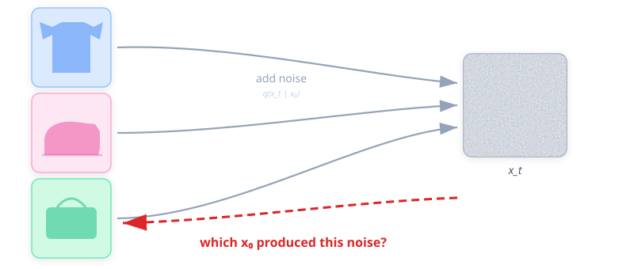
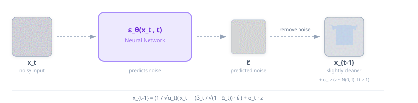

[](https://colab.research.google.com/github/miguelalexanderdiaz/overfitting_club/blob/main/blog/posts/tutorials/deep_learning/the_diffusion_paradigm/the_diffusion_paradigm.ipynb)

This is the fourth entry in our series building a
[Diffusion Transformer (DiT) from scratch](../diffusion_transformer/diffusion_transformer.qmd).
In the previous posts we assembled two critical pieces: an
[autoencoder](../autoencoder/autoencoder.qmd) that compresses images into a
compact latent space, and a
[class-conditional VAE](../class_conditional_vae/class_conditional_vae.qmd)
that injects label information via adaLN conditioning. Both generate images in a
single forward pass — the decoder maps
$\mathbf{z} \sim \mathcal{N}(\mathbf{0}, \mathbf{I})$ to pixel space in one
shot. That single-step approach works, but it forces the decoder to learn the
*entire* mapping from noise to data at once.

This post introduces a radically different idea: **iterative denoising**. Instead
of generating an image in one step, we start from pure noise and make many small
corrections, each of which is a simple denoising operation. We will implement the
full DDPM pipeline — forward noising, noise schedules, the training objective,
and reverse sampling — using a lightweight U-Net to demonstrate that the math
works before we bring in the Transformer architecture in Part 6.

## Why Diffusion? — The Limits of Single-Step Generation



In our [class-conditional VAE](../class_conditional_vae/class_conditional_vae.qmd),
the decoder must learn the *entire* mapping from a latent sample
$\mathbf{z} \sim \mathcal{N}(\mathbf{0}, \mathbf{I})$ to a realistic image in a
single forward pass. That is a hard problem — the network has to figure out global
structure, local texture, and fine details all at once.

Diffusion models take a different approach: instead of one giant leap, they define
a **Markov chain** of $T$ states

$$
\mathbf{x}_T \to \mathbf{x}_{T-1} \to \cdots \to \mathbf{x}_1 \to \mathbf{x}_0
$$

where $\mathbf{x}_T$ is pure Gaussian noise and $\mathbf{x}_0$ is the clean
image. The Markov property means each transition only depends on the *current*
state — $\mathbf{x}_{t-1}$ is produced from $\mathbf{x}_t$ alone, with no memory
of earlier steps. The animation above shows exactly this chain in action: each
frame is one state, and the image emerges progressively as we walk from
$t = T$ to $t = 0$.

This chain has two directions:

- **Forward process** (easy — no learning required). We start from a clean image
  $\mathbf{x}_0$ and gradually add Gaussian noise at each step until the signal is
  completely destroyed:
  $q(\mathbf{x}_t \mid \mathbf{x}_{t-1})$. This is a fixed process — just noise
  injection, no neural network involved.

- **Reverse process** (hard — this is what we learn). Starting from pure noise
  $\mathbf{x}_T \sim \mathcal{N}(\mathbf{0}, \mathbf{I})$, a neural network
  predicts how to denoise one step at a time:
  $p_\theta(\mathbf{x}_{t-1} \mid \mathbf{x}_t)$. Each transition is a small
  correction, not a full reconstruction.

The key insight that makes this work: when each forward step is a *small* Gaussian
perturbation, the reverse step is approximately Gaussian too
[@sohl2015deep]. So the network only needs to predict a **mean** and a
**variance** for each step — a much simpler task than generating an entire image
from scratch.

:::: {.callout-note}
## The trade-off: quality vs speed
Diffusion models produce **sharper, more diverse** samples than VAEs because the
iterative chain can correct mistakes over many steps — no single forward pass
needs to be perfect. The cost is **inference speed**: generating one image
requires running the network $T$ times (typically $T = 1000$), compared to a
single decoder pass in a VAE. Much of modern diffusion research (DDIM, distillation,
consistency models) focuses on closing this speed gap without sacrificing quality.
::::

```{python}
#| code-fold: true
#| code-summary: "Setup: imports and configuration"

from pathlib import Path
import torch
import torch.nn as nn
import torch.nn.functional as F
import torch.optim as optim
from torch.utils.data import DataLoader
from torchvision import datasets, transforms
import plotly.graph_objects as go
from plotly.subplots import make_subplots
import numpy as np
from rich.console import Console
from rich.table import Table

console = Console()
torch.manual_seed(42)
np.random.seed(42)

DEVICE = torch.device(
    "cuda" if torch.cuda.is_available()
    else "mps" if torch.backends.mps.is_available()
    else "cpu"
)
T = 1000                # total diffusion steps
BATCH_SIZE = 256
EPOCHS = 200
LR = 2e-4
EMA_DECAY = 0.999
GRAD_CLIP_NORM = 1.0
DROPOUT = 0.1
LOAD_CHECKPOINTS = True
CHECKPOINT_DIR = Path("data/checkpoints")
CHECKPOINT_DIR.mkdir(parents=True, exist_ok=True)

CLASS_NAMES = [
    "T-shirt/top", "Trouser", "Pullover", "Dress", "Coat",
    "Sandal", "Shirt", "Sneaker", "Bag", "Ankle boot",
]
NUM_CLASSES = len(CLASS_NAMES)
console.print(f"Device: {DEVICE} | T = {T}")
```

```{python}
#| code-fold: true
#| code-summary: "Load FashionMNIST"

transform = transforms.Compose([
    transforms.ToTensor(),                         # [0, 1]
    transforms.Normalize((0.5,), (0.5,)),          # [-1, 1]
])
train_data = datasets.FashionMNIST("data", train=True, download=True, transform=transform)
test_data = datasets.FashionMNIST("data", train=False, download=True, transform=transform)
train_loader = DataLoader(train_data, batch_size=BATCH_SIZE, shuffle=True)
test_loader = DataLoader(test_data, batch_size=BATCH_SIZE)
console.print(f"Train: {len(train_data):,} | Test: {len(test_data):,}")
```

## The Forward Process — Destroying Information Systematically {#sec-forward}

Before we can learn to denoise, we need a way to *add* noise to clean images in a
controlled, mathematically precise way. The forward process defines exactly this:
a fixed procedure that takes a clean image $\mathbf{x}_0$ and progressively
corrupts it over $T$ steps until nothing recognizable remains.

Each step is a **single Gaussian perturbation**. Given the image at step $t-1$,
we produce the next (noisier) version by fading the signal and injecting fresh
noise:

$$
\mathbf{x}_t \mid \mathbf{x}_{t-1}
\;\sim\; \mathcal{N}\!\Big(\sqrt{1 - \beta_t}\,\mathbf{x}_{t-1},\;
\beta_t\,\mathbf{I}\Big)
$$ {#eq-forward-step}

The scalar $\beta_t \in (0, 1)$ is **not a constant** — it is a predetermined
function of $t$ called the **noise schedule**. In the original DDPM
[@ho2020denoising], $\beta_t$ increases linearly from $\beta_1 = 10^{-4}$ to
$\beta_T = 0.02$, so early steps add very little noise while later steps are more
aggressive. We will explore different schedule choices (linear vs cosine) in
@sec-schedules. The factor $\sqrt{1 - \beta_t}$ slightly shrinks the signal so
that the total variance stays bounded as we chain many steps together. Intuitively:
each step *fades* the image a little and *adds a pinch of static*.

But running this formula iteratively — one step at a time for $T = 1000$ steps —
would be painfully slow during training. We need to noise millions of images at
random timesteps. Fortunately, the math gives us a shortcut.

### Closed-form sampling — jumping to any $t$ {#sec-closed-form}

Define $\alpha_t = 1 - \beta_t$ and the **cumulative product**
$\bar{\alpha}_t = \prod_{s=1}^{t} \alpha_s$. Then the composition of all $t$
single-step Gaussians collapses into one:

$$
\mathbf{x}_t \mid \mathbf{x}_0
\;\sim\; \mathcal{N}\!\Big(\sqrt{\bar{\alpha}_t}\,\mathbf{x}_0,\;
(1 - \bar{\alpha}_t)\,\mathbf{I}\Big)
$$ {#eq-closed-form}

The mean shrinks toward zero while the variance grows toward one — the image is
gradually replaced by noise:

```{python}
#| code-fold: true
#| code-summary: "Mean and variance of q(x_t | x_0) over time"

_betas = torch.linspace(1e-4, 0.02, T).numpy()
_alpha_bar = torch.cumprod(1.0 - torch.tensor(_betas), dim=0).numpy()

t_range = np.arange(T)
fig = go.Figure()
fig.add_trace(go.Scatter(
    x=t_range, y=np.sqrt(_alpha_bar),
    name="√ᾱₜ (mean coefficient)", line=dict(color="#4A90D9", width=2),
))
fig.add_trace(go.Scatter(
    x=t_range, y=1.0 - _alpha_bar,
    name="1 − ᾱₜ (variance)", line=dict(color="#E74C3C", width=2),
))
fig.add_hline(y=0, line_dash="dot", line_color="gray", opacity=0.5)
fig.add_hline(y=1, line_dash="dot", line_color="gray", opacity=0.5)
fig.update_layout(
    title="Forward process: mean and variance of q(x_t | x_0)",
    xaxis_title="Timestep t",
    yaxis_title="Value",
    height=320,
    width=700,
    template="plotly_white",
    legend=dict(x=0.45, y=0.5),
    margin=dict(t=50, b=50, l=60, r=20),
)
fig.show()
```

At $t = 0$ the mean coefficient is $\approx 1$ (the image is untouched) and the
variance is $\approx 0$. By $t = T$ the mean has vanished and the variance is
$\approx 1$ — pure $\mathcal{N}(\mathbf{0}, \mathbf{I})$.

Using the reparameterization trick, we can sample $\mathbf{x}_t$ directly:

$$
\mathbf{x}_t = \sqrt{\bar{\alpha}_t}\,\mathbf{x}_0
+ \sqrt{1 - \bar{\alpha}_t}\,\boldsymbol{\varepsilon},
\qquad \boldsymbol{\varepsilon} \sim \mathcal{N}(\mathbf{0}, \mathbf{I})
$$ {#eq-reparam-forward}

This is the formula we will use everywhere — during training we pick a random $t$,
draw $\boldsymbol{\varepsilon}$, and compute $\mathbf{x}_t$ in a single shot.

:::: {.callout-tip}
## The reparameterization trick — again
We already saw this in the [autoencoder tutorial](../autoencoder/autoencoder.qmd):
to sample from $\mathcal{N}(\boldsymbol{\mu}, \boldsymbol{\sigma}^2)$, we draw
$\boldsymbol{\varepsilon} \sim \mathcal{N}(\mathbf{0}, \mathbf{I})$ and compute
$\mathbf{z} = \boldsymbol{\mu} + \boldsymbol{\sigma} \odot \boldsymbol{\varepsilon}$.
The diffusion forward process uses exactly the same decomposition, with
$\boldsymbol{\mu} = \sqrt{\bar{\alpha}_t}\,\mathbf{x}_0$ and
$\boldsymbol{\sigma} = \sqrt{1 - \bar{\alpha}_t}$.
::::

<details><summary>**Derivation: why does the chain collapse?** (click to expand)</summary>

The key property is that the **sum of independent Gaussians is Gaussian**. Let us
expand a few steps explicitly. At $t = 1$:

$$
\mathbf{x}_1 = \sqrt{\alpha_1}\,\mathbf{x}_0 + \sqrt{1 - \alpha_1}\,\boldsymbol{\varepsilon}_1
$$

Substituting into the formula for $t = 2$:

$$
\mathbf{x}_2
= \sqrt{\alpha_2}\,\mathbf{x}_1 + \sqrt{1 - \alpha_2}\,\boldsymbol{\varepsilon}_2
= \sqrt{\alpha_2 \alpha_1}\,\mathbf{x}_0
  + \sqrt{\alpha_2(1 - \alpha_1)}\,\boldsymbol{\varepsilon}_1
  + \sqrt{1 - \alpha_2}\,\boldsymbol{\varepsilon}_2
$$

The two noise terms are independent Gaussians with variances
$\alpha_2(1 - \alpha_1)$ and $(1 - \alpha_2)$. Their sum is Gaussian with
variance $\alpha_2 - \alpha_2\alpha_1 + 1 - \alpha_2 = 1 - \alpha_1\alpha_2
= 1 - \bar{\alpha}_2$. By induction, at step $t$ the signal coefficient is
$\sqrt{\bar{\alpha}_t}$ and the noise variance is $1 - \bar{\alpha}_t$, giving us
the closed-form $q(\mathbf{x}_t \mid \mathbf{x}_0) \sim \mathcal{N}(\sqrt{\bar{\alpha}_t}\,\mathbf{x}_0,\;(1-\bar{\alpha}_t)\,\mathbf{I})$.
See @ho2020denoising for the full proof.

</details>

:::: {.callout-note}
## Signal-to-noise ratio
$\bar{\alpha}_t$ directly controls the signal-to-noise ratio (SNR) at step $t$.
When $\bar{\alpha}_t \approx 1$ (early steps), the signal dominates — the image
is barely noised. When $\bar{\alpha}_t \approx 0$ (late steps), the noise
dominates — the image is nearly pure Gaussian. At $t = T$, if
$\bar{\alpha}_T \approx 0$, the distribution
$q(\mathbf{x}_T \mid \mathbf{x}_0)$ is approximately
$\mathcal{N}(\mathbf{0}, \mathbf{I})$ regardless of $\mathbf{x}_0$ — we have
lost all information about the original image.
::::

Let's implement the schedule and `q_sample` in code.

```{python}
#| code-fold: true
#| code-summary: "Linear noise schedule and q_sample"

def linear_beta_schedule(T, beta_start=1e-4, beta_end=0.02):
    """DDPM linear schedule: β_t from beta_start to beta_end."""
    return torch.linspace(beta_start, beta_end, T)


# Pre-compute schedule quantities
betas = linear_beta_schedule(T)                    # (T,)
alphas = 1.0 - betas                               # α_t
alpha_bar = torch.cumprod(alphas, dim=0)           # ᾱ_t


def q_sample(x_0, t, noise=None):
    """
    Forward process: sample x_t given x_0 using the closed-form formula.
    x_0:   (B, 1, H, W) clean images in [-1, 1]
    t:     (B,) integer timesteps in [0, T-1]
    noise: optional pre-sampled ε ~ N(0, I), same shape as x_0
    """
    if noise is None:
        noise = torch.randn_like(x_0)
    sqrt_alpha_bar = alpha_bar[t].sqrt()[:, None, None, None]        # (B,1,1,1)
    sqrt_one_minus = (1.0 - alpha_bar[t]).sqrt()[:, None, None, None]
    return sqrt_alpha_bar * x_0 + sqrt_one_minus * noise
```

Now let's see the forward process in action on a real image.

```{python}
#| code-fold: true
#| code-summary: "Visualize the forward process at selected timesteps"

# Pick a single image
sample_img, sample_label = test_data[0]
x_0 = sample_img.unsqueeze(0)  # (1, 1, 28, 28)

timesteps = [0, 50, 100, 200, 500, 999]

fig = make_subplots(
    rows=1, cols=len(timesteps),
    subplot_titles=[f"t = {t}" for t in timesteps],
    horizontal_spacing=0.03,
)

for i, t in enumerate(timesteps):
    t_tensor = torch.tensor([t])
    x_t = q_sample(x_0, t_tensor).squeeze().numpy()
    fig.add_trace(
        go.Heatmap(
            z=x_t[::-1],
            colorscale="Gray_r",
            showscale=False,
            hovertemplate="pixel (%{x}, %{y}): %{z:.2f}<extra></extra>",
        ),
        row=1, col=i + 1,
    )
    fig.update_xaxes(showticklabels=False, row=1, col=i + 1)
    fig.update_yaxes(showticklabels=False, row=1, col=i + 1)

fig.update_layout(
    title_text=f"Forward noising: {CLASS_NAMES[sample_label]} → pure noise",
    height=220,
    width=900,
    margin=dict(t=60, b=10, l=10, r=10),
    template="plotly_white",
)
fig.show()
```

## Noise Schedules — Controlling the Destruction {#sec-schedules}

In @sec-forward we used the linear schedule from the original DDPM paper without
much discussion. But the *shape* of the schedule — how the noise budget is
distributed across timesteps — has a significant impact on sample quality. A
schedule that destroys information too quickly wastes capacity: the network
spends most of its effort denoising inputs where the signal is already gone.

### Linear Schedule

The linear schedule sets $\beta_t$ to increase linearly from $\beta_1 = 10^{-4}$
to $\beta_T = 0.02$. Simple and effective, but it has a drawback:
$\bar{\alpha}_t$ drops steeply through the middle timesteps, so the image loses
most of its recognizable structure by around $t \approx 500$. The second half of
the chain is essentially spent denoising near-pure noise — not the most
productive use of the network's capacity.

### Cosine Schedule

Nichol and Dhariwal [@nichol2021improved] proposed defining $\bar{\alpha}_t$
*directly* through a cosine function instead of specifying $\beta_t$:

$$
\bar{\alpha}_t = \frac{f(t)}{f(0)}, \qquad
f(t) = \cos^2\!\left(\frac{t/T + s}{1 + s} \cdot \frac{\pi}{2}\right)
$$ {#eq-cosine-schedule}

with a small offset $s = 0.008$ to prevent $\beta_t$ from being too small near
$t = 0$. The betas are then recovered as
$\beta_t = 1 - \bar{\alpha}_t / \bar{\alpha}_{t-1}$, clipped to a maximum of
$0.999$ for numerical stability.

The cosine shape distributes the SNR decrease more uniformly across timesteps:
the image retains visible structure for longer, giving the network more
"useful" timesteps to learn from.

:::: {.callout-note}
## Linear vs. cosine in practice
The original DDPM [@ho2020denoising] used the linear schedule. However, modern
diffusion pipelines overwhelmingly prefer the cosine schedule (or variants of
it) because it preserves signal longer and improves sample quality — especially
at higher resolutions. **We use the cosine schedule for the rest of this
tutorial.**
::::

### Comparing Schedules

```{python}
#| code-fold: true
#| code-summary: "Cosine schedule and comparison"

def cosine_beta_schedule(T, s=0.008):
    """Nichol & Dhariwal cosine schedule: ᾱ_t defined via a cosine curve."""
    steps = torch.arange(T + 1, dtype=torch.float64)
    f = torch.cos((steps / T + s) / (1 + s) * torch.pi / 2) ** 2
    alpha_bar_cos = f / f[0]
    betas_cos = 1 - (alpha_bar_cos[1:] / alpha_bar_cos[:-1])
    return betas_cos.clamp(max=0.999).float()


# ── Compare both schedules ──────────────────────────────────────────
betas_linear = linear_beta_schedule(T)
alpha_bar_linear = torch.cumprod(1.0 - betas_linear, dim=0)

betas_cosine = cosine_beta_schedule(T)
alpha_bar_cosine = torch.cumprod(1.0 - betas_cosine, dim=0)

# ── Switch to cosine for the rest of the tutorial ───────────────────
betas = betas_cosine
alphas = 1.0 - betas
alpha_bar = alpha_bar_cosine
```

```{python}
#| code-fold: true
#| code-summary: "ᾱ_t comparison: linear vs cosine"

t_range = np.arange(T)
fig = go.Figure()
fig.add_trace(go.Scatter(
    x=t_range, y=alpha_bar_linear.numpy(),
    name="Linear", line=dict(color="#E74C3C", width=2),
))
fig.add_trace(go.Scatter(
    x=t_range, y=alpha_bar_cosine.numpy(),
    name="Cosine", line=dict(color="#4A90D9", width=2),
))
fig.add_hline(y=0, line_dash="dot", line_color="gray", opacity=0.5)
fig.add_hline(y=1, line_dash="dot", line_color="gray", opacity=0.5)
fig.update_layout(
    title="Cumulative signal retention ᾱ_t: linear vs cosine",
    xaxis_title="Timestep t",
    yaxis_title="ᾱ_t",
    height=320,
    width=700,
    template="plotly_white",
    legend=dict(x=0.65, y=0.9),
    margin=dict(t=50, b=50, l=60, r=20),
)
fig.show()
```

The cosine curve stays higher for longer — the image retains meaningful structure
well past the midpoint — then drops smoothly to zero at $t = T$. The linear
schedule, by contrast, has already crushed $\bar{\alpha}_t$ close to zero by
$t \approx 700$.

We can see the difference on a real image:

```{python}
#| code-fold: true
#| code-summary: "Noising comparison: linear vs cosine"

timesteps_cmp = [0, 100, 250, 500, 750, 999]
schedules = [
    ("Linear", alpha_bar_linear),
    ("Cosine", alpha_bar_cosine),
]

fig = make_subplots(
    rows=2, cols=len(timesteps_cmp),
    subplot_titles=[f"t = {t}" for t in timesteps_cmp],
    row_titles=["Linear", "Cosine"],
    horizontal_spacing=0.03,
    vertical_spacing=0.08,
)

x_0_single = sample_img.unsqueeze(0)  # (1, 1, 28, 28), from section 2
torch.manual_seed(42)  # same noise for both schedules

for row_idx, (sched_name, abar) in enumerate(schedules):
    for col_idx, t in enumerate(timesteps_cmp):
        torch.manual_seed(42)  # reset so both rows use identical ε
        noise = torch.randn_like(x_0_single)
        sqrt_abar = abar[t].sqrt()
        sqrt_one_minus = (1.0 - abar[t]).sqrt()
        x_t = sqrt_abar * x_0_single + sqrt_one_minus * noise
        fig.add_trace(
            go.Heatmap(
                z=x_t.squeeze().numpy()[::-1],
                colorscale="Gray_r",
                showscale=False,
                hovertemplate="pixel (%{x}, %{y}): %{z:.2f}<extra></extra>",
            ),
            row=row_idx + 1, col=col_idx + 1,
        )
        fig.update_xaxes(showticklabels=False, row=row_idx + 1, col=col_idx + 1)
        fig.update_yaxes(showticklabels=False, row=row_idx + 1, col=col_idx + 1)

fig.update_layout(
    title_text=f"Same image, same noise — linear vs cosine schedule",
    height=380,
    width=900,
    margin=dict(t=60, b=10, l=80, r=10),
    template="plotly_white",
)
fig.show()
```

Notice how at $t = 500$ the cosine row still shows a recognizable garment while
the linear row is mostly noise. By $t = 750$ both are heavily corrupted, but the
cosine schedule preserves faint structure even there.

## The Reverse Process — Learning to Denoise {#sec-reverse}

We know how to destroy an image — the forward process turns any $\mathbf{x}_0$
into pure noise in $T$ steps. Now we need to learn how to *undo* each step:
given a noisy $\mathbf{x}_t$, recover a slightly cleaner $\mathbf{x}_{t-1}$.

### Why Reversal Is Hard

The forward process is easy because we *chose* it — just add Gaussian noise.
Reversing it requires knowing $q(\mathbf{x}_{t-1} \mid \mathbf{x}_t)$, the
distribution of "slightly cleaner" images given a noisy one. This distribution
depends on the *entire* data distribution, making it intractable.

{width=100%}

Think of it this way: many different clean images can produce the same noisy
result. A noisy blob at $t = 800$ could have been a T-shirt, a sneaker, or a
bag — the noise has erased the evidence. The forward process is many-to-one;
reversing it is one-to-many.

### Small Steps Save Us

Here is the key insight from @sohl2015deep: when each forward step adds only a
*tiny* amount of noise ($\beta_t$ is small), the reverse step is also
approximately Gaussian:

$$
p_\theta(\mathbf{x}_{t-1} \mid \mathbf{x}_t)
= \mathcal{N}\!\bigl(\mathbf{x}_{t-1};\;
\boldsymbol{\mu}_\theta(\mathbf{x}_t, t),\;\sigma_t^2\,\mathbf{I}\bigr)
$$ {#eq-reverse-step}

The variance $\sigma_t^2$ is fixed to $\beta_t$ [@ho2020denoising] (it can also
be learned — see @nichol2021improved). So **the only thing the network needs to
learn is the mean** $\boldsymbol{\mu}_\theta$: the best guess for the slightly
cleaner image at each step. Chain $T$ of these learned Gaussian steps and you
turn pure noise into a clean image.

### What Should the Mean Be?

During training we *have* the clean image $\mathbf{x}_0$ — it is the training
example. Given both $\mathbf{x}_t$ and $\mathbf{x}_0$, Bayes' rule gives us
the *exact* target mean and variance for each reverse step, no approximation
needed.

:::: {.callout-tip}
## TL;DR
When $\mathbf{x}_0$ is known, the reverse posterior
$q(\mathbf{x}_{t-1} \mid \mathbf{x}_t, \mathbf{x}_0)$ is a Gaussian whose
mean $\tilde{\boldsymbol{\mu}}_t$ and variance $\tilde{\beta}_t$ have
closed-form expressions (see derivation below). The network's job during
training is to output something that matches $\tilde{\boldsymbol{\mu}}_t$.
::::

<details><summary>**Posterior derivation and references** (click to expand)</summary>

Applying Bayes' rule to the forward Markov chain:

$$
q(\mathbf{x}_{t-1} \mid \mathbf{x}_t, \mathbf{x}_0)
= \mathcal{N}\!\bigl(\mathbf{x}_{t-1};\;
\tilde{\boldsymbol{\mu}}_t,\;
\tilde{\beta}_t\,\mathbf{I}\bigr)
$$

where

$$
\tilde{\boldsymbol{\mu}}_t
= \frac{\sqrt{\bar{\alpha}_{t-1}}\,\beta_t}{1 - \bar{\alpha}_t}\,\mathbf{x}_0
\;+\; \frac{\sqrt{\alpha_t}\,(1 - \bar{\alpha}_{t-1})}{1 - \bar{\alpha}_t}\,
\mathbf{x}_t
\qquad\qquad
\tilde{\beta}_t
= \frac{1 - \bar{\alpha}_{t-1}}{1 - \bar{\alpha}_t}\,\beta_t
$$

The key step is expanding the Gaussian densities
$q(\mathbf{x}_t \mid \mathbf{x}_{t-1})$ and
$q(\mathbf{x}_{t-1} \mid \mathbf{x}_0)$ inside Bayes' rule, then completing
the square. For the full step-by-step derivation see:

- **Ho et al. (2020)**, Section 3.2 — the original DDPM derivation
- **Lilian Weng**, *"What are Diffusion Models?"* — an excellent walkthrough
  with step-by-step algebra
- **Calvin Luo**, *"Understanding Diffusion Models: A Unified Perspective"* — a
  comprehensive tutorial covering every detail

</details>

### Predict the Noise, Not the Mean {#sec-eps-param}

So the network needs to produce something that matches the target mean
$\tilde{\boldsymbol{\mu}}_t$. It *could* predict
$\boldsymbol{\mu}_\theta$ directly, but Ho et al. [@ho2020denoising] found a
better approach: **make the network predict the noise
$\boldsymbol{\varepsilon}$ that was added to the image**.

Why does predicting noise give us the mean? Because from our forward process
(@sec-forward) we know how $\mathbf{x}_t$ was constructed:

$$
\mathbf{x}_t
= \sqrt{\bar{\alpha}_t}\,\mathbf{x}_0
+ \sqrt{1 - \bar{\alpha}_t}\,\boldsymbol{\varepsilon}
$$

If a network $\boldsymbol{\varepsilon}_\theta(\mathbf{x}_t, t)$ gives us an
estimate of $\boldsymbol{\varepsilon}$, we can work backwards in two steps:

1. **Recover** $\hat{\mathbf{x}}_0$: rearrange the formula above →
   $\hat{\mathbf{x}}_0
   = \frac{1}{\sqrt{\bar{\alpha}_t}}
   \bigl(\mathbf{x}_t
   - \sqrt{1 - \bar{\alpha}_t}\,
   \boldsymbol{\varepsilon}_\theta(\mathbf{x}_t, t)\bigr)$
2. **Plug** $\hat{\mathbf{x}}_0$ into the posterior mean
   $\tilde{\boldsymbol{\mu}}_t$ from the previous section → get the reverse mean

After simplification, those two steps collapse into one formula:

$$
\boldsymbol{\mu}_\theta(\mathbf{x}_t, t)
= \frac{1}{\sqrt{\alpha_t}}
\left(\mathbf{x}_t
- \frac{\beta_t}{\sqrt{1 - \bar{\alpha}_t}}\,
\boldsymbol{\varepsilon}_\theta(\mathbf{x}_t, t)\right)
$$ {#eq-mu-from-eps}

<details><summary>**Step-by-step substitution** (click to expand)</summary>

Starting from the posterior mean (derived in the section above):

$$
\tilde{\boldsymbol{\mu}}_t
= \frac{\sqrt{\bar{\alpha}_{t-1}}\,\beta_t}{1 - \bar{\alpha}_t}\,\mathbf{x}_0
\;+\; \frac{\sqrt{\alpha_t}\,(1 - \bar{\alpha}_{t-1})}{1 - \bar{\alpha}_t}\,
\mathbf{x}_t
$$

Substitute
$\mathbf{x}_0
= \frac{1}{\sqrt{\bar{\alpha}_t}}
\bigl(\mathbf{x}_t - \sqrt{1-\bar{\alpha}_t}\,\boldsymbol{\varepsilon}\bigr)$
into the first term:

$$
\tilde{\boldsymbol{\mu}}_t
= \frac{\sqrt{\bar{\alpha}_{t-1}}\,\beta_t}{(1 - \bar{\alpha}_t)\sqrt{\bar{\alpha}_t}}
  \bigl(\mathbf{x}_t - \sqrt{1-\bar{\alpha}_t}\,\boldsymbol{\varepsilon}\bigr)
\;+\; \frac{\sqrt{\alpha_t}\,(1 - \bar{\alpha}_{t-1})}{1 - \bar{\alpha}_t}\,
\mathbf{x}_t
$$

Collect the $\mathbf{x}_t$ terms and simplify using
$\bar{\alpha}_t = \alpha_t\,\bar{\alpha}_{t-1}$:

$$
\tilde{\boldsymbol{\mu}}_t
= \frac{1}{\sqrt{\alpha_t}}
\left(\mathbf{x}_t
- \frac{\beta_t}{\sqrt{1 - \bar{\alpha}_t}}\,\boldsymbol{\varepsilon}\right)
$$

Finally, replace the true noise $\boldsymbol{\varepsilon}$ with the network
prediction $\boldsymbol{\varepsilon}_\theta(\mathbf{x}_t, t)$ to arrive at the
$\boldsymbol{\varepsilon}$-parameterized mean formula.

</details>

In plain language, @eq-mu-from-eps says: **take the noisy image, subtract the
predicted noise (appropriately scaled), and rescale**. That gives you the mean of
the reverse step. Sample from that Gaussian, and you get a slightly cleaner
image.

{width=100%}

:::: {.callout-note}
## Three equivalent parameterizations
The network can predict any of three targets and they are all equivalent:

1. **The noise** $\hat{\boldsymbol{\varepsilon}}$ — predict what noise was added
   *(this is what DDPM uses and what we implement)*
2. **The clean image** $\hat{\mathbf{x}}_0$ — directly predict the denoised result
3. **The mean** $\boldsymbol{\mu}_\theta$ — predict the reverse mean directly

They are interchangeable because the forward formula
$\mathbf{x}_t = \sqrt{\bar{\alpha}_t}\,\mathbf{x}_0
+ \sqrt{1 - \bar{\alpha}_t}\,\boldsymbol{\varepsilon}$
links all three. Ho et al. [@ho2020denoising] found that predicting
$\boldsymbol{\varepsilon}$ works best in practice.
::::

## The Training Objective — Simple Denoising {#sec-training-objective}

We know *what* the network predicts (noise) and *how* its prediction becomes a
reverse step (@eq-mu-from-eps). The remaining question is: **what loss function
do we optimize?** The answer turns out to be remarkably simple.

### From Variational Bound to Simple Loss

:::: {.callout-tip}
## TL;DR
The rigorous derivation starts from a variational lower bound on
$\log p(\mathbf{x}_0)$ and decomposes it into one KL term per timestep. With
the $\boldsymbol{\varepsilon}$-parameterization, each KL term reduces to an MSE
between the predicted noise and the actual noise. Ho et al. then found that
**dropping the per-timestep weighting** and using a single unweighted MSE works
even better. That is the loss we use.
::::

<details><summary><strong>Variational bound derivation</strong> (click to expand)</summary>

Like VAEs, diffusion models maximize a variational lower bound (VLB, also called
the ELBO) on the log-likelihood of the data:

$$
\log p(\mathbf{x}_0) \;\ge\; \mathbb{E}_q\!\Big[\,
  \underbrace{-\text{KL}\!\big(q(\mathbf{x}_T|\mathbf{x}_0)\;\|\;p(\mathbf{x}_T)\big)}_{L_T}
  \;+\; \sum_{t=2}^{T}
  \underbrace{-\text{KL}\!\big(q(\mathbf{x}_{t-1}|\mathbf{x}_t,\mathbf{x}_0)\;\|\;p_\theta(\mathbf{x}_{t-1}|\mathbf{x}_t)\big)}_{L_{t-1}}
  \;+\; \underbrace{\log p_\theta(\mathbf{x}_0|\mathbf{x}_1)}_{L_0}
\,\Big]
$$

What each term means:

- **$L_T$** — compares the final noisy distribution $q(\mathbf{x}_T|\mathbf{x}_0)$ to the prior $p(\mathbf{x}_T) = \mathcal{N}(\mathbf{0}, \mathbf{I})$. Since the forward process is fixed and $T$ is large enough, both are nearly standard Gaussian. **This term is constant** — no learnable parameters.

- **$L_{t-1}$** (for $t = 2, \dots, T$) — a KL divergence between two Gaussians: the true posterior $q(\mathbf{x}_{t-1}|\mathbf{x}_t, \mathbf{x}_0)$ and our learned reverse $p_\theta(\mathbf{x}_{t-1}|\mathbf{x}_t)$. Since both are Gaussian, this KL has a closed-form solution that reduces to an MSE between their means. With the $\boldsymbol{\varepsilon}$-parameterization, this becomes:

$$
L_{t-1} = \frac{\beta_t^2}{2\,\sigma_t^2\,\alpha_t\,(1 - \bar{\alpha}_t)}
\;\mathbb{E}_{\boldsymbol{\varepsilon}}\!\Big[\,
  \big\|\boldsymbol{\varepsilon} - \boldsymbol{\varepsilon}_\theta(\mathbf{x}_t, t)\big\|^2
\,\Big]
$$

- **$L_0$** — a reconstruction term at the final step.

The key observation: every $L_{t-1}$ term is a **weighted MSE on noise prediction**, just with a different weight per timestep.

**References for the full derivation:**

- Ho et al. (2020), "Denoising Diffusion Probabilistic Models", Section 3.3–3.4
- Luo (2022), "Understanding Diffusion Models: A Unified Perspective", Sections 4–5 — excellent step-by-step walkthrough
- Weng (2021), "What are Diffusion Models?" — clear visual presentation of the VLB decomposition

</details>

### The Simple Loss

Ho et al. [@ho2020denoising] made a surprising empirical finding: **ignoring the
per-timestep weighting** and optimizing a plain MSE produces better samples. The
loss becomes:

$$
L_{\text{simple}} = \mathbb{E}_{t,\,\mathbf{x}_0,\,\boldsymbol{\varepsilon}}\!\Big[\,
  \big\|\boldsymbol{\varepsilon}
  - \boldsymbol{\varepsilon}_\theta(\mathbf{x}_t, t)\big\|^2
\,\Big]
$$ {#eq-simple-loss}

That is it. The entire training procedure is:

1. Sample a clean image $\mathbf{x}_0$ from the dataset
2. Sample a random timestep $t \sim \text{Uniform}\{1, \dots, T\}$
3. Sample noise $\boldsymbol{\varepsilon} \sim \mathcal{N}(\mathbf{0}, \mathbf{I})$
4. Compute the noisy image $\mathbf{x}_t = \sqrt{\bar{\alpha}_t}\,\mathbf{x}_0 + \sqrt{1 - \bar{\alpha}_t}\,\boldsymbol{\varepsilon}$ using our closed-form from @sec-forward
5. Predict $\hat{\boldsymbol{\varepsilon}} = \boldsymbol{\varepsilon}_\theta(\mathbf{x}_t, t)$
6. Compute the loss $\|\boldsymbol{\varepsilon} - \hat{\boldsymbol{\varepsilon}}\|^2$ and backpropagate

Notice step 4: we never run the full forward chain during training. We **jump
directly** to any timestep $t$ in one shot using the closed-form formula, then
ask the network to predict the noise that was added. This makes training
efficient — each step costs the same as a single forward pass through the
network.

:::: {.callout-tip}
## So what changed?
We turned a complex variational inference problem into supervised learning on
random noise. At each training step, we pick a random timestep, add known noise
to a training image, and train the network to predict that noise. No adversarial
training, no complex latent inference — just denoising.
::::

```{python}
#| code-fold: true
#| code-summary: "The DDPM training step"

def ddpm_train_step(model, x_0, alpha_bar, optimizer):
    """One DDPM training step — implements the 6-step algorithm above."""
    device = x_0.device
    batch_size = x_0.shape[0]

    # Step 2: sample random timesteps
    t = torch.randint(0, len(alpha_bar), (batch_size,), device=device)

    # Step 3: sample noise
    eps = torch.randn_like(x_0)

    # Step 4: compute x_t in one shot (closed-form forward)
    abar_t = alpha_bar[t].view(-1, 1, 1, 1)          # (B, 1, 1, 1)
    x_t = abar_t.sqrt() * x_0 + (1 - abar_t).sqrt() * eps

    # Step 5: predict the noise
    eps_pred = model(x_t, t)

    # Step 6: MSE loss and backprop
    loss = F.mse_loss(eps_pred, eps)

    optimizer.zero_grad()
    loss.backward()
    optimizer.step()

    return loss.item()
```

## The Denoiser Network — A Class-Conditional U-Net {#sec-unet}

:::: {.callout-note}
## Why a U-Net and not a DiT?
This post focuses on the *diffusion paradigm* — the forward process, the loss,
and the sampling algorithm. The denoiser architecture borrows directly from
@ho2020denoising. In Part 6, we will swap this U-Net for a Diffusion
Transformer and see how the same training loop and sampling algorithm produce
dramatically better results.
::::

### Timestep Embedding

The network must know *which* timestep it is denoising — removing heavy noise
($t = 999$) is a very different task from refining fine details ($t = 5$). We
encode $t$ using the same **sinusoidal positional encoding** from the Transformer
[@vaswani2017attention], projected through a small MLP:

$$
\text{emb}(t) = \text{MLP}\!\big(\text{SinusoidalPE}(t)\big) \in \mathbb{R}^{d_\text{emb}}
$$

This embedding is then injected into every residual block of the U-Net. The
same sinusoidal timestep encoding will reappear in the DiT (Part 6).

```{python}
#| code-fold: true
#| code-summary: "Sinusoidal timestep embedding"

class SinusoidalPE(nn.Module):
    """Sinusoidal positional encoding for integer timesteps."""
    def __init__(self, dim):
        super().__init__()
        self.dim = dim

    def forward(self, t):
        device = t.device
        half = self.dim // 2
        freqs = torch.exp(
            -np.log(10000) * torch.arange(half, device=device) / half
        )                                                  # (dim/2,)
        args = t[:, None].float() * freqs[None, :]        # (B, dim/2)
        return torch.cat([args.sin(), args.cos()], dim=-1) # (B, dim)


class TimestepEmbedding(nn.Module):
    """SinusoidalPE → MLP → embedding vector."""
    def __init__(self, dim, hidden_dim=None):
        super().__init__()
        hidden_dim = hidden_dim or 4 * dim
        self.pe = SinusoidalPE(dim)
        self.mlp = nn.Sequential(
            nn.Linear(dim, hidden_dim),
            nn.GELU(),
            nn.Linear(hidden_dim, hidden_dim),
        )

    def forward(self, t):
        return self.mlp(self.pe(t))                        # (B, hidden_dim)
```

### U-Net Architecture

Our U-Net follows the classic encoder-decoder pattern from @ronneberger2015unet
with **skip connections** at each resolution level. For diffusion we add two
things on top:

1. **Timestep-and-class embedding injection** — every residual block receives a
   combined `(t, y)` embedding via a learned projection added to the feature
   maps. The class embedding is added to the timestep embedding, so every layer
   sees "how noisy is this?" and "what am I denoising?" together.
2. **Self-attention** at one intermediate resolution — a single attention layer
   lets distant pixels coordinate, which matters a lot when stitching together
   coherent shapes from noise.

The architecture borrows all the structural ingredients from the original DDPM
U-Net [@ho2020denoising] (Swish activation, GroupNorm(32), 2 ResBlocks per
resolution, attention at one level) and downscales the capacity knobs for
FashionMNIST: base channels $64$, multipliers $(1, 2, 2)$ for 3 resolution
levels ($28 \to 14 \to 7$).

{#fig-condu-net}

:::: {.callout-warning}
## Upsampling matters: avoiding checkerboard artifacts

A naïve way to double spatial resolution is **transposed convolution**
(`ConvTranspose2d`). The problem: when the kernel size and stride don't tile
evenly, some output pixels receive contributions from more input neurons than
their neighbours. This creates a regular grid of "hot" and "cold" pixels —
the infamous **checkerboard pattern** [@odena2016deconvolution]. In a diffusion
model the artifact is especially damaging because the reverse process amplifies
it at every denoising step.

The fix used in the DDPM reference implementation (and virtually all modern
diffusion U-Nets) is **nearest-neighbour upsampling followed by a regular
convolution**: `nn.Upsample(scale_factor=2, mode="nearest")` → `Conv2d(3×3)`.
Nearest-neighbour distributes every input value uniformly to its four output
pixels, so no spatial location is privileged. The subsequent convolution then
learns to smooth and refine — without the baked-in overlap asymmetry.


::::

```{python}
#| code-fold: true
#| code-summary: "Building blocks: ResBlock, AttnBlock, up/down"

class ResBlock(nn.Module):
    """GroupNorm → SiLU → Conv, twice, with timestep+class embedding injection."""
    def __init__(self, in_ch, out_ch, emb_dim, dropout=DROPOUT):
        super().__init__()
        self.norm1 = nn.GroupNorm(32, in_ch)
        self.conv1 = nn.Conv2d(in_ch, out_ch, 3, padding=1)
        self.emb_proj = nn.Linear(emb_dim, out_ch)
        self.norm2 = nn.GroupNorm(32, out_ch)
        self.dropout = nn.Dropout(dropout)
        self.conv2 = nn.Conv2d(out_ch, out_ch, 3, padding=1)
        self.skip = nn.Conv2d(in_ch, out_ch, 1) if in_ch != out_ch else nn.Identity()

    def forward(self, x, emb):
        h = self.conv1(F.silu(self.norm1(x)))
        h = h + self.emb_proj(F.silu(emb))[:, :, None, None]
        h = self.conv2(self.dropout(F.silu(self.norm2(h))))
        return h + self.skip(x)


class AttnBlock(nn.Module):
    """Single-head self-attention at a fixed spatial resolution."""
    def __init__(self, ch):
        super().__init__()
        self.norm = nn.GroupNorm(32, ch)
        self.qkv  = nn.Conv2d(ch, ch * 3, 1)
        self.proj = nn.Conv2d(ch, ch, 1)

    def forward(self, x):
        B, C, H, W = x.shape
        q, k, v = self.qkv(self.norm(x)).chunk(3, dim=1)
        q = q.reshape(B, C, H * W).permute(0, 2, 1)        # (B, HW, C)
        k = k.reshape(B, C, H * W)                         # (B, C,  HW)
        v = v.reshape(B, C, H * W).permute(0, 2, 1)        # (B, HW, C)
        a = torch.bmm(q, k).mul_(C ** -0.5).softmax(dim=-1)  # (B, HW, HW)
        h = torch.bmm(a, v).permute(0, 2, 1).reshape(B, C, H, W)
        return x + self.proj(h)


def downsample(ch):
    """2× spatial downsample via stride-2 conv."""
    return nn.Conv2d(ch, ch, 3, stride=2, padding=1)

def upsample(ch):
    """Nearest-neighbour 2× upsample, then 3×3 conv (no checkerboard)."""
    return nn.Sequential(
        nn.Upsample(scale_factor=2, mode="nearest"),
        nn.Conv2d(ch, ch, 3, padding=1),
    )
```

```{python}
#| code-fold: true
#| code-summary: "Class-conditional U-Net"

class CondUNet(nn.Module):
    """
    Class-conditional U-Net for 1×28×28 images.

    Encoder: 1 → 64 → 128 → 128           (spatial: 28 → 14 → 7)
    Middle:  ResBlock → AttnBlock → ResBlock  (128, 7×7)
    Decoder: 128 → 128 → 64 → 1           (spatial: 7 → 14 → 28)

    Attention is applied at 14×14 resolution (both encoder and decoder). Two
    ResBlocks per level on the encoder; three on the decoder (one extra to
    consume the pre-downsample skip), following Ho et al.
    """
    def __init__(
        self, in_ch=1, ch=64, num_classes=NUM_CLASSES,
        ch_mult=(1, 2, 2), num_res_blocks=2, attn_resolutions=(14,),
    ):
        super().__init__()
        emb_dim = ch * 4                                    # 256
        self.time_emb = TimestepEmbedding(ch, emb_dim)
        self.class_emb = nn.Embedding(num_classes, emb_dim)

        self.entry = nn.Conv2d(in_ch, ch, 3, padding=1)

        # --- Encoder ---------------------------------------------------------
        self.down_layers = nn.ModuleList()
        skip_channels = [ch]
        cur_ch, cur_res = ch, 28
        for i, mult in enumerate(ch_mult):
            out_ch = ch * mult
            for _ in range(num_res_blocks):
                block = nn.ModuleDict({"res": ResBlock(cur_ch, out_ch, emb_dim)})
                if cur_res in attn_resolutions:
                    block["attn"] = AttnBlock(out_ch)
                self.down_layers.append(block)
                cur_ch = out_ch
                skip_channels.append(cur_ch)
            if i < len(ch_mult) - 1:
                self.down_layers.append(nn.ModuleDict({"down": downsample(cur_ch)}))
                skip_channels.append(cur_ch)
                cur_res //= 2

        # --- Middle ----------------------------------------------------------
        self.mid_res1 = ResBlock(cur_ch, cur_ch, emb_dim)
        self.mid_attn = AttnBlock(cur_ch)
        self.mid_res2 = ResBlock(cur_ch, cur_ch, emb_dim)

        # --- Decoder ---------------------------------------------------------
        self.up_layers = nn.ModuleList()
        for i, mult in enumerate(reversed(ch_mult)):
            out_ch = ch * mult
            for _ in range(num_res_blocks + 1):
                skip_ch = skip_channels.pop()
                block = nn.ModuleDict({"res": ResBlock(cur_ch + skip_ch, out_ch, emb_dim)})
                if cur_res in attn_resolutions:
                    block["attn"] = AttnBlock(out_ch)
                self.up_layers.append(block)
                cur_ch = out_ch
            if i < len(ch_mult) - 1:
                self.up_layers.append(nn.ModuleDict({"up": upsample(cur_ch)}))
                cur_res *= 2

        self.out_norm = nn.GroupNorm(32, cur_ch)
        self.out = nn.Conv2d(cur_ch, in_ch, 3, padding=1)

    def forward(self, x, t, y):
        emb = self.time_emb(t) + self.class_emb(y)          # (B, emb_dim)

        # Encoder: collect a skip after each ResBlock and after each downsample
        h = self.entry(x)
        hs = [h]
        for block in self.down_layers:
            if "down" in block:
                h = block["down"](h)
            else:
                h = block["res"](h, emb)
                if "attn" in block:
                    h = block["attn"](h)
            hs.append(h)

        # Middle
        h = self.mid_res1(h, emb)
        h = self.mid_attn(h)
        h = self.mid_res2(h, emb)

        # Decoder: consume skips in reverse order, pad if spatial sizes differ
        for block in self.up_layers:
            if "up" in block:
                h = block["up"](h)
            else:
                skip = hs.pop()
                if h.shape[-2:] != skip.shape[-2:]:
                    h = F.pad(h, [0, skip.shape[-1] - h.shape[-1],
                                  0, skip.shape[-2] - h.shape[-2]])
                h = torch.cat([h, skip], dim=1)
                h = block["res"](h, emb)
                if "attn" in block:
                    h = block["attn"](h)

        return self.out(F.silu(self.out_norm(h)))
```

```{python}
#| code-fold: true
#| code-summary: "Model summary"

model = CondUNet(in_ch=1, ch=64).to(DEVICE)

# Verify shapes with a dummy forward pass
with torch.no_grad():
    dummy_x = torch.randn(2, 1, 28, 28, device=DEVICE)
    dummy_t = torch.randint(0, T, (2,), device=DEVICE)
    dummy_y = torch.randint(0, NUM_CLASSES, (2,), device=DEVICE)
    dummy_out = model(dummy_x, dummy_t, dummy_y)

tbl = Table(title="CondUNet Architecture")
tbl.add_column("Stage", style="cyan")
tbl.add_column("Layers", style="magenta")
tbl.add_column("Channels", style="green")
tbl.add_column("Spatial", style="dim")
for stage, layers, ch_str, spatial in [
    ("Input",   "—",                             "1",   "28×28"),
    ("Entry",   "Conv 3×3",                      "64",  "28×28"),
    ("Level 1", "2× ResBlock",                   "64",  "28×28"),
    ("Down 1",  "Conv ↓2",                       "64",  "14×14"),
    ("Level 2", "2× (ResBlock + Attn)",          "128", "14×14"),
    ("Down 2",  "Conv ↓2",                       "128", "7×7"),
    ("Level 3", "2× ResBlock",                   "128", "7×7"),
    ("Middle",  "ResBlock + Attn + ResBlock",    "128", "7×7"),
    ("Up  3",   "3× ResBlock",                   "128", "7×7"),
    ("Up  ↑2",  "NN↑2 + Conv",                   "128", "14×14"),
    ("Up  2",   "3× (ResBlock + Attn)",          "128", "14×14"),
    ("Up  ↑2",  "NN↑2 + Conv",                   "128", "28×28"),
    ("Up  1",   "3× ResBlock",                   "64",  "28×28"),
    ("Output",  "GroupNorm + SiLU + Conv 3×3",   "1",   "28×28"),
]:
    tbl.add_row(stage, layers, ch_str, spatial)
console.print(tbl)

total = sum(p.numel() for p in model.parameters())
console.print(f"\n[bold]Total parameters:[/bold] {total:,}")
console.print(f"[bold]Input → Output:[/bold] {list(dummy_x.shape)} → {list(dummy_out.shape)}")
```

:::: {.callout-note}
## How this compares to the original DDPM U-Net

Our U-Net keeps every **structural** ingredient from @ho2020denoising and
downscales the **capacity** knobs for FashionMNIST:

| Ingredient                  | Ours                   | Ho et al. (CIFAR-10)     |
|-----------------------------|------------------------|--------------------------|
| Activation                  | SiLU (Swish)           | SiLU (Swish)             |
| Normalization               | GroupNorm(32)          | GroupNorm(32)            |
| ResBlocks per level         | 2                      | 2                        |
| Self-attention              | at 14×14               | at 16×16                 |
| Dropout                     | 0.1                    | 0.1                      |
| Time embedding dim          | $4 \times$ ch          | $4 \times$ ch            |
| **Base channels**           | **64**                 | 128                      |
| **Channel multipliers**     | **(1, 2, 2)** — 3 levels | (1, 2, 2, 2) — 4 levels|
| **Total parameters**        | ~6.5 M                 | ~35 M                    |

The only real asymmetry is the number of resolution levels — our 28×28 input
only halves twice before hitting an awkward 7×7, whereas CIFAR-10's 32×32
halves four times to 4×4. A 35 M-parameter denoiser on 28×28 grayscale would
be wildly over-provisioned for a distribution this simple.
::::

## Training on FashionMNIST {#sec-training}

### Diffusion Utilities

Before training, we bundle all the precomputed schedule tensors into a single
object and add a helper for the DDPM reverse step. This keeps the training and
sampling code clean.

```{python}
#| code-fold: true
#| code-summary: "DiffusionSchedule — precomputed tensors"

class DiffusionSchedule:
    """Holds all precomputed noise-schedule tensors on `device`."""
    def __init__(self, betas, device):
        self.T = len(betas)
        self.betas = betas.to(device)                       # β_t
        self.alphas = (1.0 - self.betas).to(device)         # α_t
        self.alpha_bar = torch.cumprod(self.alphas, 0).to(device)  # ᾱ_t

        # For the forward process (q_sample)
        self.sqrt_alpha_bar = self.alpha_bar.sqrt()
        self.sqrt_one_minus_alpha_bar = (1.0 - self.alpha_bar).sqrt()

        # For the reverse step (sampling)
        self.sqrt_recip_alpha = (1.0 / self.alphas).sqrt()
        self.beta_over_sqrt_one_minus = self.betas / self.sqrt_one_minus_alpha_bar

        # Posterior variance σ_t² = β̃_t (for DDPM sampling)
        alpha_bar_prev = F.pad(self.alpha_bar[:-1], (1, 0), value=1.0)
        self.posterior_var = self.betas * (1.0 - alpha_bar_prev) / (1.0 - self.alpha_bar)

schedule = DiffusionSchedule(betas, DEVICE)
```

### Exponential Moving Average (EMA)

**Why do we need this?** Neural network weights bounce around during training —
each gradient step pushes them in a slightly different direction. When we sample
from the model, we are stuck with whatever the weights happen to be at that
exact moment. If the last few gradient steps were noisy (and in diffusion models
they often are, because each batch sees random timesteps), the generated images
inherit that noise as blurriness or artifacts.

**How it works.** We keep a **shadow copy** of the weights that updates slowly
via a running average. After every optimizer step, we blend the current training
weights into the shadow:

$$
\theta_{\text{ema}} \;\leftarrow\; \gamma\,\theta_{\text{ema}} + (1 - \gamma)\,\theta
$$

with decay $\gamma = 0.999$. Because $(1 - \gamma)$ is small, each individual
step barely changes the shadow — it effectively averages over the last
$\frac{1}{1 - \gamma} = 1{,}000$ updates. The shadow weights are smoother,
more stable, and produce sharper samples. We only use them at sampling time;
training continues on the original (non-averaged) weights.

A useful rule of thumb: pick $\gamma$ so that $\frac{1}{1-\gamma}$ is a small
fraction of your total training steps. The original DDPM paper uses
$\gamma = 0.9999$ over ~800 K steps (a 1.25 % window). We use $\gamma = 0.999$
over ~47 K steps (a 2.1 % window) — scaling the window with the training
budget keeps EMA's effective smoothing proportional.

**The cost.** EMA **doubles the memory** for model parameters — we store two
full copies of every weight tensor. For our small U-Net this is negligible, but
for large-scale models (e.g. Stable Diffusion with ~860M parameters) the extra
memory is significant. Despite this cost, EMA is used in virtually every
diffusion model in practice because the quality improvement is substantial.

```{python}
#| code-fold: true
#| code-summary: "EMA helper"

class EMA:
    """Exponential Moving Average of model parameters."""
    def __init__(self, model, decay=EMA_DECAY):
        self.decay = decay
        self.shadow = {k: v.clone() for k, v in model.state_dict().items()}

    def update(self, model):
        """Update shadow weights after each optimizer step."""
        for k, v in model.state_dict().items():
            self.shadow[k].lerp_(v, 1 - self.decay)

    def apply(self, model):
        """Swap in EMA weights for sampling."""
        self.backup = {k: v.clone() for k, v in model.state_dict().items()}
        model.load_state_dict(self.shadow)

    def restore(self, model):
        """Restore training weights after sampling."""
        model.load_state_dict(self.backup)
```

### Training Loop

```{python}
#| code-fold: true
#| code-summary: "Checkpoint helpers"

def save_checkpoint(name, model, optimizer, history, ema=None):
    data = {"model": model.state_dict(), "optimizer": optimizer.state_dict(), "history": history}
    if ema is not None:
        data["ema"] = ema.shadow
    torch.save(data, CHECKPOINT_DIR / f"{name}.pt")

def load_checkpoint(name, model, optimizer, ema=None):
    path = CHECKPOINT_DIR / f"{name}.pt"
    if LOAD_CHECKPOINTS and path.exists():
        ckpt = torch.load(path, map_location=DEVICE, weights_only=False)
        model.load_state_dict(ckpt["model"])
        optimizer.load_state_dict(ckpt["optimizer"])
        if ema is not None and "ema" in ckpt:
            ema.shadow = ckpt["ema"]
        return ckpt["history"]
    return None
```

```{python}
#| code-fold: true
#| code-summary: "Train the class-conditional DDPM"

optimizer = optim.Adam(model.parameters(), lr=LR)
ema = EMA(model)

history = load_checkpoint("cddpm_unet", model, optimizer, ema)
if history is None:
    history = []
    for epoch in range(EPOCHS):
        model.train()
        epoch_loss = 0.0
        for images, labels in train_loader:
            images = images.to(DEVICE)
            labels = labels.to(DEVICE)
            batch_size = images.shape[0]

            # Random timesteps
            t = torch.randint(0, T, (batch_size,), device=DEVICE)

            # Forward process: add noise
            eps = torch.randn_like(images)
            abar_t = schedule.alpha_bar[t].view(-1, 1, 1, 1)
            x_t = abar_t.sqrt() * images + (1 - abar_t).sqrt() * eps

            # Predict noise and compute loss
            eps_pred = model(x_t, t, labels)
            loss = F.mse_loss(eps_pred, eps)

            optimizer.zero_grad()
            loss.backward()
            torch.nn.utils.clip_grad_norm_(model.parameters(), max_norm=GRAD_CLIP_NORM)
            optimizer.step()
            ema.update(model)
            epoch_loss += loss.item() * batch_size

        history.append(epoch_loss / len(train_data))

    save_checkpoint("cddpm_unet", model, optimizer, history, ema)

console.print(f"[bold green]Training complete.[/bold green] Final loss = {history[-1]:.5f}")
```

```{python}
#| code-fold: true
#| code-summary: "Training loss curve"
#| label: fig-training-loss
#| fig-cap: "DDPM training loss over epochs"

fig = go.Figure()
fig.add_trace(go.Scatter(
    x=list(range(1, len(history) + 1)), y=history,
    mode="lines+markers",
    line=dict(color="#6366f1", width=2),
    marker=dict(size=5),
    name="MSE Loss",
))
fig.update_layout(
    title="DDPM Training Loss",
    xaxis_title="Epoch",
    yaxis_title="MSE Loss (ε prediction)",
    height=350, width=700,
    margin=dict(t=50, b=50, l=60, r=20),
    template="plotly_white",
)
fig.show()
```

## DDPM Sampling — Generating from Noise {#sec-sampling}

With the model trained, we can now generate new images by running the reverse
process. The sampling algorithm is Algorithm 2 from @ho2020denoising:

1. Start from pure noise: $\mathbf{x}_T \sim \mathcal{N}(\mathbf{0}, \mathbf{I})$
2. For $t = T, T{-}1, \dots, 1$:
   - If $t > 1$, sample $\mathbf{z} \sim \mathcal{N}(\mathbf{0}, \mathbf{I})$; else $\mathbf{z} = \mathbf{0}$
   - $\mathbf{x}_{t-1} = \frac{1}{\sqrt{\alpha_t}}\!\left(\mathbf{x}_t - \frac{\beta_t}{\sqrt{1 - \bar{\alpha}_t}}\,\boldsymbol{\varepsilon}_\theta(\mathbf{x}_t, t)\right) + \sigma_t\,\mathbf{z}$
3. Return $\mathbf{x}_0$

The stochastic term $\sigma_t \mathbf{z}$ is what makes DDPM a *stochastic*
sampler. Setting $\mathbf{z} = \mathbf{0}$ at $t = 1$ ensures the final output is
deterministic given $\mathbf{x}_1$ — we do not want to add noise to our finished
image.

:::: {.callout-note}
## Why so many steps?
DDPM uses $T = 1000$ steps. Each step only makes a tiny correction, which means
the Gaussian approximation of the reverse process is accurate. Fewer steps would
require each step to make larger corrections, violating the Gaussian assumption.
Later work (DDIM [@song2020denoising]) showed how to skip steps and generate in
as few as 10–50 steps by using a non-Markovian reverse process. We stick with the
full 1000 steps here for conceptual clarity.
::::

```{python}
#| code-fold: true
#| code-summary: "DDPM sampling loop"

@torch.no_grad()
def ddpm_sample(model, schedule, shape, y, device, save_every=None):
    """
    Generate class-conditional samples via DDPM reverse process (Algorithm 2).

    Args:
        shape:      (B, C, H, W) — number and size of samples
        y:          (B,) integer class labels
        save_every: if set, store intermediate x_t every N steps for visualization

    Returns:
        x_0:           (B, C, H, W) final generated samples
        intermediates: list of (t, x_t) tuples (empty if save_every is None)
    """
    model.eval()
    x = torch.randn(shape, device=device)                   # x_T ~ N(0, I)
    intermediates = []

    for t_idx in reversed(range(schedule.T)):
        t_batch = torch.full((shape[0],), t_idx, device=device, dtype=torch.long)

        # Predict noise
        eps_pred = model(x, t_batch, y)

        # Compute mean: μ_θ = (1/√α_t)(x_t - (β_t/√(1-ᾱ_t)) · ε̂)
        mean = schedule.sqrt_recip_alpha[t_idx] * (
            x - schedule.beta_over_sqrt_one_minus[t_idx] * eps_pred
        )

        if t_idx > 0:
            # Add stochastic noise: σ_t · z
            sigma = schedule.posterior_var[t_idx].sqrt()
            z = torch.randn_like(x)
            x = mean + sigma * z
        else:
            x = mean                                         # no noise at final step

        if save_every and t_idx % save_every == 0:
            intermediates.append((t_idx, x.cpu().clone()))

    return x, intermediates
```

### Watching Denoising Happen

Let's visualize the reverse process step-by-step using the EMA weights. We
generate one sample per class so we can watch each category emerge from pure
noise.

```{python}
#| code-fold: true
#| code-summary: "Denoising trajectory (EMA weights, one sample per class)"
#| label: fig-denoising-process
#| fig-cap: "DDPM denoising trajectory with EMA weights — one sample per class."

display_steps = [999, 800, 600, 400, 200, 100, 50, 20, 5, 0]
n_cols = len(display_steps)
n_rows = NUM_CLASSES  # one row per class

ema.apply(model)
torch.manual_seed(0)
y = torch.arange(NUM_CLASSES, device=DEVICE)  # one per class
x = torch.randn(NUM_CLASSES, 1, 28, 28, device=DEVICE)
snaps = {}
model.eval()
with torch.no_grad():
    for t_idx in reversed(range(schedule.T)):
        t_batch = torch.full((NUM_CLASSES,), t_idx, device=DEVICE, dtype=torch.long)
        eps_pred = model(x, t_batch, y)
        mean = schedule.sqrt_recip_alpha[t_idx] * (
            x - schedule.beta_over_sqrt_one_minus[t_idx] * eps_pred)
        if t_idx > 0:
            sigma = schedule.posterior_var[t_idx].sqrt()
            x = mean + sigma * torch.randn_like(x)
        else:
            x = mean
        if t_idx in display_steps:
            snaps[t_idx] = x.cpu().clone()
ema.restore(model)

fig = make_subplots(
    rows=n_rows, cols=n_cols,
    subplot_titles=[f"t={t}" for t in display_steps] + [""] * (n_cols * (n_rows - 1)),
    row_titles=CLASS_NAMES,
    horizontal_spacing=0.01, vertical_spacing=0.02,
)
for row in range(n_rows):
    for col, t in enumerate(display_steps, 1):
        img = snaps[t][row].squeeze().numpy()
        fig.add_trace(
            go.Heatmap(z=img[::-1], colorscale="Gray_r", showscale=False,
                       hovertemplate="(%{x}, %{y}): %{z:.2f}<extra></extra>"),
            row=row + 1, col=col,
        )
for r in range(1, n_rows + 1):
    for c in range(1, n_cols + 1):
        fig.update_xaxes(showticklabels=False, row=r, col=c)
        fig.update_yaxes(showticklabels=False, row=r, col=c)
fig.update_layout(
    title_text="Denoising Trajectory (one sample per class)",
    height=n_rows * 80 + 80, width=900,
    margin=dict(t=60, b=10, l=40, r=10),
)
fig.show()
```

### Generated Samples

Let's generate 8 samples for each FashionMNIST class, always using the EMA
weights for sampling.

```{python}
#| code-fold: true
#| code-summary: "Class-conditional samples — 8 per class"
#| label: fig-conditional-samples
#| fig-cap: "Class-conditional DDPM — 8 generated samples per FashionMNIST class."

N_PER_CLASS = 8

ema.apply(model)
fig = make_subplots(
    rows=NUM_CLASSES, cols=N_PER_CLASS,
    vertical_spacing=0.01, horizontal_spacing=0.01,
    row_titles=CLASS_NAMES,
)

for c in range(NUM_CLASSES):
    labels = torch.full((N_PER_CLASS,), c, dtype=torch.long, device=DEVICE)
    samples, _ = ddpm_sample(
        model, schedule, (N_PER_CLASS, 1, 28, 28), labels, DEVICE
    )
    samples = samples.cpu()
    for i in range(N_PER_CLASS):
        img = samples[i].squeeze().numpy()
        fig.add_trace(
            go.Heatmap(z=img[::-1], colorscale="Gray_r", showscale=False,
                       hovertemplate="(%{x}, %{y}): %{z:.2f}<extra></extra>"),
            row=c + 1, col=i + 1,
        )

for r in range(1, NUM_CLASSES + 1):
    for c in range(1, N_PER_CLASS + 1):
        fig.update_xaxes(showticklabels=False, row=r, col=c)
        fig.update_yaxes(showticklabels=False, row=r, col=c)
ema.restore(model)

fig.update_layout(
    title_text="Class-Conditional DDPM — 8 samples per class",
    height=NUM_CLASSES * 100 + 60, width=900,
    margin=dict(t=50, b=10, l=100, r=10),
)
fig.show()
```

## The Full Picture — How Diffusion Connects to DiT {#sec-full-picture}

Let's recap what we have built:

1. **Forward process** (@sec-forward) — a fixed noising chain parameterized by
   $\{\beta_t\}$ that destroys information one Gaussian step at a time
2. **Training** (@sec-training-objective) — predict the noise added to
   randomly-noised training images with a simple MSE loss (@eq-simple-loss)
3. **Sampling** (@sec-sampling) — iterative reverse denoising from pure noise,
   using @eq-mu-from-eps to compute each reverse step

The crucial insight is that the **denoiser architecture is plug-and-play**. Our
U-Net takes $(\mathbf{x}_t, t, y)$ as input and predicts
$\hat{\boldsymbol{\varepsilon}}$ — the forward process, training loss, and
sampling algorithm never look inside it. *Any* architecture with the same
signature works.

This is exactly what the Diffusion Transformer (DiT) [@peebles2023scalable]
exploits: replace the U-Net with a Vision Transformer and upgrade the additive
class conditioning to **adaLN** — same diffusion math, same training loop, same
sampling, better architecture and richer conditioning.

In Part 5, we build the Vision Transformer (ViT): patch embedding, positional
encoding for images, and transformer blocks operating on image patches. In
Part 6, we combine ViT + adaLN + the diffusion framework from this post to
build the full DiT.

## What's Next?

We now understand the diffusion paradigm — how to turn generation into
denoising — and have a working class-conditional DDPM on FashionMNIST. The next
step is to build the [Vision Transformer (ViT)](TODO) in Part 5: patch
embedding, positional encoding for images, and transformer blocks operating on
image patches. Then in Part 6, we combine the ViT architecture with adaLN
conditioning (upgrading the simple additive approach from this post) and the
diffusion framework to build the full
[Diffusion Transformer (DiT)](../diffusion_transformer/diffusion_transformer.qmd).

## Acknowledgements

This tutorial builds on several foundational works:

- **DDPM**: Ho, Jain, and Abbeel [@ho2020denoising] for the denoising diffusion
  probabilistic model framework and the simple $\boldsymbol{\varepsilon}$-prediction objective.
- **Improved DDPM**: Nichol and Dhariwal [@nichol2021improved] for the cosine
  noise schedule and improved training techniques.
- **Deep Unsupervised Learning**: Sohl-Dickstein et al. [@sohl2015deep] for the
  original diffusion-based generative framework using nonequilibrium
  thermodynamics.
- **DDIM**: Song, Meng, and Ermon [@song2020denoising] for denoising diffusion
  implicit models and accelerated sampling.
- **U-Net**: Ronneberger, Fischer, and Brox [@ronneberger2015unet] for the
  encoder-decoder architecture with skip connections.
- **DiT**: Peebles and Xie [@peebles2023scalable] for the Diffusion Transformer
  architecture that motivates this entire series.
