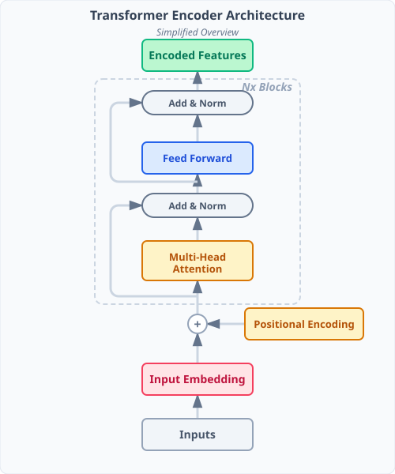

[](https://colab.research.google.com/github/miguelalexanderdiaz/quarto_blog/blob/main/blog/posts/tutorials/deep_learning/transformer/transformer.ipynb)

This is the first entry in our series building a Diffusion Transformer (DiT)
from scratch. We start with the core building block: the **encoder** side of the
Transformer architecture introduced in *Attention Is All You Need*
[@vaswani2017attention]. We focus on the encoder because it is the foundation
reused by vision transformers, DiT, and most modern architectures.

::: {#fig-encoder-arch-simple}


Simplified overview of the Transformer Encoder architecture.
:::

## Introduction: The Biological Inspiration of Visual Attention

The term "attention" in deep learning is heavily inspired by human biology. In human vision, our eyes don't process the entire visual field at a uniform, high resolution. Instead, we have a small central area of the retina called the **fovea** that captures sharp, colorful details, while our peripheral vision is blurry and mostly sensitive to motion and contrast.

To understand a scene, we rapidly move our eyes (saccades) to direct our foveal "spotlight" toward the most relevant parts of the environment, selectively ignoring the rest. 

This biological attention mechanism is simulated in @fig-human-vision.

::: {#fig-human-vision}


Interactive demonstration of human visual attention. Your mouse cursor acts as the fovea, dynamically focusing on specific details while leaving the rest of the visual field blurry and desaturated.
:::

Transformers apply a similar philosophy to data. Instead of processing every word or image patch with equal, rigid filters, the model dynamically computes which other parts of the input are most relevant to the current element, focusing its computational "fovea" where it matters most.

### From Static to Dynamic Computation

Before the Transformer era, the dominant architectures in deep learning—like Convolutional Neural Networks (CNNs) and standard Deep Neural Networks (DNNs)—relied heavily on **static weights**. Once a model was trained, the weight matrices governing the connections between neurons were frozen during inference. In a traditional DNN, the transformation applied to an input vector $\mathbf{x}$ is typically $\mathbf{y} = f(\mathbf{W}\mathbf{x} + \mathbf{b})$, where $\mathbf{W}$ is fixed. The model applies the exact same rigid set of filters regardless of the specific input being processed.

While effective, this static approach has a fundamental limitation when dealing with complex sequences like language or multimodal data, where meaning changes drastically based on context. A static weight matrix struggles to flexibly adapt its routing of information on a per-input basis.

The **Transformer** paradigm flips this on its head. Instead of relying solely on static connections to process features, it introduces a mechanism where the **activations themselves dynamically modulate the computation**. Through the self-attention mechanism, the inputs evaluate one another and generate their own connection weights (attention scores) on the fly. The routing of information isn't hardcoded in a fixed matrix; rather, the input sequence dynamically decides which parts of itself are most relevant and how information should flow.

This shift from static learned weights to dynamically computed, input-dependent activations is the core innovation that gives Transformers their unprecedented contextual reasoning capabilities (see @fig-static-dynamic).

::: {#fig-static-dynamic}


Comparison between static weights in traditional networks and dynamically computed activations in Transformers.
:::


## Self-Attention Intuition

Before diving into the mechanics, let's build intuition for *why*
self-attention exists. Consider this sentence:

> *The animal didn't cross the street because **it** was too tired*

When the model processes the word **"it"**, it needs to figure out what "it"
refers to. Is it the animal? The street? Self-attention gives the model a way to
answer this question: for each token, it computes a **weighted combination** of
*all* tokens in the sentence, with weights reflecting relevance.

For "it", the attention mechanism should assign high weight to "animal" (since
"it" refers to the animal) and lower weight to less relevant words like "cross"
or "the".

As shown in @fig-sa-intuition, lines connect "it" to every other word, and
their thickness represents how much attention "it" pays to each word.

::: {#fig-sa-intuition}


Self-attention intuition. The word "it" attends most strongly to "animal", correctly resolving the coreference.
:::

This is the core insight: **self-attention lets each token gather information
from the entire sequence**, weighting nearby and distant tokens purely by
relevance — not by distance. A word at position 1 can directly inform a word at
position 7, with no information bottleneck.

We will use this sentence as our running example throughout the post. But first,
let's see how raw text gets converted into something a model can actually work
with.


```{python}
#| code-fold: true
#| code-summary: "Setup: imports and configuration"

import math
import torch
import torch.nn as nn
import pandas as pd
import plotly.express as px
import plotly.graph_objects as go
from plotly.subplots import make_subplots
from rich.console import Console
from rich.table import Table
from rich.panel import Panel

console = Console()
torch.manual_seed(42)
d_model = 32   # small for demonstration (original paper uses 512)


def shape_table(title: str, rows: list[tuple[str, tuple, str]]):
    """Display a Tensor / Shape / Description table."""
    t = Table(title=title)
    t.add_column("Tensor", style="cyan")
    t.add_column("Shape", style="green")
    t.add_column("Description", style="dim")
    for name, shape, desc in rows:
        t.add_row(name, str(shape), desc)
    console.print(t)


def pipeline_table(title: str, rows: list[tuple[str, str, tuple]]):
    """Display a Step / Tensor / Shape table."""
    t = Table(title=title)
    t.add_column("Step", style="cyan")
    t.add_column("Tensor", style="magenta")
    t.add_column("Shape", style="green")
    for step, name, shape in rows:
        t.add_row(step, name, str(shape))
    console.print(t)
```

## Tokenization

Before a transformer can process text, the raw string must be converted into a
sequence of **tokens** — discrete units the model understands. Tokenization
typically operates at the *subword* level (e.g. Byte-Pair Encoding), striking a
balance between a manageable vocabulary size and the ability to represent any
word.

:::: {.callout-note}
## NLP vs Vision (DiT/ViT) translation
This post uses **text tokens** to teach the mechanics, but the encoder math is the same for images.

- **Text token** (word/subword) ↔ **Image token** (patch / latent patch)
- **Token IDs + embedding lookup** ↔ **Patch embedding** (a linear projection of patch pixels/latents into $d_{\text{model}}$)
- **1D positional encoding** ↔ **2D positional encoding** (or learned 2D position embeddings)

So when you see "token," you can mentally substitute "patch" if you're reading this for DiT.
::::

A simple word-level tokenizer would split our example sentence into:

| Position | 0   | 1      | 2      | 3     | 4   | 5      | 6       | 7  | 8   | 9   | 10    |
|----------|-----|--------|--------|-------|-----|--------|---------|----|-----|-----|-------|
| Token    | The | animal | didn't | cross | the | street | because | it | was | too | tired |

Each token is then looked up in a **vocabulary** — a fixed dictionary that maps
every known token to a unique integer ID. This mapping is shown in action in @fig-tok-anim.

::: {#fig-tok-anim}


Tokenization process. Each word is mapped to a unique integer ID from the vocabulary.
:::

These integer IDs are what the model actually receives as input. The vocabulary
is built once during training (or borrowed from a pre-trained tokenizer) and
stays fixed.

This is the very first step in the encoder pipeline. The diagram below shows the
full encoder architecture (see @fig-arch) — we have just completed the **Inputs** stage at the
bottom. As we work through the post, each block will light up.

::: {#fig-arch}


The Transformer encoder architecture.
:::

Let's implement this in PyTorch. We split the sentence into words, build a
vocabulary mapping each unique token to an integer ID, and convert the full
sequence into a tensor of IDs:

```{python}
sentence = "The animal didn't cross the street because it was too tired"
tokens = sentence.split()
vocab = {tok: i for i, tok in enumerate(sorted(set(tokens)))}
token_ids = torch.tensor([vocab[t] for t in tokens], dtype=torch.long)

t = Table(title="Tokenization")
t.add_column("Position", style="cyan", justify="center")
t.add_column("Token", style="magenta")
t.add_column("ID", style="green", justify="center")
for i, (tok, id_val) in enumerate(zip(tokens, token_ids.tolist())):
    t.add_row(str(i), tok, str(id_val))
console.print(t)
```

## Embedding

An integer ID by itself carries no semantic meaning. The **embedding layer**
maps each token ID to a learnable dense vector of dimension $d_{\text{model}}$.

Concretely, the embedding layer is a matrix
$\mathbf{E} \in \mathbb{R}^{|\mathcal{V}| \times d_{\text{model}}}$ where
$|\mathcal{V}|$ is the vocabulary size. Looking up token $i$ simply means
selecting row $i$ from this matrix:

$$
\mathbf{x}_i = \mathbf{E}[i]
$$

In the original Transformer, $d_{\text{model}} = 512$. After the embedding
lookup, our 11-token sentence becomes a matrix
$\mathbf{X} \in \mathbb{R}^{11 \times 512}$ — one 512-dimensional vector per
token.

The key insight is that these learned vectors capture **semantic meaning** as
geometry: words with similar meanings end up as nearby points in this
high-dimensional space. The animation below projects embeddings down to 2D to
show how semantic clusters emerge (@fig-emb-space) — related words naturally group together, and
the distance between points reflects how similar their meanings are.

::: {#fig-emb-space}


2D projection of the embedding space showing semantic clusters.
:::

::: {.callout-tip}
## Why dense vectors?
One-hot vectors are huge and sparse ($|\mathcal{V}|$-dimensional). Dense
embeddings compress meaning into a small, continuous space where similar words
naturally cluster together. "cat" and "kitten" end up with similar vectors even
though their token IDs might be thousands apart.
:::

These vectors are **learned** during training. The model adjusts them so that
tokens appearing in similar contexts drift towards similar regions of the
embedding space.

In PyTorch, `nn.Embedding` is exactly this lookup table — we pass in our token
IDs and get back one dense vector per token:

```{python}
embedding_layer = nn.Embedding(num_embeddings=len(vocab), embedding_dim=d_model)
X_embed = embedding_layer(token_ids)

shape_table("Embedding", [
    ("token_ids", tuple(token_ids.shape), "[N] — integer IDs"),
    ("X_embed",   tuple(X_embed.shape),   "[N, d_model] — dense vectors"),
])
```

## Positional Encoding

Self-attention treats its input as a **set** — it has no built-in notion of
order. Without additional information, the model would see
"The animal crossed the street" and "street the crossed animal The" as
identical. Clearly, word order matters.

**Positional encoding** solves this by adding a position-dependent signal to
each embedding vector *before* it enters the attention layers:

$$
\mathbf{z}_i = \mathbf{x}_i + \mathbf{PE}(i)
$$

The original Transformer uses a deterministic sinusoidal formula. For position
$\text{pos}$ and dimension $i$:

$$
\text{PE}(\text{pos}, 2i)   = \sin\!\bigl(\text{pos} \;/\; 10000^{2i / d_{\text{model}}}\bigr)
$$
$$
\text{PE}(\text{pos}, 2i+1) = \cos\!\bigl(\text{pos} \;/\; 10000^{2i / d_{\text{model}}}\bigr)
$$

Each dimension gets a sinusoidal wave with a different frequency. Low-index
dimensions oscillate fast (capturing fine-grained position differences) while
high-index dimensions oscillate slowly (capturing broad positional trends).

@fig-pe-waves shows 4 sin/cos pairs at progressively lower frequencies —
exactly what the first 8 dimensions of the positional encoding look like.

::: {#fig-pe-waves}


Sinusoidal positional encodings across different dimensions.
:::

Notice that the positional encoding vector has the **same dimensionality**
($d_{\text{model}}$) as the embedding vector. This is by design: the two are
added **element-wise** before entering the attention layers. The embedding
captures *what* the token means; the positional encoding captures *where* it
sits. By summing them, each input vector carries both signals simultaneously —
and the model can learn to disentangle them as needed.

::: {.callout-note}
## Why sinusoidal?
Sinusoidal encodings have a useful property: the encoding of position
$\text{pos} + k$ can be expressed as a linear function of the encoding at
$\text{pos}$, for any fixed offset $k$. This lets the model learn to attend to
*relative* positions easily. Learned positional embeddings (used in later
architectures like BERT) work equally well in practice, but sinusoidal encodings
require no extra parameters.
:::

After adding positional encodings, each vector $\mathbf{z}_i$ carries both
**what** the token is (from the embedding) and **where** it sits in the sequence
(from the positional encoding). This combined representation is what flows into
the self-attention mechanism.

:::: {.callout-tip}
## So what changed?
We turned each token embedding from "meaning only" into "meaning + position," because attention alone can't tell *where* tokens are in the sequence.
::::

Here is the sinusoidal formula translated directly into PyTorch. We generate the
full $\text{PE}$ matrix and add it element-wise to our embeddings:

```{python}
def sinusoidal_positional_encoding(seq_len: int, d_model: int) -> torch.Tensor:
    pe = torch.zeros(seq_len, d_model)
    position = torch.arange(seq_len, dtype=torch.float32).unsqueeze(1)
    div_term = torch.exp(
        torch.arange(0, d_model, 2, dtype=torch.float32) * (-math.log(10000.0) / d_model)
    )
    pe[:, 0::2] = torch.sin(position * div_term)
    pe[:, 1::2] = torch.cos(position * div_term)
    return pe

PE = sinusoidal_positional_encoding(len(tokens), d_model)
X = X_embed + PE

shape_table("Positional Encoding", [
    ("X_embed", tuple(X_embed.shape), "[N, d_model] — token embeddings"),
    ("PE",      tuple(PE.shape),      "[N, d_model] — sinusoidal positions"),
    ("X",       tuple(X.shape),       "[N, d_model] — embedding + position"),
])
```

## Self-Attention in Detail (Q, K, V)


In [Section 1](#self-attention-intuition) we saw that "it" should attend
strongly to "animal". But *how* does the model decide which tokens are
relevant? The answer lies in three learned projections: **Query**, **Key**, and
**Value**.

At this point, each token is represented by its **position-aware** vector
$\mathbf{z}_i = \mathbf{x}_i + \mathbf{PE}(i)$. We'll use that vector as the
input to attention. For every token vector $\mathbf{z}_i$ the model computes:

$$
\mathbf{q}_i = \mathbf{z}_i \, W_q, \qquad
\mathbf{k}_i = \mathbf{z}_i \, W_k, \qquad
\mathbf{v}_i = \mathbf{z}_i \, W_v
$$

where $W_q, W_k \in \mathbb{R}^{d_{\text{model}} \times d_k}$ and
$W_v \in \mathbb{R}^{d_{\text{model}} \times d_v}$ are learned weight
matrices. Or equivalently in matrix form, stacking all token vectors into
$X \in \mathbb{R}^{n \times d_{\text{model}}}$:

$$
Q = X \, W_q, \qquad K = X \, W_k, \qquad V = X \, W_v
$$

The intuition behind each role:

- **Query** ($\mathbf{q}_i$) — *"What am I looking for?"* The question this
  token broadcasts to the rest of the sequence.
- **Key** ($\mathbf{k}_i$) — *"What do I contain?"* The label each token
  advertises so that queries can match against it.
- **Value** ($\mathbf{v}_i$) — *"What information do I carry?"* The actual
  content that gets passed along when a query matches a key.

Think of it like a search engine: the query is your search term, keys are page
titles, and values are the page contents. You match your search against titles,
then read the content of the best matches (see @fig-qkv-proj).

::: {#fig-qkv-proj}


Projection of input embeddings into Query, Key, and Value vectors.
:::

### Computing Attention Scores

Now that each token has a query and a key, we can measure how relevant any
token $j$ is to token $i$ by taking the **dot product** of the query of $i$
with the key of $j$:

$$
\text{score}(i, j) = \mathbf{q}_i \cdot \mathbf{k}_j
$$

A higher dot product means the query and key point in similar directions —
i.e., token $j$ is what token $i$ is "looking for". The scores are then divided
by $\sqrt{d_k}$ to prevent them from growing too large (which would push
softmax into regions with tiny gradients):

$$
\text{scaled\_score}(i, j) = \frac{\mathbf{q}_i \cdot \mathbf{k}_j}{\sqrt{d_k}}
$$

@fig-att-score shows how the query for **"it"** is compared against the
key of every other token, producing a raw score for each pair.

::: {#fig-att-score}


Computing raw attention scores via dot product between queries and keys.
:::

Notice that **"animal"** gets the highest score (3.2) — the model has learned
that the key of "animal" and the query of "it" point in similar directions.

### Softmax → Attention Weights

Raw scores can be any real number. We need a **probability distribution** — a
set of non-negative weights that sum to 1. The softmax function does exactly
this:

$$
\alpha_{ij} = \text{softmax}_j\!\left(\frac{\mathbf{q}_i \cdot \mathbf{k}_j}{\sqrt{d_k}}\right)
           = \frac{\exp(\text{score}_{ij})}{\sum_{l=1}^{n} \exp(\text{score}_{il})}
$$

Higher scores get exponentially more weight. The result is a set of **attention
weights** $\alpha_{ij}$ that tell us how much token $i$ should attend to each
token $j$ (@fig-att-softmax).

::: {#fig-att-softmax}


Applying softmax to scale attention scores into a probability distribution.
:::

After softmax, **"animal"** holds 42% of the attention weight — by far the
largest share. The model is confirming what we saw intuitively in Section 1:
when "it" looks at the rest of the sentence, it focuses most heavily on
"animal".

### Weighted Sum of Values

The final step of self-attention is to use these weights to compute a
**weighted sum** of the value vectors. Each value vector carries the "content"
of its token, and the weights determine how much of each token's content to
include:

$$
\text{Attention}(\mathbf{q}_i) = \sum_{j=1}^{n} \alpha_{ij} \, \mathbf{v}_j
$$

The output for token "it" will be a vector dominated by the value of "animal"
(since it has the highest weight), with smaller contributions from the other
tokens (see @fig-att-output).

::: {#fig-att-output}


Computing the final attention output as a weighted sum of value vectors.
:::

The output vector for "it" is now rich with information about "animal" — exactly
the coreference signal the model needs. This is the power of self-attention: it
lets each token build a context-aware representation by selectively mixing
information from the entire sequence.

:::: {.callout-tip}
## So what changed?
Each token gets upgraded from a standalone vector into a **context-aware** vector by taking a weighted mixture of information from all other tokens.
::::

Let's wire up the full self-attention pipeline in PyTorch — project into Q, K, V,
compute scaled dot-product scores, apply softmax, and produce the weighted
output:

```{python}
# Linear projections
q_proj = nn.Linear(d_model, d_model)
k_proj = nn.Linear(d_model, d_model)
v_proj = nn.Linear(d_model, d_model)

Q = q_proj(X)   # [N, d_model]
K = k_proj(X)
V = v_proj(X)

# Scaled dot-product attention
scores = Q @ K.transpose(-2, -1) / math.sqrt(d_model)   # [N, N]
weights = torch.softmax(scores, dim=-1)                   # [N, N]
attention_output = weights @ V                             # [N, d_model]

pipeline_table("Self-Attention Pipeline", [
    ("Project",      "Q",      tuple(Q.shape)),
    ("Project",      "K",      tuple(K.shape)),
    ("Project",      "V",      tuple(V.shape)),
    ("Dot product",  "scores", tuple(scores.shape)),
    ("Weighted sum", "output", tuple(attention_output.shape)),
])
console.print(Panel(
    f"Row 0 sums to [bold green]{weights[0].sum().item():.4f}[/] — valid probability distribution",
    title="Softmax check",
))
```

## Matrix Calculation of Self-Attention

So far we've traced attention for a single query — computing one row of scores,
one softmax, one weighted sum. In practice we process **all tokens at once**
using matrix operations.

Stack the individual vectors into matrices: each row $i$ of $Q$ is $\mathbf{q}_i$,
each row $j$ of $K$ is $\mathbf{k}_j$, and each row $j$ of $V$ is
$\mathbf{v}_j$:

$$
Q = X \, W_q, \qquad K = X \, W_k, \qquad V = X \, W_v
$$

where $X \in \mathbb{R}^{n \times d_{\text{model}}}$ is the matrix of all input
vectors (as defined in Section 5). The entire self-attention computation then collapses to a single
formula:

$$
\text{Attention}(Q, K, V) = \text{softmax}\!\left(\frac{Q \, K^T}{\sqrt{d_k}}\right) V
$$

Let's walk through each step of this pipeline in @fig-att-matrix.

::: {#fig-att-matrix}


Matrix calculation of self-attention for all tokens simultaneously.
:::

The score matrix $Q K^T$ is an $n \times n$ matrix where entry $(i,j)$ is the
dot product $\mathbf{q}_i \cdot \mathbf{k}_j$ — exactly the scores we computed
one at a time in the previous section. Dividing by $\sqrt{d_k}$ and applying
softmax row-wise produces the attention weight matrix: each row is a probability
distribution over all tokens.

Multiplying this weight matrix by $V$ performs the weighted sum for *every*
token simultaneously: row $i$ of the output is
$\sum_j \alpha_{ij} \, \mathbf{v}_j$ — the same per-token output we derived
step-by-step in Section 5, but computed all at once.

### The Attention Heatmap

Let's visualize the full attention weight matrix for our running example. Each
cell shows how much the row token (query) attends to the column token (key).
Darker cells mean higher attention (@fig-att-heatmap).

::: {#fig-att-heatmap}


Attention heatmap showing the weights between all pairs of tokens.
:::

Look at the **"it" row** (highlighted with a purple border): the darkest cell
is at the "animal" column — exactly the pattern we predicted in
[Section 1](#self-attention-intuition). The model has learned that when "it"
queries the sequence, the key of "animal" produces the highest match. The second
darkest cell is "it" itself — a common pattern where tokens maintain some of
their own information.

::: {.callout-tip}
## Reading the heatmap
Each **row** sums to 1 (it's a softmax distribution). Dark diagonal cells mean
a token attends to itself. Off-diagonal dark cells reveal which *other* tokens
each position finds most relevant — these are the interesting linguistic
relationships the model discovers.
:::

We can visualize the full $N \times N$ weight matrix as a heatmap using Plotly:

```{python}
fig = px.imshow(
    weights.detach().numpy(),
    x=[f"{i}:{t}" for i, t in enumerate(tokens)],
    y=[f"{i}:{t}" for i, t in enumerate(tokens)],
    labels={"x": "Key Token", "y": "Query Token", "color": "Weight"},
    title="Self-Attention Heatmap [N, N]",
    color_continuous_scale="Purples",
)
fig.update_xaxes(side="top")
fig.show()
```

## Multi-Head Attention {#multi-head-attention}

Everything we've built so far — queries, keys, values, scaled dot-product,
softmax — computes a **single** set of attention weights. That gives the model
one "perspective" on how tokens relate to each other. But language has many
simultaneous relationships happening at once: syntactic links (subject–verb
agreement), coreference (which noun a pronoun refers to), semantic associations
(adjective–noun modification). A single attention head has to compress all of
these into one set of weights, which limits what it can learn.

The fix is simple: instead of running one large attention, run **$h$ smaller
attentions in parallel**. Each head $i$ gets its own learned projection matrices
$W_q^{(i)}, W_k^{(i)}, W_v^{(i)}$ that project the input into a smaller
subspace of dimension $d_k = d_{\text{model}} / h$. Each head then independently
computes attention over that subspace:

$$\text{head}_i = \text{Attention}\!\bigl(X W_q^{(i)},\; X W_k^{(i)},\; X W_v^{(i)}\bigr)$$

::: {#fig-mha-overview}


Multi-head attention runs several self-attention operations in parallel.
:::

After all heads compute their outputs independently, we **concatenate** them
along the feature dimension and multiply by a final output projection matrix
$W_O$ to map back to $d_{\text{model}}$:

$$\text{MultiHead}(X) = \text{Concat}(\text{head}_1, \dots, \text{head}_h) \; W_O$$

Here's the key insight on dimensions: if $d_{\text{model}} = 512$ and $h = 8$,
each head works with vectors of size $d_k = 64$. Concatenating 8 heads gives us
$8 \times 64 = 512$, and $W_O$ maps $512 \to 512$. No information is lost, and
the total parameter count is the same as if we'd used a single large head — we
just organized the computation differently (@fig-mha-dims).

::: {#fig-mha-dims}


Dimensionality breakdown in multi-head attention.
:::

In practice, different heads naturally **specialize** during training. Some
attend to adjacent tokens (capturing local syntax), others reach across the
sequence for long-range dependencies (like resolving "it" to "animal"), and still
others focus on semantic similarity between content words. The model doesn't need
to be told to diversify — the independent subspaces encourage it (@fig-mha-heads).

::: {#fig-mha-heads}


Different attention heads specialize in capturing different linguistic relationships.
:::

Multi-head attention gives the model multiple **representational subspaces**.
Each head focuses on different aspects of the input — syntax, coreference,
semantics, positional patterns — and the output projection $W_O$ learns to
combine these diverse perspectives into a single, richer representation than any
single head could produce on its own.

::: {.callout-tip}
## Parameter count
$h$ heads with $d_k = d_{\text{model}} / h$ use the **same number of
parameters** as a single head with the full $d_{\text{model}}$. Each head has
three projection matrices of size $d_{\text{model}} \times d_k$, so the total is
$h \times 3 \times d_{\text{model}} \times d_k = 3 \times d_{\text{model}}^2$
— exactly what a single head would need. Multi-head attention is *free
diversity*!
:::

::: {.callout-tip}
## So what changed?
Instead of forcing one attention pattern to capture *everything*, we learn several smaller attention patterns in parallel and then combine them.
:::

Here's multi-head attention in practice. We reuse the same projection weights but
reshape into `[num_heads, N, head_dim]` so each head operates on its own
subspace, then concatenate and project back:

```{python}
num_heads = 4
head_dim = d_model // num_heads

# Project and split into heads: [N, d_model] → [num_heads, N, head_dim]
Q_mha = q_proj(X).reshape(len(tokens), num_heads, head_dim).transpose(0, 1)
K_mha = k_proj(X).reshape(len(tokens), num_heads, head_dim).transpose(0, 1)
V_mha = v_proj(X).reshape(len(tokens), num_heads, head_dim).transpose(0, 1)

# Parallel attention across all heads
scores_mha = Q_mha @ K_mha.transpose(-2, -1) / math.sqrt(head_dim)  # [h, N, N]
weights_mha = torch.softmax(scores_mha, dim=-1)
out_mha = weights_mha @ V_mha                                        # [h, N, head_dim]

# Concatenate heads and project back
out_concat = out_mha.transpose(0, 1).reshape(len(tokens), d_model)   # [N, d_model]
out_proj = nn.Linear(d_model, d_model)
out_mha_final = out_proj(out_concat)

pipeline_table("Multi-Head Attention", [
    ("Split heads", "Q per head", tuple(Q_mha.shape)),
    ("Attention",   "scores",     tuple(scores_mha.shape)),
    ("Concat",      "out_concat", tuple(out_concat.shape)),
    ("Output proj", "out_final",  tuple(out_mha_final.shape)),
])

# Visualize per-head attention for "it"
query_idx = 7
fig = make_subplots(rows=1, cols=num_heads,
                    subplot_titles=[f"Head {h}" for h in range(num_heads)])
for h in range(num_heads):
    fig.add_trace(
        go.Bar(x=tokens, y=weights_mha[h, query_idx].detach().numpy(), showlegend=False),
        row=1, col=h + 1,
    )
fig.update_layout(title=f"Per-head attention for '{tokens[query_idx]}'", height=300)
fig.show()
```

## Residual Connections and Layer Normalization

Deep neural networks often suffer from the **vanishing gradient problem**: as gradients are backpropagated through many layers, they can become so small that the early layers fail to learn. The Transformer mitigates this using a critical architectural feature called **Residual Connections** (also known as skip connections), originally popularized by ResNets.

### How Residual Connections Work

Around every sub-layer in the Transformer (such as the Multi-Head Attention layer we just built), there is a residual connection followed by a **Layer Normalization** step.

If we let $x$ be the input to a sub-layer, and $\text{Sublayer}(x)$ be the function implemented by the sub-layer itself, the output with the residual connection becomes:

$$
\text{Output} = \text{LayerNorm}(x + \text{Sublayer}(x))
$$

This data flow is visualized in @fig-residual-conn.

::: {#fig-residual-conn}


Residual connection data flow. Notice how the original input data ($x$) completely bypasses the complex transformation and gets added directly back to the output ($\text{Sublayer}(x)$).
:::

### Why this matters

1. **Uninterrupted Gradient Flow:** During backpropagation, the addition operation distributes gradients equally. This means the gradient can flow backwards along the skip connection completely unaltered, bypassing the complex attention mechanisms. This is what allows Transformers to be stacked dozens or even hundreds of layers deep without the gradients vanishing.
2. **Information Preservation:** Self-attention is a very aggressive operation—it mixes and scrambles the token representations based on their relationships. The residual connection ensures that the model never completely "forgets" the original token identity. If the attention mechanism decides a token doesn't need to gather any new context, $\text{Sublayer}(x)$ can learn to output near-zero, and the output just safely falls back to the original input $x$.

### Layer Normalization

Immediately after the residual addition, the output is passed through **Layer Normalization** (LayerNorm).

::: {.callout-note}
## LayerNorm vs BatchNorm in NLP
There's a common point of confusion around what gets normalized. If our input tensor shape is `[Batch, SequenceLength, Channels]`:

- **BatchNorm** computes statistics *per channel* across the entire Batch and SequenceLength. 
- **LayerNorm** computes statistics *per token* across all of its Channels. 

Because sentence lengths vary and token statistics fluctuate wildly across different batches of text, computing the distribution *per token* independently (LayerNorm) proved vastly more stable and superior for Transformers.
:::

For an output vector $\mathbf{z} = x + \text{Sublayer}(x)$, LayerNorm computes:

$$
\text{LayerNorm}(\mathbf{z}) = \gamma \frac{\mathbf{z} - \mu}{\sqrt{\sigma^2 + \epsilon}} + \beta
$$

Where:

- $\mu$ and $\sigma^2$ are the mean and variance computed across the $d_{\text{model}}$ dimensions of the single token $\mathbf{z}$.
- $\epsilon$ (epsilon) is a tiny constant (e.g., $10^{-5}$) added for numerical stability to prevent division by zero in case the variance is exactly zero.
- $\gamma$ and $\beta$ are learnable scale and shift parameters.

This process is visualized in @fig-layer-norm.

::: {#fig-layer-norm}


Layer normalization process. The feature distributions for different tokens start with varying means and variances, get standardized to a standard normal distribution ($\mu=0, \sigma=1$), and finally get shifted and scaled by the learned parameters $\gamma$ and $\beta$.
:::

LayerNorm ensures that the values within the token vector don't explode or collapse as they pass through the deep stack of layers, stabilizing the training process and allowing for much higher learning rates.

:::: {.callout-tip}
## So what changed?
Residual connections preserve a clean information/gradient path, and LayerNorm keeps activations well-scaled—together they make deep stacks of attention blocks train reliably.
::::

The residual connection is just an addition, and `nn.LayerNorm` handles the
normalization. Notice how the mean snaps to ~0 and std to ~1 after LayerNorm:

```{python}
ln = nn.LayerNorm(d_model)

# 1. Residual connection: add MHA output back to input
residual_out = X + out_mha_final                # [N, d_model]

# 2. Layer normalization
normed_out = ln(residual_out)                    # [N, d_model]

tok_idx = 7
raw = residual_out[tok_idx].detach()
normed = normed_out[tok_idx].detach()
t = Table(title=f"LayerNorm Effect on '{tokens[tok_idx]}'")
t.add_column("Stage", style="cyan")
t.add_column("Mean", style="green", justify="right")
t.add_column("Std", style="green", justify="right")
t.add_row("Pre-LN", f"{raw.mean():.4f}", f"{raw.std():.4f}")
t.add_row("Post-LN", f"{normed.mean():.4f}", f"{normed.std():.4f}")
console.print(t)
```

## The Feed-Forward Network

After the Multi-Head Attention sublayer (and its residual connection and LayerNorm), the token representations pass through a **Position-wise Feed-Forward Network (FFN)**. 

While the Self-Attention layer is responsible for routing information *between* different tokens, the FFN is responsible for processing the information *within* each individual token.

### Position-Wise Processing

The term "position-wise" means that this exact same neural network is applied to every single token in the sequence independently and identically. There is no communication between tokens in this step.

The FFN consists of two linear transformations with a ReLU activation in between:

$$
\text{FFN}(x) = \max(0, xW_1 + b_1)W_2 + b_2
$$

### The Expansion and Compression Strategy

The FFN acts as a massive feature mixer. In the original Transformer:


1. The input vector $x$ has a dimensionality of $d_{\text{model}} = 512$.
2. The first linear layer ($W_1$) projects this into a much larger hidden space, typically $d_{\text{ff}} = 2048$ (four times the input size).
3. The ReLU activation introduces non-linearity, allowing the network to learn complex patterns.
4. The second linear layer ($W_2$) compresses the 2048-dimensional vector back down to the original $512$ dimensions.

This "expand-and-compress" bottleneck forces the network to mix the features gathered during the attention phase, creating richer, higher-level representations.

This process is visualized in @fig-ffn-anim.

::: {#fig-ffn-anim}


The Position-Wise Feed-Forward Network. The 512-dimensional input is expanded into a 2048-dimensional hidden layer to mix features, then compressed back to 512 dimensions.
:::

Just like the Multi-Head Attention sublayer, the FFN is also surrounded by a residual connection and followed by Layer Normalization.

:::: {.callout-tip}
## So what changed?
Attention mixes information **between tokens**; the FFN then adds nonlinearity and feature mixing **within each token** (independently at every position).
::::

Two linear layers with GELU in between — the first expands to $4 \times
d_{\text{model}}$, the second compresses back:

```{python}
hidden_dim = 4 * d_model

fc1 = nn.Linear(d_model, hidden_dim)
act = nn.GELU()
fc2 = nn.Linear(hidden_dim, d_model)

hidden_states = act(fc1(normed_out))   # [N, 4*d_model]  (expansion)
ffn_out = fc2(hidden_states)            # [N, d_model]    (compression)

shape_table("Feed-Forward Network", [
    ("Input",  tuple(normed_out.shape),    "[N, d_model]"),
    ("Hidden", tuple(hidden_states.shape), "[N, 4*d_model] — expanded"),
    ("Output", tuple(ffn_out.shape),       "[N, d_model] — compressed"),
])
```

## Putting It All Together — The Encoder Block

We have now built all the individual components of the Transformer Encoder. Let's see how they fit together into a single, unified **Encoder Block**.

Each Encoder block takes a sequence of embeddings (of shape `[SequenceLength, 512]`) and outputs a new sequence of embeddings of the exact same shape. This means we can stack these blocks on top of each other as many times as we want. The original paper stacked $N = 6$ of these blocks.

Here is the complete data flow inside a single Encoder block:

1. **Input**: A sequence of vectors (either from the embedding layer + positional encoding, or from the output of the previous block).
2. **Multi-Head Attention**: The sequence passes through the self-attention mechanism, allowing tokens to dynamically gather context from each other.
3. **Add & Norm 1**: The original input is added to the attention output (residual connection), and the result is layer-normalized.
4. **Feed-Forward Network**: The normalized vectors are passed through the position-wise FFN to mix features and add non-linearity.
5. **Add & Norm 2**: The input to the FFN is added to the FFN output (residual connection), and the result is layer-normalized again.

This full architecture is animated in @fig-encoder-block.

::: {#fig-encoder-block}


The complete architecture of a single Transformer Encoder Block. The signal flows through Multi-Head Attention, Add & Norm, Feed-Forward Network, and another Add & Norm.
:::

By stacking these blocks, the model builds increasingly complex representations. The lower layers might learn basic syntax and local grammar, while the higher layers can resolve complex coreferences and understand deep semantic meaning.

Finally, let's wrap everything into clean `nn.Module` classes. The
`TransformerEncoderBlock` chains attention → add & norm → FFN → add & norm,
exactly mirroring the diagram above:

```{python}
class MultiHeadAttention(nn.Module):
    def __init__(self, embed_dim: int, num_heads: int):
        super().__init__()
        self.num_heads = num_heads
        self.head_dim = embed_dim // num_heads
        self.q_proj = nn.Linear(embed_dim, embed_dim)
        self.k_proj = nn.Linear(embed_dim, embed_dim)
        self.v_proj = nn.Linear(embed_dim, embed_dim)
        self.out_proj = nn.Linear(embed_dim, embed_dim)

    def forward(self, x: torch.Tensor):
        B, N, D = x.shape
        Q = self.q_proj(x).reshape(B, N, self.num_heads, self.head_dim).transpose(1, 2)
        K = self.k_proj(x).reshape(B, N, self.num_heads, self.head_dim).transpose(1, 2)
        V = self.v_proj(x).reshape(B, N, self.num_heads, self.head_dim).transpose(1, 2)

        scores = Q @ K.transpose(-2, -1) / math.sqrt(self.head_dim)
        weights = torch.softmax(scores, dim=-1)
        out = (weights @ V).transpose(1, 2).reshape(B, N, D)
        return self.out_proj(out), weights

class FeedForward(nn.Module):
    def __init__(self, embed_dim: int, hidden_dim: int):
        super().__init__()
        self.net = nn.Sequential(
            nn.Linear(embed_dim, hidden_dim), nn.GELU(), nn.Linear(hidden_dim, embed_dim),
        )

    def forward(self, x: torch.Tensor):
        return self.net(x)

class TransformerEncoderBlock(nn.Module):
    def __init__(self, embed_dim: int, num_heads: int, mlp_hidden_dim: int):
        super().__init__()
        self.norm1 = nn.LayerNorm(embed_dim)
        self.norm2 = nn.LayerNorm(embed_dim)
        self.attn = MultiHeadAttention(embed_dim, num_heads)
        self.ffn = FeedForward(embed_dim, mlp_hidden_dim)

    def forward(self, x: torch.Tensor):
        attn_out, attn_w = self.attn(self.norm1(x))
        x = x + attn_out
        x = x + self.ffn(self.norm2(x))
        return x, attn_w

# Run a forward pass  [1, N, d_model]
X_batch = X.unsqueeze(0)
encoder_block = TransformerEncoderBlock(d_model, num_heads=4, mlp_hidden_dim=4 * d_model)
final_output, final_weights = encoder_block(X_batch)

shape_table("Encoder Block", [
    ("Input",        tuple(X_batch.shape),       "[Batch, N, d_model]"),
    ("Output",       tuple(final_output.shape),  "[Batch, N, d_model]"),
    ("Attn weights", tuple(final_weights.shape), "[Batch, Heads, N, N]"),
])
```

### What's Next?

In this post, we have thoroughly covered the **Encoder** half of the Transformer, which is the exact same architecture used by modern models like BERT or Vision Transformers. 

In the next post of this series, we will transition to the **Decoder** and introduce **Cross-Attention**, taking us one step closer to building our Diffusion Transformer (DiT) from scratch!

## Acknowledgements

This post was heavily inspired by Jay Alammar's excellent visual guide [@alammar2018illustrated], which remains one of the best introductions to the Transformer architecture.
